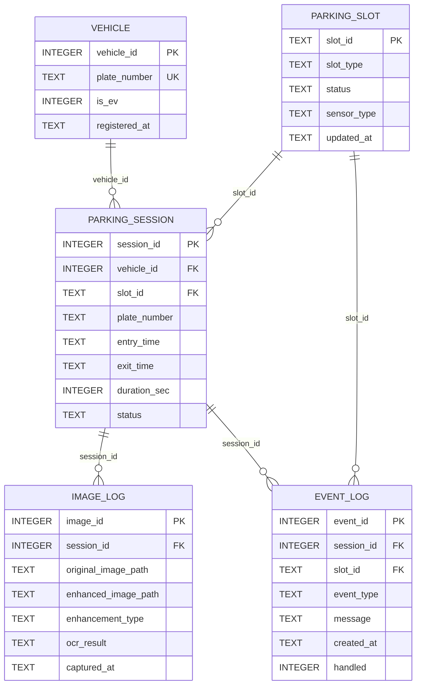

# 스마트 주차장 MVP SQLite DB

## 설계 목적

`data/db/parking.db`는 Raspberry Pi 스마트 주차장 MVP에서 필요한 차량 판별, 주차면 상태,
입·출차 세션, 이미지와 OCR 결과, 이벤트 이력을 간단한 5개 테이블로 관리한다.
SQLite 연결 시 foreign key를 활성화하며 C DB Manager는 prepared statement와 bind API를
사용한다.

## 테이블

- `VEHICLE`: 데모 차량번호와 EV 여부
- `PARKING_SLOT`: EV 충전구역 및 일반 주차면의 현재 상태와 센서 유형
- `PARKING_SESSION`: 차량별 입차, 출차, 점유 시간과 세션 상태. 미등록 차량이나 OCR 실패는
  `vehicle_id=NULL`을 허용하고 입차 당시 OCR 문자열은 `plate_number`에 보존
- `IMAGE_LOG`: 원본/개선 이미지 경로, 화질개선 방식, OCR 결과
- `EVENT_LOG`: 입출차, 부정주차, 장기점유, 센서 오류, 알람 해제 이벤트

## ERD



## 설치 및 초기화

Raspberry Pi OS/Debian에서 필요한 패키지:

```sh
sudo apt install sqlite3 libsqlite3-dev build-essential
```

프로젝트 루트에서 DB를 초기화한다. 기존 `data/db/parking.db`는 삭제 전에 자동으로
`data/db/backups/parking_YYYYMMDD_HHMMSS.db`에 백업된다.

```sh
./tools/reset_db.sh
```

DB 내용 확인:

```sh
./tools/inspect_db.sh
```

수동 백업:

```sh
./tools/backup_db.sh
```

## 빌드 및 테스트

```sh
cmake -S . -B cmake-build -DCMAKE_BUILD_TYPE=Release
cmake --build cmake-build -j2
```

생성되는 `cmake-build/db-manager-test`는 인수로 전달한 DB를 변경하므로
초기화한 테스트 DB에서만 실행한다.

테스트 프로그램은 차량 조회, P01 점유 갱신, 주차 세션/이미지/이벤트 생성, 세션 종료,
이벤트 처리 완료를 순서대로 검증한다.

## C 코드 사용 예

```c
#include "db_manager.h"

int vehicle_id;
int is_ev;
int session_id;

if (db_open("data/db/parking.db") == 0) {
    if (db_get_vehicle_by_plate("12가3456", &vehicle_id, &is_ev) == 0) {
        db_update_slot_status("P01", "OCCUPIED");
        db_create_parking_session(vehicle_id, "P01", "12가3456", &session_id);
    }
    db_close();
}
```

정수형 선택 FK에 `-1`을 전달하면 `NULL`로 저장한다. 공개 함수는 성공 시 `0`, 실패 시
음수를 반환하며 상세 오류는 `stderr`에 기록한다.

## 주의사항

- Gemini API Key와 카메라 계정/비밀번호는 DB 또는 소스에 저장하지 않고 환경변수나 Git에서
  제외된 로컬 설정으로 관리한다.
- seed 차량번호는 실제 개인정보가 아닌 데모 데이터만 사용한다.
- 개인정보 보안과 번호판 마스킹은 MVP 범위에서 최소화했으며 운영 전 접근통제, 암호화,
  보존기간 및 삭제 정책을 추가해야 한다.
- C++ 서버의 `EventDatabase`는 이 C DB Manager를 사용하며 기본 DB 경로는 프로젝트 루트의
  `data/db/parking.db`다. `EVENT_DB_PATH` 환경변수로 다른 경로를 지정할 수 있다.
- MQTT 카메라 이벤트 수신 시 채널별 `EVENT_LOG`가 추가되고 스냅샷 저장 성공 시
  `IMAGE_LOG`도 추가된다. OCR/입차 판정 전 이벤트이므로 이 단계의 `session_id`는 `NULL`이다.
