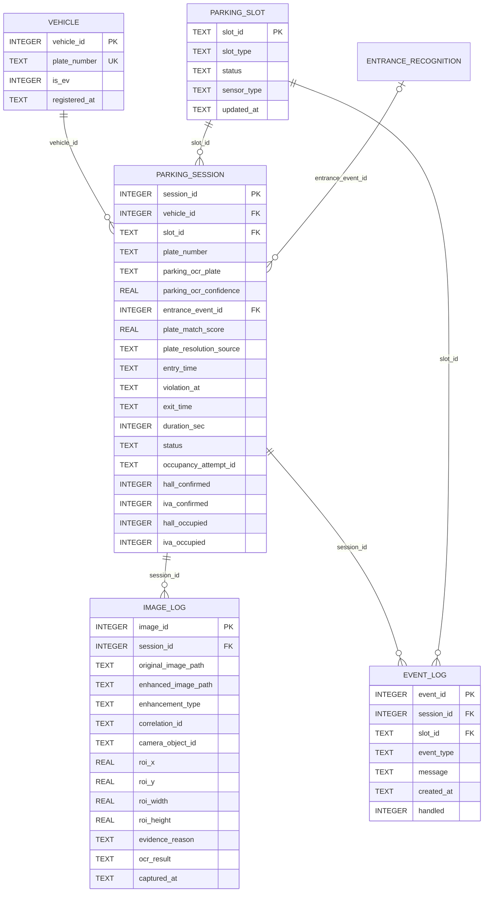

# 스마트 주차장 SQLite DB

기준일: 2026-08-24 (`db/schema.sql` 기준, EVDA-238)

## 설계 목적

`data/db/parking.db`는 Raspberry Pi 스마트 주차장에서 필요한 차량 판별, 주차면 상태,
입·출차 세션, 이미지와 OCR 결과, 이벤트 이력, 화재 경보, Qt 계정/세션, 점유 판정
파이프라인의 진행 상태를 16개 테이블로 관리한다. 5개 핵심 테이블은 MVP 시절과
이름이 같지만 `PARKING_SESSION`과 `IMAGE_LOG`는 이후 열이 크게 늘었다(아래 ERD 참고).
SQLite 연결 시 foreign key를 활성화하며 C DB Manager는 prepared statement와 bind API를
사용한다.

## 테이블

핵심 5개(MVP 때부터 존재, 열 구성은 아래 ERD가 최신):

- `VEHICLE`: 차량번호와 EV 여부(1=EV, 0=NON_EV로 단순화, 기존 PHEV 값은 EV로 흡수)
- `PARKING_SLOT`: EV 충전구역 및 일반 주차면의 현재 상태와 센서 유형
- `PARKING_SESSION`: 차량별 입차, 출차, 점유 시간과 세션 상태. 미등록 차량이나 OCR 실패는
  `vehicle_id=NULL`을 허용하고 입차 당시 OCR 문자열은 `plate_number`에 보존. CH2 입구
  매칭 결과(`entrance_event_id`, `plate_match_score`)와 Hall/IVA 확인 상태 4개 플래그도
  이 테이블에 있다
- `IMAGE_LOG`: 원본/개선 이미지 경로, ROI 좌표·revision, correlation 식별자, OCR 결과
- `EVENT_LOG`: 입출차, 부정주차, 장기점유, 센서 오류, 알람 해제 이벤트

EVDA-192 이후 추가된 11개(점유 판정 파이프라인, 화재, Qt 계정, CH2 입구):

| 테이블 | 역할 |
|---|---|
| `SYSTEM_SETTINGS` | Qt REST API로 바꾼 런타임 설정(예: overstay 임계값)을 재시작 후에도 복원 |
| `ENTRANCE_RECOGNITION` | CH2 입구 BestShot의 EV 판정·OCR 결과. `PARKING_SESSION`과 수명이 달라 별도 보관 |
| `app_users` | Qt 로그인 계정. `password_hash`는 libsodium Argon2id PHC 문자열만 저장 |
| `app_sessions` | Qt Bearer 세션. 원문 access token은 반환 직후 폐기하고 SHA-256 digest만 저장 |
| `FIRE_ALARM_STATE` | 채널별 화재 경보 lifecycle(OPEN/ACKNOWLEDGED/RESOLVED) 현재 상태 |
| `FIRE_MQTT_OUTBOX` | 화재 상태/이벤트를 Qt MQTT로 신뢰성 있게 전달하는 재시도 큐 |
| `SENSOR_RETIRED_BOOT_ID` | 재부팅한 센서의 이전 boot_id를 기록해 재전송 시퀀스를 구분 |
| `OCCUPANCY_COMMAND_INBOX` | Hall/카메라/출차 타임아웃 관측을 순서대로 적용하는 명령 큐 |
| `PARKING_CORRELATION_BINDING` | IVA object_id ↔ 세션 correlation 바인딩과 만료 |
| `OCCUPANCY_SENSOR_SEQUENCE_STATE` | Hall 센서별 마지막 시퀀스 번호(중복/역전 판별) |
| `IVA_SLOT_OBSERVATION_STATE` | 슬롯별 IVA 관측 상태(OCCUPIED/VACANT_PENDING/VACANT)와 영역별 원시 상태 |
| `OCCUPANCY_EXIT_DEADLINE` | IVA EXIT 확인 대기(`CAMERA_IVA_EXIT_CONFIRM_MS`) 타이머 상태 |

정확한 열과 제약은 `db/schema.sql`이 최종 근거다.

## ERD (핵심 5개 테이블)


```mermaid
erDiagram
    VEHICLE ||--o{ PARKING_SESSION : "vehicle_id"
    PARKING_SLOT ||--o{ PARKING_SESSION : "slot_id"
    ENTRANCE_RECOGNITION |o--o{ PARKING_SESSION : "entrance_event_id"
    PARKING_SESSION ||--o{ IMAGE_LOG : "session_id"
    PARKING_SESSION ||--o{ EVENT_LOG : "session_id"
    PARKING_SLOT ||--o{ EVENT_LOG : "slot_id"

    VEHICLE {
        INTEGER vehicle_id PK
        TEXT plate_number UK
        INTEGER is_ev
        TEXT registered_at
    }
    PARKING_SLOT {
        TEXT slot_id PK
        TEXT slot_type
        TEXT status
        TEXT sensor_type
        TEXT updated_at
    }
    PARKING_SESSION {
        INTEGER session_id PK
        INTEGER vehicle_id FK
        TEXT slot_id FK
        TEXT plate_number
        TEXT parking_ocr_plate
        REAL parking_ocr_confidence
        INTEGER entrance_event_id FK
        REAL plate_match_score
        TEXT plate_resolution_source
        TEXT entry_time
        TEXT violation_at
        TEXT exit_time
        INTEGER duration_sec
        TEXT status
        TEXT occupancy_attempt_id
        INTEGER hall_confirmed
        INTEGER iva_confirmed
        INTEGER hall_occupied
        INTEGER iva_occupied
    }
    IMAGE_LOG {
        INTEGER image_id PK
        INTEGER session_id FK
        TEXT original_image_path
        TEXT enhanced_image_path
        TEXT enhancement_type
        TEXT correlation_id
        TEXT camera_object_id
        REAL roi_x
        REAL roi_y
        REAL roi_width
        REAL roi_height
        TEXT evidence_reason
        TEXT ocr_result
        TEXT captured_at
    }
    EVENT_LOG {
        INTEGER event_id PK
        INTEGER session_id FK
        TEXT slot_id FK
        TEXT event_type
        TEXT message
        TEXT created_at
        INTEGER handled
    }
```

나머지 11개 테이블은 자기 완결적인 상태 저장소라 위 ERD의 외래키 그래프와
직접 연결되지 않으며(내부적으로 `slot_id`/`session_id` 문자열로만 참조),
`db/schema.sql`에 개별 정의돼 있다.

## 설치 및 초기화

Raspberry Pi OS/Debian에서 필요한 패키지:

```sh
sudo apt install sqlite3 libsqlite3-dev build-essential
```

프로젝트 루트에서 DB를 초기화한다. 기존 `data/db/parking.db`는 삭제 전에 자동으로
`data/db/backups/parking_YYYYMMDD_HHMMSS.db`에 백업된다.

```sh
./tools/reset_db.sh
```

DB 내용 확인:

```sh
./tools/inspect_db.sh
```

수동 백업:

```sh
./tools/backup_db.sh
```

## 빌드 및 테스트

```sh
cmake -S . -B cmake-build -DCMAKE_BUILD_TYPE=Release
cmake --build cmake-build -j2
```

생성되는 `cmake-build/db-manager-test`는 인수로 전달한 DB를 변경하므로
초기화한 테스트 DB에서만 실행한다.

테스트 프로그램은 차량 조회, P01 점유 갱신, 주차 세션/이미지/이벤트 생성, 세션 종료,
이벤트 처리 완료를 순서대로 검증한다.

## C 코드 사용 예

```c
#include "db_manager.h"

int vehicle_id;
int is_ev;
int session_id;

if (db_open("data/db/parking.db") == 0) {
    if (db_get_vehicle_by_plate("12가3456", &vehicle_id, &is_ev) == 0) {
        db_update_slot_status("P01", "OCCUPIED");
        db_create_parking_session(vehicle_id, "P01", "12가3456", &session_id);
    }
    db_close();
}
```

정수형 선택 FK에 `-1`을 전달하면 `NULL`로 저장한다. 공개 함수는 성공 시 `0`, 실패 시
음수를 반환하며 상세 오류는 `stderr`에 기록한다.

## 주의사항

- Gemini API Key와 카메라 계정/비밀번호는 DB 또는 소스에 저장하지 않고 환경변수나 Git에서
  제외된 로컬 설정으로 관리한다.
- seed 차량번호는 실제 개인정보가 아닌 데모 데이터만 사용한다.
- 개인정보 보안과 번호판 마스킹은 MVP 범위에서 최소화했으며 운영 전 접근통제, 암호화,
  보존기간 및 삭제 정책을 추가해야 한다.
- C++ 서버의 `EventDatabase`는 이 C DB Manager를 사용하며 기본 DB 경로는 프로젝트 루트의
  `data/db/parking.db`다. `EVENT_DB_PATH` 환경변수로 다른 경로를 지정할 수 있다.
- MQTT 카메라 이벤트 수신 시 채널별 `EVENT_LOG`가 추가되고 스냅샷 저장 성공 시
  `IMAGE_LOG`도 추가된다. OCR/입차 판정 전 이벤트이므로 이 단계의 `session_id`는 `NULL`이다.
