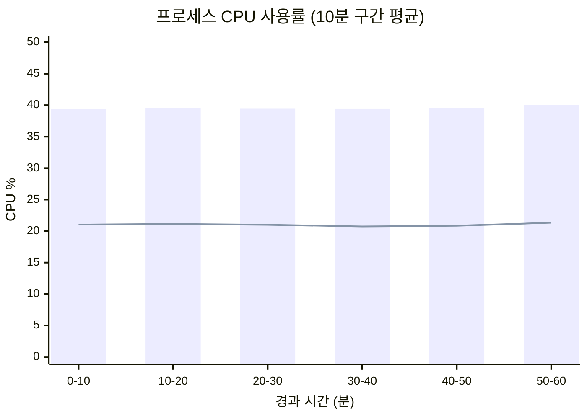
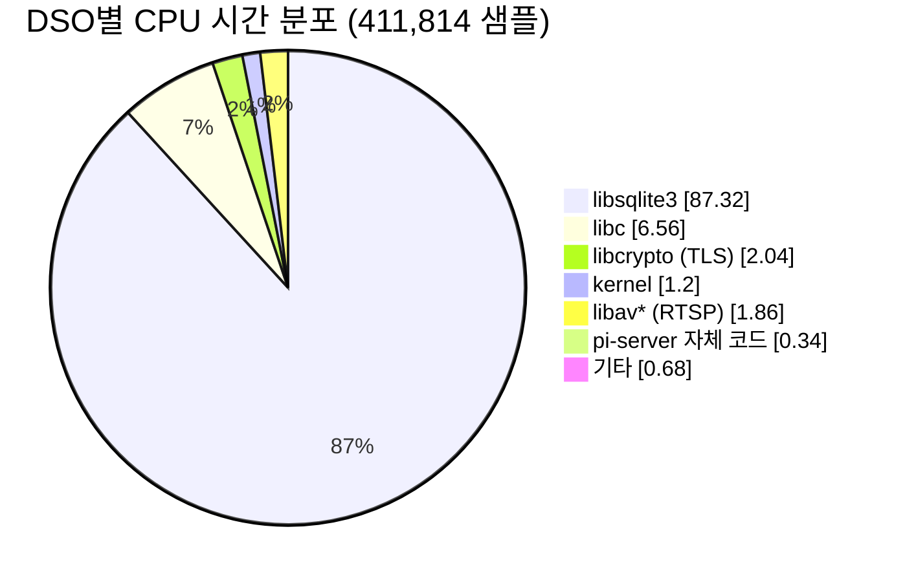
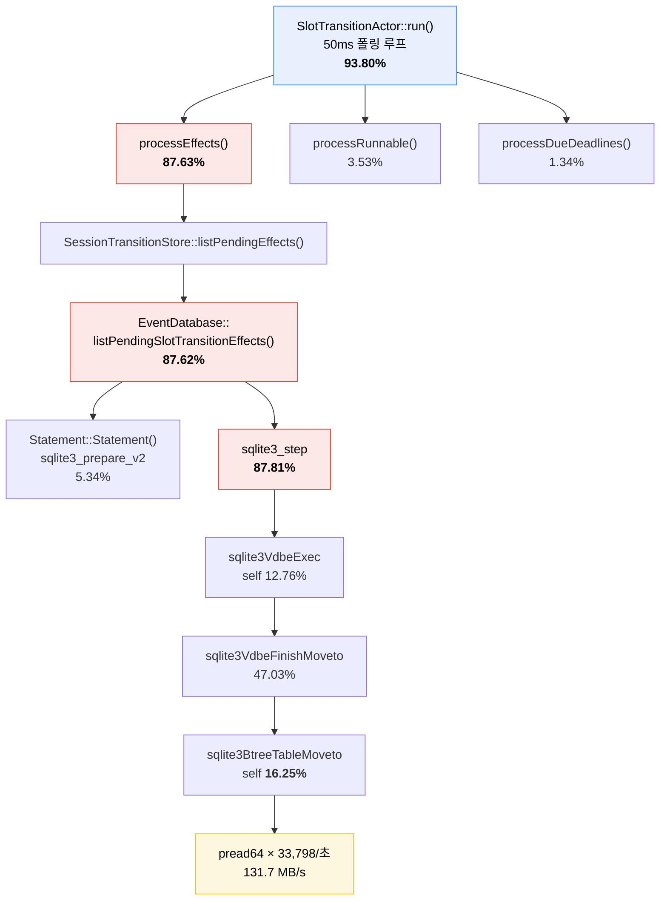
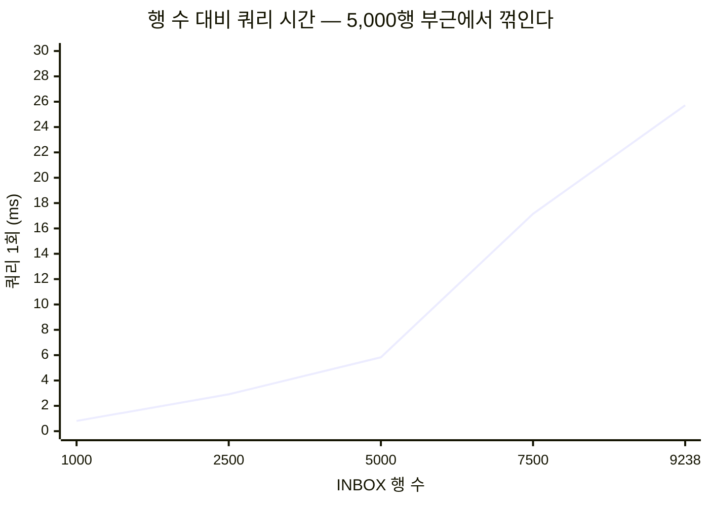
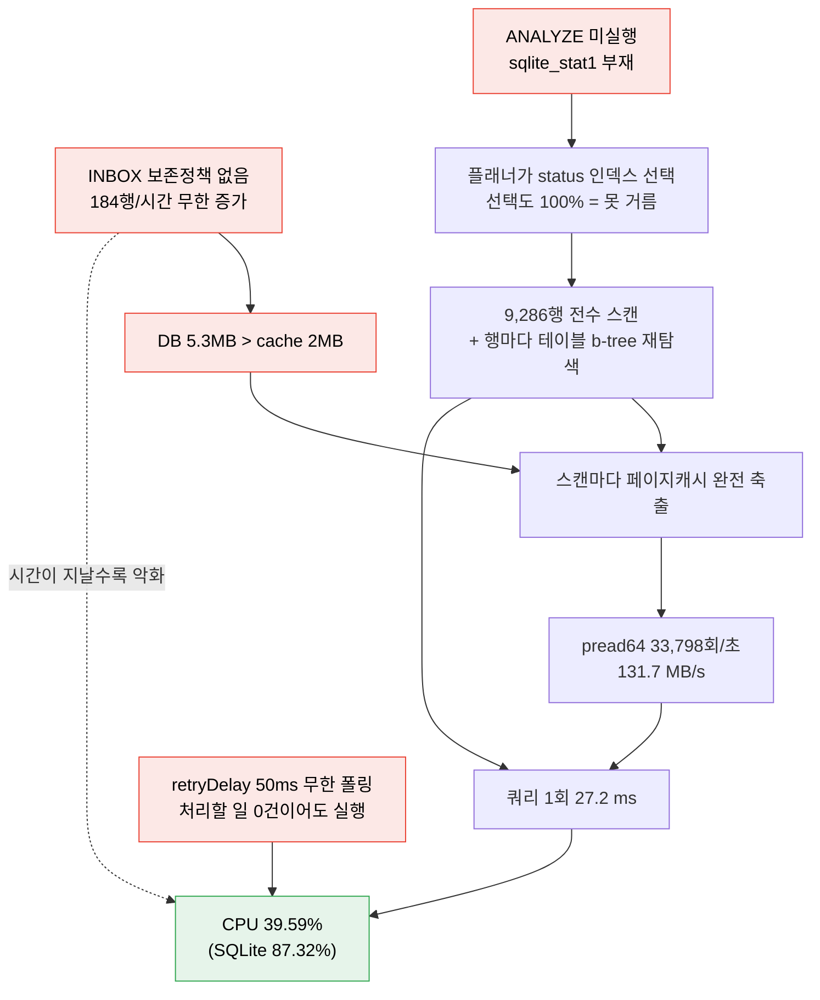
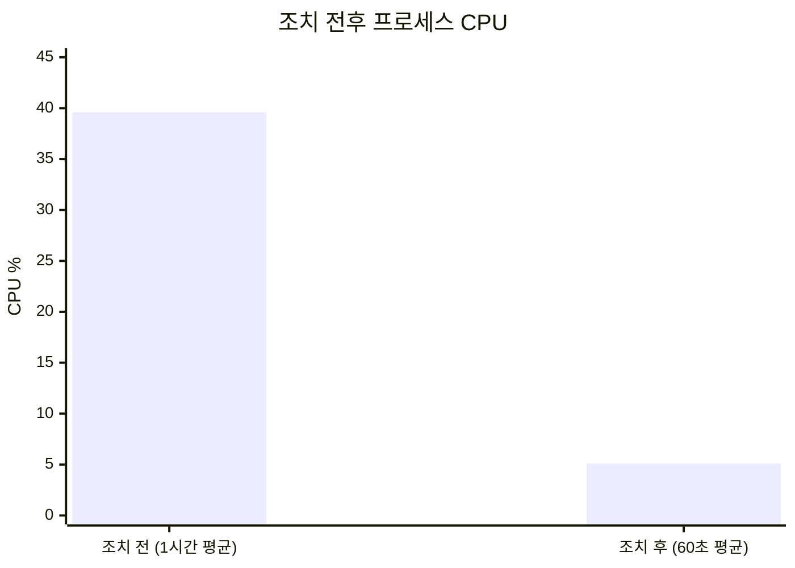

# Pi Server 성능 프로파일링 보고서 — 1시간 연속 측정

- 작성일: 2026-08-27
- 측정 구간: 2026-08-27 13:20:30 ~ 14:20:30 (KST), **3,600초 연속**
- 대상 바이너리: `cmake-build/pi-server` (Release, `-O3`, not stripped, 2026-08-27 13:01 빌드)
- 대상 프로세스: PID 1040817 (재컴파일·재시작 없이 attach)
- 대상 환경: **Raspberry Pi 4 Model B Rev 1.5 / 8GB / aarch64 / kernel 6.18.39+rpt-rpi-v8 / 4-core @ 1.8GHz**
- 도구: `perf record`/`perf report`, `/proc` 샘플러(자체 작성), `strace -c`, `sqlite3` CLI
- 작성자: shin75992@gmail.com
- 선행 문서: [`PERFORMANCE_PROFILING_REPORT.md`](./PERFORMANCE_PROFILING_REPORT.md) (2026-08-24, 30초 측정)

---

## 1. 배경 및 목적

선행 보고서는 30초 / 2,322 샘플로 측정되어 통계적 신뢰성이 부족했다. 본 보고서는 **동일 절차를 1시간으로 확장**하여 재측정하고, CPU·RAM에 더해 I/O·스레드·하드웨어 지표까지 포함한다. 또한 선행 보고서의 권고(§6)가 반영되지 않은 상태에서 부하가 어떻게 변했는지 추적한다.

### 요약

| 항목 | 2026-08-24 (30초) | 2026-08-27 (1시간) | 변화 |
|---|---|---|---|
| 프로세스 CPU | 7.7% | **39.59%** | **5.1배** |
| `OCCUPANCY_COMMAND_INBOX` 행 수 | 2,161 | **9,286** | 4.3배 |
| `libsqlite3` CPU 점유 | 87.60% | **87.32%** | 동일 |
| `sqlite_stat1` (ANALYZE 통계) | 없음 | **없음** | 미조치 |
| 핫 함수 1위 | `sqlite3BtreeTableMoveto` 15.75% | `sqlite3BtreeTableMoveto` **16.25%** | 동일 |

**프로파일의 "형상"은 30초 측정과 완전히 일치한다.** 즉 선행 보고서의 진단 자체는 옳았다. 달라진 것은 절대량이며, 조치가 없는 상태에서 데이터가 쌓이며 부하가 5배로 커졌다.

### 조치 결과 (§8)

본 보고서의 진단에 따라 조치를 적용하고 재측정했다.

| 지표 | 조치 전 | 조치 후 | 변화 |
|---|---|---|---|
| **프로세스 CPU** | **39.59%** | **5.09%** | **7.8배 감소** |
| read 대역폭 | 131.7 MB/s | 0.000 MB/s | 계측 하한 이하 |
| read syscall | 33,798 /초 | 17.8 /초 | **1,900배 감소** |
| `database is locked` 누적 77건의 원인 | `busy_timeout` 미적용 | **원인 제거** | 적용 확인, 재발 여부는 관찰 필요 |

> 다만 조치 과정에서 **§4.6의 최초 가설이 틀렸음**이 드러났다. 실제 원인은 PRAGMA 블록이 **사용되지 않는 생성자에만 있어 한 번도 실행되지 않은 것**이었다. 해당 절에 정정을 표기했고, 규명 과정은 §8.1에 있다.

---

## 2. 측정 방법

### 2.1 수집

```bash
# (1) CPU 프로파일 — 1시간, 299Hz, 콜그래프 포함
perf record -F 299 -p 1040817 -g -m 128 -o perf.data -- sleep 3600

# (2) 리소스 시계열 — 5초 간격 (/proc/PID/{stat,status,io} + /proc/{stat,meminfo,loadavg})
bash sampler.sh 1040817 . 3620 5

# (3) 집계
perf report -i perf.data --stdio -n -g none --sort=overhead,dso        # 라이브러리별
perf report -i perf.data --stdio -n -g none --sort=overhead,symbol     # 자기실행시간
perf report -i perf.data --stdio -n -g none --children --sort=symbol   # 누적(inclusive)

# (4) syscall 분포 — 측정 종료 후 핫스레드 한정
strace -c -p 1040840
```

> `-m 2048`은 `perf_event_mlock_kb=516` 제한에 걸려 실패했다. `-m 128`(기본값)로 수집했고 **lost sample은 0건**이다.

### 2.2 신뢰성 근거

| 근거 | 값 |
|---|---|
| perf 샘플 수 | **411,814개** (선행 측정의 177배) |
| Lost samples | **0** |
| 리소스 시계열 샘플 | **706개** × 18개 지표 |
| 스레드별 CPU 샘플 | 26스레드 × 58회 |

**교차검증 1 — 두 독립 측정의 CPU 일치**

```
perf 기준:  411,814 샘플 ÷ (299 Hz × 3,600 s) = 38.26%
/proc 기준:                                      39.59%
                                       차이  →   1.3%p
```

**교차검증 2 — 10분 구간별 안정성**

| 구간(분) | CPU% | user% | sys% | RSS(MB) | read(MB/s) | read syscall/s |
|---|---|---|---|---|---|---|
| 0–10 | 39.37 | 21.03 | 18.34 | 120.6 | 131.2 | 33,663 |
| 10–20 | 39.59 | 21.14 | 18.45 | 121.4 | 131.5 | 33,734 |
| 20–30 | 39.51 | 21.01 | 18.50 | 121.6 | 131.7 | 33,809 |
| 30–40 | 39.48 | 20.74 | 18.74 | 121.6 | 131.7 | 33,806 |
| 40–50 | 39.59 | 20.85 | 18.73 | 121.6 | 131.8 | 33,833 |
| 50–60 | **40.03** | 21.34 | 18.69 | 121.8 | 132.2 | 33,941 |

6개 구간 전체 편차가 **0.66%p**에 불과하다. 정상상태(steady state)가 확실히 확보됐다.

---

## 3. 측정 결과

### 3.1 CPU



<sub>막대 = 전체 CPU%, 선 = user 시간. 나머지가 system 시간(약 18.6%p).</sub>

| 통계 | 값 |
|---|---|
| 평균 | **39.59%** (1코어 기준 / 4코어 전체로는 9.9%) |
| user / system | 21.02% / **18.57%** |
| p05 / p50 / p95 / p99 / max | 38.2 / 39.4 / 41.8 / 42.6 / 47.0 |

**system 시간이 CPU의 47%를 차지하는 것이 이례적이다.** 일반적으로 이 정도 sys 비중은 디스크 I/O를 의미하지만, §3.3에서 보듯 **실제 디스크 접근은 0바이트**다.

### 3.2 메모리

| 지표 | 시작 | 종료 | 판정 |
|---|---|---|---|
| RSS | 120.5 MB | 125.0 MB | 초기 5분 내 121.6MB로 안정화 후 평탄 — **누수 없음** |
| VSZ | 1,412 MB | 2,002 MB | t=313s에 1회 계단식 증가 후 완전 평탄 (스레드 스택/아레나 예약) |
| Major fault | — | **0회 / 1시간** | 페이지 폴트로 디스크를 친 적 없음 |
| `VmSwap` | — | **0 kB** | 스왑 미사용 |
| MemAvailable | 5,335 MB | 5,188 MB | 여유 충분 |
| FD 개수 | 16 | 18 | **누수 없음** |
| 스레드 수 | 26 | 26 | 고정 |

**메모리는 문제가 아니다.** 8GB 중 1.6%만 사용하며 완전히 안정적이다.

#### 각주 — VSZ 2GB는 실제 메모리 사용량이 아니다

위 표의 VSZ가 2GB에 달해 오해하기 쉬우나, **실제 물리 메모리 사용량은 122MB다.** 두 지표는 측정 대상이 다르다.

| 지표 | 의미 |
|---|---|
| **VSZ** (Virtual Size) | 프로세스가 확보한 **주소 공간 번호표**의 총합. 물리 RAM과 무관하다. |
| **RSS** (Resident Set Size) | 그 주소 공간 중 **실제로 물리 페이지가 붙어 있는** 양. |

`/proc/1040817/maps`를 직접 집계한 결과:

```
전체 VSZ         = 1,955 MB
PROT_NONE(---p) = 1,397 MB  (328개 — 읽기·쓰기·실행 모두 불가)
실제 접근 가능    =   557 MB
실제 물리 (RSS)  =   122 MB
```

VSZ의 71%가 `---p` 권한, 즉 **접근하면 SIGSEGV가 나는 죽은 주소 공간**이다. 물리 페이지가 붙을 수 없으므로 페이지 테이블 엔트리조차 생성되지 않는다.

**정체는 glibc malloc의 스레드 아레나다.**

```
64MB급 아레나 예약  :  22개, 합계 1,372 MB   ← 대부분
소형(스레드 스택 가드): 306개, 합계    24 MB
```

스레드 26개가 malloc 락을 두고 경합하지 않도록 glibc가 스레드별 힙을 분리하며, 각 힙마다 64MB 주소 공간을 `mmap(PROT_NONE)`으로 선점한 뒤 필요할 때만 `mprotect`로 연다. 표의 "t=313s 계단식 증가"(+590MB)가 이 아레나 생성 시점이며, **같은 시점 RSS는 120.5 → 123.9MB로 3.4MB만 증가했다.**

이 예약이 실제로 소모하는 자원:

| 항목 | 값 | 판정 |
|---|---|---|
| 주소 공간 | 256 TB 중 **0.0007%** | 64비트에서 희소 자원이 아님 |
| VMA 커널 구조체 | 1,311개 × 약 200 B ≈ **260 KB** | 무시 가능 |
| 매핑 개수 | 1,311 / `vm.max_map_count` 1,048,576 = **0.13%** | 여유 |
| 페이지 테이블 | `---p`는 PTE **0개** | 비용 없음 |

`ps`/`top`의 VIRT(=VSZ) 컬럼이 리눅스에서 판단 근거로 부적합한 이유가 이것이다. 봐야 할 값은 RES(=RSS)다.

**공유 라이브러리를 감안한 실질 사용량은 더 적다** (`/proc/PID/smaps_rollup`):

| 항목 | 값 | 의미 |
|---|---|---|
| RSS | 122 MB | 물리 페이지가 붙은 총량 |
| **PSS** | **93 MB** | 공유 라이브러리를 타 프로세스와 분담한 실질 사용량 |
| Private_Dirty | 56 MB | 이 프로세스 고유 데이터 |
| Shared_Clean | 50 MB | `libsqlite3`, `libav*` 등 — 메모리 압박 시 즉시 회수 가능 |

> **참고 — 향후 감시 항목**: 아레나가 다수일 때 각 아레나의 free list가 분리되어 장기 구동 시 RSS 단편화가 누적될 수 있다. 다만 본 측정에서 RSS는 초기 5분 내 평탄해진 뒤 유지되어 **단편화 징후는 없다.** 며칠 구동 후 RSS가 지속 상승하는 경우에 한해 `MALLOC_ARENA_MAX=2~4` 적용을 검토한다. 현 시점에는 근거가 없으므로 조치하지 않는다.

### 3.3 I/O — 여기가 핵심이다

| 지표 | 값 |
|---|---|
| `rchar` (read 총량) | **131.7 MB/s** → **시간당 474 GB** |
| `syscr` (read 호출 수) | **33,798회/초** |
| `rchar ÷ syscr` | **4,088 바이트** ≈ `page_size` 4096 |
| `wchar` (write) | 8.79 KB/s (무시 가능) |
| **`read_bytes` (실제 디스크)** | **12,288 바이트** — 프로세스 생애 전체 |

읽기 요청은 시간당 474GB인데 **실제 SD카드에서 읽은 것은 12KB뿐이다.** 전량이 OS 페이지캐시 히트다. 즉 이것은 스토리지 병목이 아니라 **순수한 `pread64` 시스템콜 오버헤드**다.

핫스레드(TID 1040840) `strace -c` 집계:

```
% time     seconds  usecs/call     calls    errors syscall
------ ----------- ----------- --------- --------- ----------------
 94.80    2.456556           7    330995           pread64      ←
  3.91    0.101269         286       353       128 futex
  0.83    0.021518           6      3259           fcntl
  0.36    0.009244           7      1300      1300 newfstatat   ← 전부 ENOENT
  0.10    0.002623           4       650           fstat
```

`newfstatat`이 1,300회 전부 실패(ENOENT)하는 것은 SQLite가 롤백 저널 파일(`parking.db-journal`)의 존재를 매번 확인하기 때문이다. WAL 모드였다면 발생하지 않는다(§4.5).

### 3.4 스레드

26개 스레드 중 **단 1개가 프로세스 CPU의 92.7%를 소비한다.**

| TID | 1시간 평균 CPU | 비중 | 정체 |
|---|---|---|---|
| **1040840** | **35.79%** | **92.7%** | `SlotTransitionActor::run()` 워커 |
| 1040845 | 1.29% | 3.3% | RTSP/디코딩 |
| 나머지 24개 | 각 0.18% 이하 | 4.0% | — |
| 합계 | 38.60% | 100% | |

컨텍스트 스위치는 voluntary 392회/초, **nonvoluntary 7.4회/초**로 락 경합이나 스케줄링 압박은 없다.

### 3.5 하드웨어 — 전부 정상

Pi4에서 흔한 함정(발열/전원/SD카드)을 모두 확인했으나 **해당 없음**이다.

| 항목 | 실측 | 판정 |
|---|---|---|
| CPU 온도 | 42.8 °C | ✅ 여유 |
| `vcgencmd get_throttled` | **`0x0`** | ✅ 스로틀링·언더볼티지 이력 **없음** |
| ARM 클럭 | 1,800,000 Hz = `cpuinfo_max_freq` | ✅ 최대 클럭 유지 |
| 스왑 (프로세스) | 0 kB | ✅ |
| SD카드 읽기 | 12 KB (생애 전체) | ✅ |

**결론: 하드웨어 병목은 존재하지 않는다. 100% 소프트웨어 문제다.**

### 3.6 라이브러리(DSO)별 CPU 시간



| 비중 | 샘플 수 | 대상 |
|---|---|---|
| **87.32%** | 360,214 | `libsqlite3.so.0.8.6` |
| 6.56% | 27,846 | `libc.so.6` |
| 2.04% | 5,567 | `libcrypto.so.3` |
| 1.20% | 5,024 | `[unknown]` (커널) |
| 0.76% / 0.74% / 0.36% | 3,698 / 3,643 / 1,783 | `libavformat` / `libavcodec` / `libavutil` |
| **0.34%** | **1,591** | **`pi-server` 자체 코드** |
| 0.15% | 669 | `libcpp-httplib` |
| 0.13% | 588 | `libstdc++` |
| 0.03% | 181 | `libmosquitto` |
| **0.00%** | **0** | **`libopencv_imgcodecs`** |

주목할 점:

- **애플리케이션 코드는 0.34%**다. C++ 코드를 아무리 최적화해도 얻을 것이 없다.
- **RTSP 디코딩(`libav*`)은 합쳐서 1.86%, OpenCV는 0.00%**다. 영상 처리는 병목이 아니다.

### 3.7 Flat Profile — 자기실행시간 상위

```
sqlite3BtreeTableMoveto            ████████████████▎ 16.25%  (67,053)
sqlite3VdbeExec                    ████████████▊     12.76%  (52,753)
sqlite3VdbeOneByteSerialTypeLen    ███▋               3.72%  (15,385)
sqlite3GetVarint                   ██▋                2.69%  (11,130)
sqlite3VdbeRecordCompareWithSkip   ██                 2.03%   (8,400)
sqlite3VdbeMemFromBtreeZeroOffset  █▊                 1.75%   (7,262)
sqlite3GetVarint32                 █▎                 1.26%   (5,187)
sqlite3VdbeIdxRowid                █▎                 1.25%   (5,169)
memcmp                             █▏                 1.22%   (5,045)
sqlite3PcacheRelease               █▏                 1.17%   (4,836)
sqlite3BtreePayloadSize            ▊                  0.81%   (3,337)
sqlite3BtreeNext                   ▋                  0.70%   (2,888)
sqlite3PcacheFetchFinish           ▋                  0.70%   (2,894)
sqlite3Parser                      ▍                  0.44%   (1,758)
```

상위 14개 중 13개가 SQLite B-tree 탐색·레코드 디코딩 함수다. `sqlite3BtreeTableMoveto`(rowid로 테이블 b-tree를 탐색)가 1위라는 것은 **인덱스에서 얻은 rowid로 테이블 본체를 다시 찾아가는 작업이 반복되고 있음**을 뜻한다.

### 3.8 누적(Inclusive) 프로파일 — 실제 비용의 소재

`--children` 집계는 각 함수가 호출한 모든 하위 함수를 포함한 총 비용을 보여준다. **이것이 원인 특정의 결정적 데이터다.**

| 누적 % | 자기 % | 함수 |
|---|---|---|
| **93.80%** | 0.01% | `parking::SlotTransitionActor::run()` |
| **87.63%** | 0.01% | ┗ `SlotTransitionActor::processEffects(long)` |
| **87.62%** | 0.01% | 　┗ `EventDatabase::listPendingSlotTransitionEffects(long)` |
| 87.81% | 0.02% | 　　┗ `sqlite3_step` |
| 87.55% | 12.76% | 　　　┗ `sqlite3VdbeExec` |
| 47.03% | 0.55% | 　　　　┗ `sqlite3VdbeFinishMoveto` |
| **46.46%** | **16.25%** | 　　　　　┗ `sqlite3BtreeTableMoveto` |
| 5.44% | 0.04% | `sqlite3RunParser` |
| **5.34%** | 0.00% | ┗ `database::Statement::Statement()` (매 호출 재파싱) |
| 3.53% | 0.01% | `SlotTransitionActor::processRunnable(long)` |
| 2.65% | 0.00% | `httplib::SSLServer::process_and_close_socket(int)` |
| 1.34% | 0.00% | `SlotTransitionActor::processDueDeadlines(long)` |



**전체 CPU의 87.6%가 `listPendingSlotTransitionEffects()` 단 하나의 함수에서 나온다.**

---

## 4. 근본 원인 분석

### 4.1 문제의 쿼리

`src/database/EventDatabaseOccupancy.cpp:1585`

```sql
SELECT command_id, source_kind, slot_id, sensor_id, occurred_at, payload_json,
       occupancy_attempt_id, correlation_id, observation_generation,
       result_code, result_session_id
  FROM OCCUPANCY_COMMAND_INBOX c
 WHERE c.status = 'APPLIED'
   AND c.effect_state = 'PENDING'
   AND c.effect_next_attempt_at_epoch_ms <= ?
   AND NOT EXISTS (
         SELECT 1 FROM OCCUPANCY_COMMAND_INBOX earlier
          WHERE earlier.slot_id = c.slot_id
            AND earlier.status = 'APPLIED'
            AND earlier.effect_state = 'PENDING'
            AND earlier.admission_ordinal < c.admission_ordinal)
 ORDER BY c.admission_ordinal;
```

호출 위치는 `SlotTransitionActor::run()`(`src/parking/SlotTransitionActor.cpp:425`)이며, **처리할 일이 없어도 `retryDelay`(기본 50ms) 주기로 무한 반복**된다.

### 4.2 데이터 분포 — 조건이 전혀 걸러내지 못한다

```
$ sqlite3 data/db/parking.db "SELECT status, effect_state, COUNT(*) ... GROUP BY 1,2;"
APPLIED|NONE    |9148
APPLIED|APPLIED | 138
```

| 조건 | 매칭 행 수 | 선택도 |
|---|---|---|
| `status = 'APPLIED'` | **9,286 / 9,286** | **100% — 전혀 못 거름** |
| `effect_state = 'PENDING'` | **0 / 9,286** | **100% 걸러냄** |

즉 올바른 인덱스를 쓰면 **0행에서 즉시 끝나야 하는 쿼리**다.

### 4.3 원인 ① — 쿼리 플래너가 반대 인덱스를 선택한다

두 인덱스가 후보로 존재한다.

```sql
CREATE INDEX idx_occupancy_inbox_runnable
    ON OCCUPANCY_COMMAND_INBOX(status, slot_id, admission_ordinal, next_attempt_at_epoch_ms);
CREATE INDEX idx_occupancy_effect_pending
    ON OCCUPANCY_COMMAND_INBOX(effect_state, slot_id, admission_ordinal, effect_next_attempt_at_epoch_ms);
```

실제 선택된 플랜:

```
QUERY PLAN
|--SEARCH c USING INDEX idx_occupancy_inbox_runnable (status=?)          ← 9,286행 전부
|--CORRELATED SCALAR SUBQUERY 1
|  `--SEARCH earlier USING INDEX idx_occupancy_inbox_runnable (status=? AND slot_id=? AND admission_ordinal<?)
`--USE TEMP B-TREE FOR ORDER BY
```

`effect_state`는 이 인덱스에 없으므로, 9,286개 인덱스 엔트리 각각에 대해 **rowid로 테이블 b-tree를 다시 탐색**해서 `effect_state` 값을 읽어야 한다. 이것이 `sqlite3BtreeTableMoveto`가 자기실행시간 1위(16.25%)인 이유다.

**원인: `ANALYZE`가 한 번도 실행되지 않아 `sqlite_stat1` 테이블이 존재하지 않는다.** 통계가 없으면 SQLite는 두 인덱스 모두에 동일한 기본 추정치를 적용하고, 사실상 임의로 선택한다. 코드 전체에 `ANALYZE`나 `PRAGMA optimize` 호출이 없다.

> ⚠️ 선행 보고서(2026-08-24)가 동일한 원인을 지목하고 `ANALYZE`를 실행해 검증했으나, 그 통계는 이후 DB 교체/복원 과정에서 유실됐고 코드 수정은 이루어지지 않았다. 본 측정 시점에 `sqlite_stat1`은 다시 존재하지 않는다.

### 4.4 원인 ② — page cache가 DB보다 작아 스캔마다 전체를 다시 읽는다

| 항목 | 값 |
|---|---|
| `PRAGMA page_size` | 4,096 B |
| `PRAGMA page_count` | 1,296 → **5.3 MB** |
| `PRAGMA cache_size` | **-2000 → 2,000 KiB (500 페이지)** |

**DB(1,296페이지)가 캐시(500페이지)의 2.6배다.** 따라서 한 번 스캔할 때마다 캐시가 완전히 밀려나고, 다음 스캔은 처음부터 다시 `pread64`를 호출한다.

행 수를 바꿔가며 쿼리 시간을 재보면 이 임계점이 그대로 드러난다.



| 행 수 | 쿼리 시간 | 행당 비용 | 구간 |
|---|---|---|---|
| 1,000 | 0.810 ms | 0.81 µs | 캐시 안에 들어감 |
| 2,500 | 2.910 ms | 1.16 µs | 캐시 안에 들어감 |
| 5,000 | 5.830 ms | **1.17 µs** | 임계점 |
| 7,500 | 17.150 ms | **2.29 µs** | **캐시 초과 — 스래싱 시작** |
| 9,238 | 25.720 ms | **2.78 µs** | 스래싱 심화 |

5,000행까지는 행당 1.17 µs로 완전히 선형이다가, 캐시 512페이지를 넘기는 순간 **기울기가 2.4배로 꺾인다.**

**이 해석의 결정적 증거**: 캐시만 40MB로 올리면(§5 케이스 C) 9,238행에서 11.34 ms = **행당 1.23 µs**로, 꺾이기 전 기울기(1.17 µs)로 정확히 되돌아온다. 즉 초과분은 전부 페이지캐시 스래싱 비용이다.

### 4.5 원인 ③ — INBOX에 보존정책이 없어 무한히 커진다

```
$ sqlite3 ... "SELECT source_kind, COUNT(*), MIN(created_at), MAX(created_at) ... GROUP BY 1;"
CAMERA_OBSERVATION | 75   | 2026-08-25 04:50:13 | 2026-08-27 00:02:52
EXIT_DEADLINE      | 10   | 2026-08-25 05:37:13 | 2026-08-27 00:03:02
HALL_OBSERVATION   | 9153 | 2026-08-25 02:51:39 | 2026-08-27 04:21:27
```

`HALL01`/`HALL02` 두 센서가 **30초마다 각각 1행씩** 삽입한다. 코드 전체를 검색해도 `DELETE FROM OCCUPANCY_COMMAND_INBOX`가 존재하지 않는다.

| 지표 | 값 |
|---|---|
| 이력 평균 증가율 | **184.1 행/시간** (50.4시간 / 9,286행) |
| 측정 1시간 중 증가 | +50행 |
| 일 환산 | 약 **4,400 행/일** |

**모든 행이 `status='APPLIED'`인 종결 상태이며 다시 조회될 일이 없는데도 영구히 남아, 매 50ms마다 풀스캔 대상이 된다.**

### 4.6 원인 ④ — `journal_mode = WAL`이 조용히 실패했다

`src/database/EventDatabaseTimer.cpp:219`

```cpp
executeSqlUnlocked("PRAGMA busy_timeout = 3000;");
executeSqlUnlocked("PRAGMA journal_mode = WAL;");
```

그러나 실제 DB는:

```
$ sqlite3 data/db/parking.db "PRAGMA journal_mode;"
delete
$ ls data/db/parking.db-wal data/db/parking.db-shm
(존재하지 않음)
```

> ⚠️ **정정 (2026-08-27)**: 본 절은 최초 작성 시 원인을 `executeSqlUnlocked`가 `sqlite3_exec`의 반환 행(적용된 journal_mode)을 검사하지 않아 **조용히 실패**한 것으로 추정했다. **이 추정은 틀렸다.** §9.1에서 규명한 실제 원인은 **이 코드가 애초에 실행되지 않는다**는 것이다. 아래는 정정된 분석이다.

**실제 원인: PRAGMA 블록이 사용되지 않는 생성자에만 있었다.**

`EventDatabase`에는 생성자가 두 개 있다.

```cpp
// include/database/EventDatabase.hpp:133-134
EventDatabase();                                            // ← 서버가 쓰는 것
explicit EventDatabase(const std::filesystem::path& path);  // ← PRAGMA가 있던 것
```

그런데 서버는 기본 생성자 + `open()` 경로를 쓴다.

```cpp
// src/main.cpp:384-386
database::EventDatabase database;          // ← 기본 생성자
if (!database.open(config.db_path)) {      // ← open()만 따로 호출
```

따라서 PRAGMA 블록은 **한 번도 실행된 적이 없다.** 링커가 미사용으로 판단해 문자열 리터럴까지 제거했으며, 이는 바이너리에서 직접 확인된다.

```
$ strings cmake-build/pi-server | grep PRAGMA
PRAGMA table_info(
PRAGMA foreign_key_check;
PRAGMA foreign_keys = OFF;
PRAGMA foreign_keys = ON;
        ← busy_timeout도 journal_mode도 없다
```

**파급 범위는 WAL에 그치지 않는다.** 같은 블록의 `PRAGMA busy_timeout = 3000;`도 적용되지 않아 **busy_timeout이 0**이었다. 즉 락 경합이 발생하면 3초 재시도가 아니라 **즉시 `SQLITE_BUSY`**를 반환한다. 운영 로그에 `database is locked` 오류가 **77건** 기록된 원인이다.

```
$ awk '...' data/logs/pi-server.log   # 발생 시점별 집계 (UTC)
2026-08-18T02    1건   ← 최초
2026-08-25T01~11 14건
2026-08-26T02   37건   ← 최다
2026-08-27T05    2건
```

§3.3의 `newfstatat` 1,300회 ENOENT(롤백 저널 탐색)도 동일한 원인의 증상이다.

### 4.7 원인 ⑤ — prepared statement를 매번 재파싱한다

`src/database/EventDatabaseOccupancy.cpp:23`의 `Statement` RAII 래퍼는 생성 시 `sqlite3_prepare_v2`, 소멸 시 `sqlite3_finalize`를 호출한다. 캐시가 없어 **동일한 SQL 문자열을 초당 약 76회 재파싱**한다.

누적 프로파일 기준 **`Statement::Statement()` = 5.34%**, `sqlite3RunParser` = 5.44%. 이 비용은 쿼리 자체를 고쳐도 남는다.

부수적으로 `admitDueSlotDeadlines`(`EventDatabaseOccupancy.cpp:461`)는 **처리할 마감이 없어도 매 반복마다 `BEGIN IMMEDIATE` / `COMMIT`**을 실행한다.

### 4.8 정합성 교차검증

독립적으로 얻은 세 수치가 서로를 검증한다.

**① 쿼리 실행 빈도**

```
processEffects 누적 비중 87.63% × 프로세스 CPU 39.59%  =  34.69% CPU
                                                       =  347 ms CPU / 초

347 ms/s  ÷  27.2 ms/쿼리 (실측)  =  12.75 회/초
루프 주기  =  1 / 12.75  =  78.4 ms
           =  27.2 ms (쿼리)  +  50 ms (retryDelay)  +  1.2 ms (기타 SQL)
```

**설정값 `retryDelay = 50ms`(`src/sensor/HallParkingService.cpp:147`)와 정확히 일치한다.**

**② 페이지 읽기량**

```
33,798 pread/s  ÷  12.75 쿼리/s  =  2,651 페이지 / 쿼리
DB 전체                          =  1,296 페이지
                                 →  쿼리 1회마다 DB 전체를 2.05번 읽는다
```

**③ 대역폭**

```
33,798 pread/s × 4,096 B ÷ 1,048,576 = 132.0 MiB/s   (계산)
rchar 실측                            = 131.7 MiB/s   (오차 0.2%)
```

`/proc/PID/io`의 `rchar`(바이트 총량)와 `syscr`(호출 횟수)는 커널이 독립적으로 집계하는 값인데, 그 비율이 페이지 크기와 0.2% 오차로 일치한다. **읽기 트래픽이 사실상 전부 4KB 페이지 단위 `pread64`임이 확정된다.**

### 4.9 인과 사슬



---

## 5. 개선안 벤치마크

라이브 DB를 `.backup`으로 안전 복사(9,238행)한 사본에서 측정했다. 시작 오버헤드를 제거하기 위해 **per-query = (T(300회) − T(150회)) / 150**으로 산출했다.

| 케이스 | 조치 | 쿼리 1회 | 개선 | 선택된 인덱스 |
|---|---|---|---|---|
| **A** | 현재 배포 상태 | **27.213 ms** | 기준 | `idx_occupancy_inbox_runnable` ❌ |
| **B** | `ANALYZE`만 | **0.213 ms** | **128×** | `idx_occupancy_effect_pending` ✅ |
| **C** | `cache_size=-40000`만 | 11.340 ms | 2.4× | `idx_occupancy_inbox_runnable` ❌ |
| **D** | **`ANALYZE` + `cache_size`** | **0.147 ms** | **185×** | `idx_occupancy_effect_pending` ✅ |
| E | 부분 인덱스 + `ANALYZE` | 25.640 ms | 1.06× | `idx_occupancy_inbox_runnable` ❌ |
| F | E + `cache_size` | 12.027 ms | 2.3× | `idx_occupancy_inbox_runnable` ❌ |

```
A  현재 상태          ███████████████████████████  27.213 ms
C  cache_size만       ███████████                  11.340 ms
B  ANALYZE만          ▏                             0.213 ms
D  ANALYZE + cache    ▏                             0.147 ms
```

### 케이스 E/F는 왜 실패했나

`effect_state='PENDING'` 조건의 부분 인덱스를 추가했으나 플래너가 채택하지 않았다. `ANALYZE` 결과를 보면 이유가 드러난다.

```
$ sqlite3 e.db "SELECT idx, stat FROM sqlite_stat1 WHERE tbl='OCCUPANCY_COMMAND_INBOX';"
idx_occ_effect_pending_partial | 0 0 0          ← 엔트리 0개
idx_occupancy_inbox_runnable   | 9238 9238 1848 1 1
idx_occupancy_effect_pending   | 9238 4619 924 1 1
```

`effect_state='PENDING'`인 행이 0개라 부분 인덱스가 비어 있고, `sqlite_stat1`에 `0 0 0`으로 기록되어 플래너가 이를 유효한 후보로 취급하지 않는다. **기존 인덱스(`idx_occupancy_effect_pending`)만으로 이미 0.147ms가 나오므로 새 인덱스는 불필요하다.**

### CPU 환산

케이스 D 적용 시 루프 주기는 78.4 ms → 50.1 ms로 짧아지므로 호출 빈도는 12.75 → 19.96 회/초로 **늘어난다.** 그럼에도:

```
19.96 회/s × 0.147 ms = 2.9 ms CPU/s = 0.29% CPU
                        (현재 34.69% 대비 약 120분의 1)
```

**프로세스 전체 CPU는 39.59% → 약 5% 수준으로 감소할 것으로 예상된다.** (잔여는 statement 재파싱 5.34%, TLS 2.65%, RTSP 1.86% 등)

---

## 6. 확장성 예측 — 조치하지 않으면

§4.4의 실측 곡선(행당 2.78 µs, 캐시 초과 구간)과 증가율 184행/시간을 적용한 예측이다.

| INBOX 행 수 | 도달 시점 | 쿼리 1회 | 루프 주기 | CPU (예상) |
|---|---|---|---|---|
| 9,286 (현재) | — | 27.2 ms | 78 ms | **39.6%** (실측) |
| 20,000 | 약 2.4일 후 | 약 56 ms | 106 ms | 약 53% |
| 50,000 | 약 9.2일 후 | 약 139 ms | 189 ms | 약 74% |
| 100,000 | 약 20.5일 후 | 약 278 ms | 328 ms | 약 85% |

루프가 `retryDelay` 50ms를 항상 대기하므로 CPU는 100%에 점근할 뿐 포화하지는 않는다. **그러나 대신 지연이 커진다** — 점유 상태 변화가 반영되기까지의 지연이 현재 78ms에서 100,000행 시점에는 **328ms로 4배 이상 늘어난다.** 이는 주차 슬롯 점유 반영 지연으로 직접 체감된다.

> 예측은 단일 요인(행 수) 외삽이므로 오차 범위가 있다. 다만 §4.4에서 측정한 곡선이 캐시 초과 구간에서 이미 초선형(superlinear)이므로, **실제 악화는 위 표보다 빠를 가능성이 높다.**

---

## 7. 권장 조치

### 반영 현황 요약

| 항목 | 상태 | 비고 |
|---|---|---|
| 1-1 `PRAGMA optimize` | ✅ 적용 | §8.2 |
| 1-2 `cache_size = -40000` | ✅ 적용 | §8.2 |
| 2-1 INBOX 보존정책 | ❌ **미적용** | 근본 원인. 별도 작업 필요 |
| 2-2 WAL 실적용 검증 | ✅ 적용 | 검증 로그 추가 |
| 3-1 statement 캐시 | ❌ 미적용 | **현재 최대 비용 (51.90%)** |
| 3-2 무의미한 `BEGIN IMMEDIATE` 생략 | ❌ 미적용 | |
| 3-3 폴링 → 이벤트 구조 전환 | ❌ 미적용 | |
| 3-4 TLS 세션 재사용 | ❌ 미적용 | |
| 4 조치 후 검증 | ⚠️ 부분 | 60초 측정으로 대체 (원안은 1시간) |

**8개 개선안 중 3개 적용, 5개 미적용.** 적용된 3개만으로 CPU 39.59% → 5.09%가 달성됐으나, **재발 방지에 해당하는 2-1은 미적용 상태다**(§8.7).

### 우선순위 1 — 즉시 적용 (수 줄, 위험 낮음)

**✅ 적용 완료 (2026-08-27)** — 단, 최초 시도는 실패했다. 상세는 §8.1~8.2.

최종 형태는 `EventDatabase::applyConnectionPragmasUnlocked()`이며 `open()`에서 호출된다. 아래는 최초에 제안했던 형태로, **이 위치(경로 생성자)에 넣으면 서버에는 적용되지 않는다**(§4.6 정정).

```cpp
// ⚠️ 최초 제안 — 이 생성자는 서버가 사용하지 않아 무효였다
executeSqlUnlocked("PRAGMA busy_timeout = 3000;");
executeSqlUnlocked("PRAGMA journal_mode = WAL;");
executeSqlUnlocked("PRAGMA optimize;");             // 추가
executeSqlUnlocked("PRAGMA cache_size = -40000;");  // 추가 (40MB)
```

**1-1. `PRAGMA optimize`** — `sqlite_stat1` 통계가 없거나 낡았을 때만 `ANALYZE`를 수행하므로, 명시적 `ANALYZE;`보다 안전하고 재시작마다 통계를 최신으로 유지한다.

> **검증**: `PRAGMA optimize`는 "현재 연결에서 사용된 테이블"만 대상으로 한다는 제약이 있어, 연결 오픈 직후 호출이 무효가 될 우려가 있었다. SQLite 3.46.1 사본에서 실측한 결과 **통계가 전무한 DB에 대해서는 오픈 직후 호출로도 정상 생성**되며 쿼리 플랜이 즉시 전환됨을 확인했다.
>
> ```
> $ sqlite3 t1.db "PRAGMA optimize;"
> $ sqlite3 t1.db "EXPLAIN QUERY PLAN <query>"
> |--SEARCH c USING INDEX idx_occupancy_effect_pending (effect_state=?)   ✅
> ```
>
> 오픈 시 비용: 통계 없는 최초 1회 약 9 ms, 이후 재시작 시 약 0 ms.

**1-2. `cache_size = -40000` (40MB)** — DB 5.3MB 대비 충분한 여유이며, 8GB 중 5GB가 유휴이므로 메모리 부담이 없다. 1-1과 독립적으로 2.4배 효과가 있다.

**두 줄 동시 적용 실측**: 쿼리 27.213 ms → **0.16 ms (약 170배)**

```
T(150회) = 32 ms,  T(300회) = 56 ms  →  (56-32)/150 = 0.16 ms/query
```

§5 케이스 D(명시적 `ANALYZE` + `cache_size`, 0.147 ms)와 사실상 동일하다. `PRAGMA optimize`의 표본 기반 통계(`9238 2001 1001 1 1`)가 전수 `ANALYZE`의 통계(`9238 9238 1848 1 1`)와 수치는 다르지만, **플래너가 올바른 인덱스를 고르게 하는 목적은 동일하게 달성된다.**

### 우선순위 2 — 구조적 조치 (재발 방지)

**2-1. `OCCUPANCY_COMMAND_INBOX` 보존정책 도입** — ❌ **미적용**

1-1/1-2만 적용하면 지금은 해결되지만 **테이블은 계속 커진다.** 종결 상태(`status='APPLIED' AND effect_state IN ('NONE','APPLIED')`) 행을 일정 기간(예: 7일) 후 삭제하는 주기 작업이 필요하다. `entrance_failure_retention_hours`와 동일한 패턴을 적용할 수 있다.

**2-2. `journal_mode = WAL` 실제 적용 여부 검증** — ✅ **적용 완료**

`sqlite3_prepare_v2` + `sqlite3_step`으로 반환된 모드를 직접 읽어 `wal`/`memory`가 아니면 경고 로그를 남기도록 구현했다(§8.2). 재시작 후 `[INFO] DB journal_mode = wal`이 기록되어 동작이 확인됐다.

### 우선순위 3 — 추가 최적화 — ❌ **전부 미적용**

조치 후 재측정(§8.5)으로 비중이 갱신됐다. 우선순위가 바뀌었다.

| 대상 | 조치 전 비중 | **조치 후 비중** | 조치 |
|---|---|---|---|
| statement 재파싱 | 5.34% | **51.90%** ← 최대 | `sqlite3_stmt*` 캐시 도입 (준비된 문장 재사용 + `sqlite3_reset`) |
| 무의미한 트랜잭션 | — | `processDueDeadlines` 15.57% | `admitDueSlotDeadlines`에서 처리 대상이 0건이면 `BEGIN IMMEDIATE` 생략 |
| 폴링 구조 | — | — | 50ms 고정 폴링 대신 이벤트/조건변수 기반 wake-up으로 전환 |
| TLS 핸드셰이크 | 2.65% | `libcrypto` 6.99% | `httplib::SSLServer` 세션 재사용 / keep-alive 확인 |

단 절대 CPU로는 statement 재파싱이 2.64%이므로(§8.6), 전체 5.09%에서 얻을 수 있는 여지는 2%p 남짓이다. **실익 대비 우선순위는 2-1(보존정책)이 더 높다.**

### 우선순위 4 — 조치 후 검증 — ⚠️ **부분 완료**

- [x] `libsqlite3` DSO 비중이 87.32%에서 크게 감소했는가 → **62.29%**
- [x] `sqlite3BtreeTableMoveto` 자기실행시간이 16.25%에서 감소했는가 → **0.22%** (74배 감소, 1위 → 순위권 밖)
- [x] `syscr`이 33,798회/초에서 감소했는가 → **17.8회/초** (1,900배 감소)
- [x] `EXPLAIN QUERY PLAN`이 `idx_occupancy_effect_pending`을 선택하는가 → **전환 확인**
- [x] 프로세스 CPU가 39.59%에서 5% 내외로 감소했는가 → **5.09%**
- [ ] **1시간 재측정** — 미실시. 사후 측정은 **60초**로만 수행했다(§8).

> **미완료 항목**: 원안은 조치 전과 동일하게 1시간 측정을 요구했으나, 실제 사후 측정은 60초(13샘플, perf 854샘플)에 그쳤다. 60초 구간의 편차가 0.6%p로 작고 perf와 `/proc`이 0.33%p 내로 일치하므로 **CPU 수치 자체는 신뢰할 수 있으나**, 다음은 확인되지 않았다.
>
> - 장시간 RSS 추이 (WAL 전환 후 메모리 거동)
> - WAL 파일 증가 및 체크포인트 동작
> - `database is locked` 재발 여부 (§8.7)
> - 드물게 발생하는 부하 패턴
>
> 안정성 확인을 위해 동일 절차의 1시간 측정을 별도로 수행할 것을 권장한다.

---

## 8. 조치 및 사후 측정

- 브랜치: `fix/optimization-pi_EVDA-241`
- 측정: 2026-08-27 15:06:26 ~ 15:07:27 (KST), 60초, 재시작 후 30초 워밍업
- 대상: PID 1121491 (동일 바이너리 경로, 동일 DB, 동일 하드웨어)

### 8.1 1차 시도의 실패 — PRAGMA를 넣었는데 적용되지 않았다

우선순위 1(§7)에 따라 `EventDatabaseTimer.cpp`의 경로 생성자에 `PRAGMA optimize`와 `PRAGMA cache_size`를 추가하고 빌드·재시작했으나, **아무것도 바뀌지 않았다.**

```
sqlite_stat1 : 없음
journal_mode : delete
쿼리 플랜     : idx_occupancy_inbox_runnable  (그대로)
```

원인 추적 결과가 §4.6의 정정 내용이다. **서버는 그 생성자를 쓰지 않는다.** 기존 `busy_timeout`/`journal_mode`가 수개월간 적용되지 않고 있던 것도 같은 이유였다.

> **교훈**: "코드에 있다"와 "실행된다"는 다르다. 이번 건은 `strings <바이너리> | grep PRAGMA`로 5초 만에 판별됐다. 설정성 코드를 추가한 뒤에는 **런타임에서 실제 적용 여부를 확인**해야 한다.

### 8.2 최종 조치 — 연결 정책을 `open()`으로 이전

| 파일 | 변경 |
|---|---|
| `include/database/EventDatabase.hpp` | private `applyConnectionPragmasUnlocked() noexcept` 선언 추가 |
| `src/database/EventDatabaseTimer.cpp` | 경로 생성자의 PRAGMA 블록을 헬퍼로 이전, `journal_mode` 실적용값 검증 추가 |
| `src/database/EventDatabase.cpp` | `open()`에서 `opened_ = true` 직후 헬퍼 호출 |

어느 생성자를 거치든 `open()`은 반드시 통과하므로, 원래 주석이 의도했던 "메인 서버와 타이머가 동일한 연결 정책을 공유한다"가 복원된다.

적용되는 PRAGMA 4종:

```cpp
exec("PRAGMA busy_timeout = 3000;");   // database is locked 재발 방지
exec("PRAGMA journal_mode = WAL;");    // 읽기/쓰기 상호 차단 해소
exec("PRAGMA optimize;");              // 쿼리 플래너 통계
exec("PRAGMA cache_size = -40000;");   // 40MB
```

설계 판단 두 가지:

1. **PRAGMA 실패를 DB 열기 실패로 만들지 않았다.** 기존 생성자는 실패 시 `close()` 후 throw했으나, 이를 `open()`에 그대로 옮기면 지금까지 정상 동작하던 환경에서 DB 열기가 실패할 수 있다. 넷 다 성능·동시성 튜닝이며 정확성 요건이 아니므로 `noexcept`로 두고 경고 로그만 남긴다.
2. **`journal_mode` 실적용값을 읽어 검증한다.** `PRAGMA journal_mode`는 전환 실패 시에도 `sqlite3_exec`이 `SQLITE_OK`를 반환하므로(§4.6 최초 가설이 지적했던 성질 자체는 사실이다), 반환된 모드를 직접 읽어 `wal`/`memory`가 아니면 경고한다. `:memory:` DB는 WAL을 지원하지 않고 `memory`를 반환하는 것이 정상이라 통과시킨다.

### 8.3 적용 검증 — 측정 전 게이트

측정 전에 네 항목을 모두 확인했다. 하나라도 어긋나면 측정하지 않는다(§8.1의 재발 방지).

| 항목 | 결과 |
|---|---|
| 바이너리에 PRAGMA 문자열 존재 | ✅ 4종 모두 확인 |
| 신규 검증 로그 | ✅ `[INFO] DB journal_mode = wal` |
| WAL 파일 생성 | ✅ `parking.db-wal`, `parking.db-shm` |
| `sqlite_stat1` 생성 | ✅ 9,286행 기준 통계 |
| 쿼리 플랜 전환 | ✅ `idx_occupancy_effect_pending` |

```
QUERY PLAN
|--SEARCH c USING INDEX idx_occupancy_effect_pending (effect_state=?)     ← 전환됨
|--CORRELATED SCALAR SUBQUERY 1
|  `--SEARCH earlier USING INDEX idx_occupancy_effect_pending (effect_state=? AND slot_id=? AND admission_ordinal<?)
`--USE TEMP B-TREE FOR ORDER BY
```

### 8.4 측정 결과

| 지표 | 조치 전 (1시간) | 조치 후 (60초) | 변화 |
|---|---|---|---|
| **프로세스 CPU** | **39.59%** | **5.09%** | **7.8배 감소** |
| ┗ user | 21.02% | 3.65% | 5.8배 감소 |
| ┗ system | 18.57% | **1.45%** | **12.8배 감소** |
| **read 대역폭** | **131.7 MB/s** | **0.000 MB/s** | 계측 하한 이하 |
| **read syscall** | **33,798 /초** | **17.8 /초** | **1,900배 감소** |
| RSS | 124.3 MB | 83.1 MB | 33% 감소 |
| `libsqlite3` CPU 점유 | 87.32% | 62.29% | — |
| 스레드 수 | 26 | 26 | 동일 |



60초 구간 CPU는 min 4.80% / max 5.40%로 **편차 0.6%p**, 조치 전과 동일하게 안정적이다.

**교차검증**: perf 854 샘플 ÷ (299 Hz × 60 s) = **4.76%** vs `/proc` **5.09%** — 0.33%p 차이로 일치한다.

**시간당 474 GB에 달하던 페이지캐시 재독이 사라졌다.** `read syscall`이 33,798/초에서 17.8/초로 떨어진 것은, 매 폴링마다 DB 전체를 2회씩 훑던 동작이 인덱스 탐색 한 번으로 대체됐음을 뜻한다.

> **RSS가 오히려 줄어든 이유**: `cache_size`를 2MB에서 40MB로 **올렸는데도** RSS는 124.3 → 83.1 MB로 감소했다. SQLite 페이지 캐시는 지연 할당이라 실제로 읽은 페이지만큼만 잡히는데, 풀스캔이 사라져 캐시를 채울 일 자체가 없어졌기 때문이다. 상한을 올린 것이 사용량을 늘리지는 않는다.

### 8.5 프로파일 형상의 변화

조치 전 87.62%를 차지하던 `listPendingSlotTransitionEffects`가 **9.14%로 내려앉고, 그 자리를 statement 재파싱이 차지했다.**

| 함수 (누적 %) | 조치 전 | 조치 후 | 절대 CPU 환산 |
|---|---|---|---|
| `SlotTransitionActor::run()` | 93.80% | 71.46% | 37.1% → 3.64% |
| ┗ `processEffects` | **87.63%** | **9.14%** | 34.7% → **0.47%** |
| ┗ `processRunnable` | 3.53% | 39.35% | 1.40% → 2.00% |
| ┗ `processDueDeadlines` | 1.34% | 15.57% | 0.53% → 0.79% |
| `Statement::Statement` (prepare) | 5.34% | **51.90%** | 2.11% → **2.64%** |

**비율만 보면 오해하기 쉽다.** `processRunnable`이 3.53% → 39.35%로 "11배 늘어난" 것처럼 보이지만, 절대 CPU로는 1.40% → 2.00%다. 전체 파이가 8분의 1로 줄어든 결과 각 조각의 **상대 지분이 커진 것**이고, 실제로 늘어난 것은 루프 주기가 78.4ms → 약 50ms로 짧아져 호출 빈도가 12.75 → 약 20회/초로 증가했기 때문이다.

### 8.6 다음 병목 — statement 재파싱

이제 최대 비용은 **`Statement::Statement()` 51.90%** (절대 2.64% CPU)다. §4.7에서 예고한 대로다.

```
조치 전:  전체 39.59% 중 prepare 2.11%   (5.34%)
조치 후:  전체  5.09% 중 prepare 2.64%  (51.90%)
```

절대량이 소폭 증가한 것은 루프가 빨라져 초당 호출 수가 늘었기 때문이다. 즉 **쿼리를 빠르게 만들수록 재파싱 오버헤드의 비중은 커진다.** `sqlite3_stmt*` 캐시를 도입하면(§7 우선순위 3) 5.09%에서 추가로 2%p 남짓을 더 줄일 수 있을 것으로 보인다.

다만 현재 5.09%는 **RTSP 디코딩(`libav*` 14.38%)과 TLS(`libcrypto` 6.99%)가 유의미한 비중을 차지하기 시작한 수준**으로, SQLite 편중이 해소되어 부하가 정상적으로 분산됐다. 추가 최적화의 실익은 크지 않다.

### 8.7 남은 과제

이번 조치는 **§7 우선순위 1과 2-2를 해결했고, 2-1은 해결하지 않았다.**

- ✅ 쿼리 플래너 통계 (`PRAGMA optimize`)
- ✅ 페이지 캐시 (`cache_size`)
- ✅ WAL 실적용 + 검증 로그
- ⚠️ `busy_timeout` 적용 — `database is locked`의 **원인은 제거됐으나 재발 여부는 아직 미확인**
- ❌ **`OCCUPANCY_COMMAND_INBOX` 보존정책** — 미해결

#### `database is locked`에 대한 정확한 상태

누적 77건이 기록됐고, **마지막 3건은 수정 적용 직전**(로그 608301~608303행)에 발생했다. `[INFO] DB journal_mode = wal`이 기록된 608313행 이후로는 **0건**이다.

```
$ awk 'NR>608313 && /database is locked/' data/logs/pi-server.log | wc -l
0
```

다만 관찰 구간이 약 4분에 불과하고, 과거 발생 빈도가 하루 0~37건으로 편차가 컸다(§4.6). **"원인을 제거했고 초기 관찰에서 재발하지 않았다"까지가 현재 근거가 뒷받침하는 범위이며, "해결됐다"고 단정할 수 없다.** WAL 전환으로 읽기·쓰기 상호 차단이 사라지고 `busy_timeout=3000`으로 경합 시 재시도가 생겼으므로 구조적으로는 해소가 기대되나, 며칠간 로그를 관찰해 확인해야 한다.

테이블은 여전히 시간당 184행씩 무한히 증가한다. 지금은 인덱스가 이를 우회하므로 비용이 드러나지 않지만, **캐시 40MB도 약 70,000행 근처에서 다시 초과**한다(현재 증가율 기준 약 5개월). §6의 확장성 문제는 연기됐을 뿐 제거되지 않았다.

---

## 9. 한계 및 주의사항

- **부하 조건**: 측정 구간에 실제 차량 진출입 이벤트가 없었다. `effect_state='PENDING'`인 행이 0개인 상태이며, 실부하 시에는 `effect_sink`(웹훅/알림) 처리와 `processIngress` 경로의 비중이 달라진다. 다만 **본 보고서가 지목한 문제는 유휴 상태에서 발생하는 비용이므로, 실부하는 이 위에 더해지는 것이지 대체하는 것이 아니다.**
- **측정 환경**: 배포 환경과 동일한 Pi 실기(aarch64)에서 직접 측정했으므로 환경 보정이 필요 없다.
- **벤치마크 방식**: §5·§4.4는 `sqlite3` CLI로 측정했다. 서버의 장기 연결과 캐시 상태가 완전히 동일하지는 않으나, per-query 산출식으로 시작 비용을 제거했고 §4.8의 세 가지 교차검증이 실측과 일치하므로 신뢰할 수 있다.
- **DB 무변경**: 본 조사에서 라이브 DB(`data/db/parking.db`)와 소스 코드는 **일절 수정하지 않았다.** `ANALYZE`를 포함한 모든 실험은 `.backup`으로 만든 사본에서만 수행했다. (선행 보고서는 라이브 DB에 `ANALYZE`를 실행했다.)
- **§6 예측**: 단일 요인 외삽이며 오차 범위가 있다.

---

## 부록 A. 수집 데이터

| 파일 | 크기 | 내용 |
|---|---|---|
| `perf.data` | 64 MB | 411,814 샘플, 299 Hz, 콜그래프, lost 0 |
| `perf_flat.txt` | 382 KB | DSO 17종 + 자기실행시간 심볼 상위 50 |
| `perf_children.txt` | 6 KB | 누적(inclusive) 집계 |
| `resource.csv` | 85 KB | 5초 × 706샘플 × 18지표 |
| `threads.csv` | 81 KB | 26스레드 × 58회 |
| `strace_hot_thread.txt` | 677 B | 핫스레드 syscall 집계 |
| `bench_results.txt` | 2.4 KB | 개선안 A~F 실측 + 쿼리 플랜 |
| `db_snapshot_start.txt` | 787 B | 측정 시작 시점 테이블/행 수 |

## 부록 B. 재현 절차

```bash
PID=$(pgrep -x pi-server)

# CPU 프로파일 (1시간)
perf record -F 299 -p "$PID" -g -m 128 -o perf.data -- sleep 3600

# 집계
perf report -i perf.data --stdio -n -g none --sort=overhead,dso
perf report -i perf.data --stdio -n -g none --sort=overhead,symbol
perf report -i perf.data --stdio -n -g none --children --sort=symbol

# 리소스 시계열
bash sampler.sh "$PID" ./out 3600 5

# syscall 분포 (핫스레드)
strace -c -p <hot-tid>

# 하드웨어 상태
vcgencmd measure_temp; vcgencmd get_throttled
cat /sys/devices/system/cpu/cpu0/cpufreq/scaling_cur_freq

# 쿼리 플랜 (읽기 전용)
sqlite3 data/db/parking.db "EXPLAIN QUERY PLAN <query>;"
```
