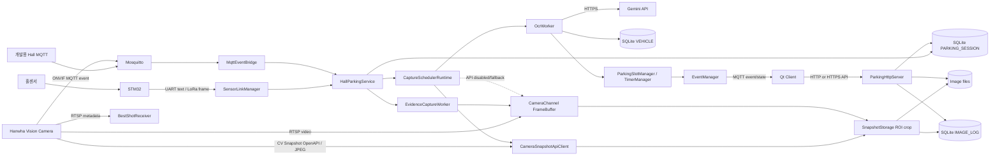
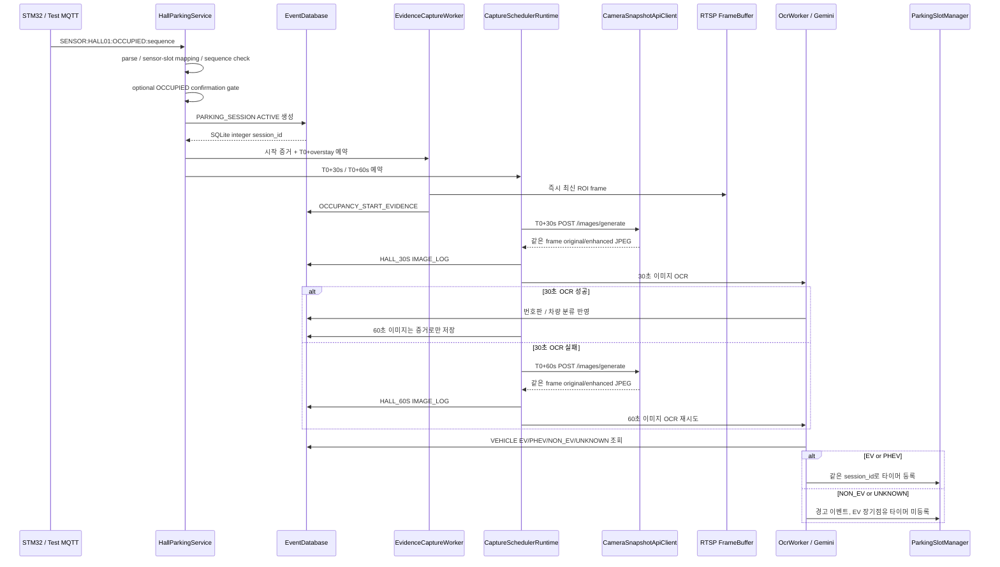

# Pi Server Architecture

WiseAI IVA 차량 탐지의 MQTT parsing 및 슬롯 매핑 계약은
[`docs/IVA_VEHICLE_DETECTION.md`](../IVA_VEHICLE_DETECTION.md)를 참고한다.

기준일: 2026-08-05

기준 코드: CV Snapshot API 통합 작업 트리 (base `f6b8ac8`)

이 문서는 외부 발표 자료가 아니라 현재 `Pi_Server` C/C++ 코드에 실제로
연결된 런타임 아키텍처를 설명한다. 외부 기획서와 발표 자료는
`docs/reference/`에 보관한다.

## 1. 시스템 경계



Raspberry Pi는 카메라 RTSP를 Qt에 중계하지 않는다. Snapshot API 전용 모드에서는
Pi도 RTSP를 수신하지 않고 이벤트 시점에 original/enhanced JPEG만 요청한다. Qt의
실시간 영상 표시는 카메라와 Qt 사이의 직접 RTSP 연결 책임이다.

EVDA-192에서는 한 채널에 고정된 `EV01~EV04` IVA 영역을 WiseAI가 판단하고 Pi가
고정 MQTT Publication을 수신한다. `PARKING_OCCUPANCY_SOURCE=CAMERA_IVA`이면 ENTER가
세션을 만들고 EXIT는 기본 10초 확인 후 Hall VACANT와 동일한 출차 정리 정책으로
세션을 닫는다. 신규 이미지는 `ch1/EV01/session_<id>/<stage>/`에 저장한다. Snapshot
API 모드에서는 좌표 확정 전까지 카메라의 전체 original/enhanced 프레임을 저장한다.

## 2. 프로세스 시작 순서

`src/main.cpp`가 composition root다. 생성과 시작 순서는 다음과 같다.

```text
AppConfig 환경변수 로드
→ CameraChannel 생성
→ SQLite open / runtime migration
→ SystemEventReporter 시작
→ ParkingHttpServer 시작
→ 선택적 RTSP, Snapshot API, Scheduler, Timer, OCR 객체 구성
→ EvidenceCaptureWorker 시작
→ RTSP fallback 모드일 때만 RtspStreamReceiver 시작·최초 frame 대기
→ OcrWorker / BestShotReceiver 시작
→ MqttEventBridge 연결
→ CaptureSchedulerRuntime 시작
→ UART/LoRa SensorLinkManager 시작
→ 기존 ACTIVE 타이머 복구
→ SIGINT/SIGTERM 대기
```

Snapshot API가 비활성인 경우 RTSP URL이 없거나 최초 프레임을 받지 못하면 실패한다.
Snapshot API가 활성이고 fallback이 꺼져 있으면 RTSP 없이 서버를 시작한다.

## 3. 홀센서 입차 및 OCR 흐름



### 3.1 입력 transport

| 입력 | 활성화 설정 | 처리 경로 |
|---|---|---|
| 개발용 MQTT | `HALL_MQTT_INPUT_ENABLED=true` | `MqttEventBridge → HallParkingService` |
| UART line | `SENSOR_LINK_MODE=uart-line` | `UartDriver → SensorLinkManager → HallParkingService` |
| LoRa frame | `SENSOR_LINK_MODE=lora-frame` | `UartDriver → LoRaDriver CRC16 → HallParkingService` |

`config/parking_slots.json`의 `sensor_id`가 STM32 메시지의 센서 ID와 일치해야 한다.

### 3.2 30초·60초 촬영 활성화

```bash
CAPTURE_SCHED_ENABLED=true
HALL_CAPTURE_OCR_ENABLED=true
CAPTURE_OFFSETS_SEC=30,60
CAPTURE_OCR_MAX_ATTEMPTS=2
CAMERA_SNAPSHOT_API_ENABLED=true
CAMERA_OPEN_API_BASE=http://CAMERA_IP/opensdk/APP_ID
CAMERA_IMAGE_BASE=http://CAMERA_IP:8080
CAMERA_IMAGE_SERVER_PORT=8080
```

`CAPTURE_SCHED_ENABLED`의 코드 기본값은 `false`다. 비활성 상태에서는 30/60초
경로 대신 `OCCUPANCY_START_EVIDENCE`를 OCR 입력으로 사용한다.

### 3.3 실제 촬영 의미

`CAMERA_SNAPSHOT_API_ENABLED=true`이면 `HallCaptureExecutor`와
`EvidenceCaptureWorker`는 CV5 CAP의
`/images/generate`를 호출하고 응답에 포함된 같은 run의 original/enhanced JPEG를 즉시
다운로드한다. `OcrWorker`는 제공된 enhanced 경로를 사용하므로 Pi OpenCV 화질 개선을
실행하지 않는다. API가 비활성이면 기존 `CameraChannel::latest_full_frame` ROI 촬영을
사용하며, API 실패 시 RTSP fallback은 별도 설정으로만 허용한다.

현재 CV Snapshot API 계약에는 ROI 입력이 없기 때문에 API 모드의 OCR 입력은 채널 전체
프레임이다. ROI가 필요하면 카메라 CAP 계약 확장 또는 Pi의 crop-only 정책을 별도로
결정해야 한다.

## 4. 조기 출차와 장기 점유

### 4.1 1시간 이전 VACANT

```text
HallParkingService VACANT
→ PARKING_SESSION 종료 / PARKING_SLOT VACANT
→ CaptureScheduler 30/60초 예약 취소
→ EvidenceCaptureWorker 장기점유 예약 취소
→ 진행 중 OCR 결과 반영 차단
→ TimerManager 취소
→ 위반 전이면 해당 session_id 이미지 파일 삭제
→ IMAGE_LOG 행 삭제
```

### 4.2 T0+1시간 이상 점유

```text
EvidenceCaptureWorker
→ Camera Snapshot API 전체 original/enhanced frame
→ OVERSTAY_EVIDENCE 파일 / IMAGE_LOG 저장

TimerManager
→ PARKING_SESSION.status = VIOLATION
→ violation_at 기록
→ VIOLATION_TRIGGERED
→ EventManager
→ Qt MQTT OVERTIME_VIOLATION
```

증거 worker와 타이머는 독립 스레드지만, 타이머가 먼저 깨어나 증거 경로가 비어 있으면
증거 작업을 즉시 앞당기고 500ms 간격으로 최대 5초만 기다린다. 이후에도 실패하면
`TIMER_ERROR`를 남기고 이미지 없이 위반 알림은 계속하여 알림 자체가 유실되지 않게 한다.

서버 재시작 시에는 SQLite의 활성 세션 `entry_time`을 원래 T0로 사용해 아직 없는 증거만
복원한 후 장기점유 타이머를 복원한다. VACANT 취소는 priority queue에서 해당 세션 Job을
즉시 제거해 용량을 회수한다.

홀센서 DB/파일 작업 큐는 `PARKING_HALL_WORK_QUEUE_CAPACITY`(기본 100)로 제한한다.
같은 슬롯의 대기 이벤트는 최신 상태로 병합하고, 서로 다른 슬롯의 신규 이벤트가 용량을
넘을 때만 상태 변경 전에 거부하여 `HALL_WORK_QUEUE_OVERFLOW`를 기록한다.

## 5. 카메라 이벤트 경로

### 5.1 IVA MQTT

```text
Camera ONVIF MQTT
→ MqttEventBridge
→ CameraEventParser
→ active IVA Area 확인
→ Area name 또는 channel로 EV01~EV04 매핑
→ RTSP 최신 frame ROI crop
→ scene JPEG + OpenCV enhanced 생성
→ EVENT_LOG / IMAGE_LOG
→ OcrWorker
→ Qt 카메라 이벤트 topic 발행
```

MotionAlarm, MotionDetection, ObjectDetection 등 비 IVA 이벤트는 중복 사진을 막기 위해
현재 Snapshot을 저장하지 않는다.

### 5.2 BestShot metadata

```text
Camera RTSP metadata track
→ BestShotReceiver
→ ONVIF XML Object / ImageRef 파싱
→ Camera HTTPS Digest 인증 JPEG 다운로드
→ Vehicle BestShot이 별도 PARKING_SESSION 생성
→ Plate BestShot을 같은 채널 세션에 연결
→ Gemini OCR
```

BestShot 경로는 홀센서 경로와 별개로 DB 세션을 생성한다. 동일 차량에 두 경로를
동시 운영하면 활성 세션 중복 정책을 추가로 확정해야 한다.

## 6. 저장 구조

### 6.1 SQLite

| 테이블 | 책임 |
|---|---|
| `VEHICLE` | 번호판, EV/PHEV 등록 정보 |
| `PARKING_SLOT` | 슬롯 종류, 점유 상태, 센서 종류 |
| `PARKING_SESSION` | 입차, 출차, 위반, 번호판, 차량 연결 |
| `IMAGE_LOG` | 원본/개선 파일 경로, OCR, 촬영 사유 |
| `EVENT_LOG` | 주차·OCR·오류·알림 이벤트 |

활성 세션은 슬롯당 하나만 허용하며, 증거 이미지는
`session_id + evidence_reason`당 하나만 허용한다.

### 6.2 이미지 파일

```text
data/snapshots/
└── ch1/
    ├── EV01/session_<id>/<stage>/
    ├── EV02/session_<id>/<stage>/
    ├── EV03/session_<id>/<stage>/
    └── EV04/session_<id>/<stage>/

data/bestshots/
├── vehicle/
└── plate/
```

DB에는 이미지 BLOB이 아니라 파일 경로와 메타데이터를 저장한다.

## 7. Qt 관제 연동

Pi → Qt MQTT:

```text
parking/v1/events/{slot_id}  QoS 1, retain false
parking/v1/state/{slot_id}   QoS 1, retain true
```

주차 이벤트 payload에는 `session_id`, `slot_id`, `plate_number`, `vehicle_type`,
`alarm_state`, ROI, `session_images_url`이 포함된다.

Qt → Pi HTTP/HTTPS:

```text
GET /api/v1/health
GET /api/v1/parking-slots
GET /api/v1/parking-slots/{slot_id}
GET /api/v1/parking-sessions/active
GET /api/v1/parking-sessions/{session_id}/images
GET /api/v1/images/{image_id}/original
GET /api/v1/images/{image_id}/enhanced
```

인증서와 개인키를 둘 다 설정하면 `cpp-httplib` `SSLServer`로 HTTPS를 사용하고,
둘 다 비우면 HTTP로 동작한다. 현재 API token, 로그인, 클라이언트 인증서는
구현되지 않았다.

## 8. 오류 보고와 동시성

`SystemEventReporter`는 센서·UART·LoRa 스레드와 SQLite 저장을 분리한다.

```text
report()
→ 최대 100개 bounded queue
→ 동일 key 오류 30초 중복 억제
→ worker thread에서 EVENT_LOG 저장
→ DB 실패 시 queue 앞에 넣고 재시도
```

주차 세션 상태, 타이머 만료, VACANT는 전이 mutex로 직렬화한다. 증거 촬영,
30/60초 촬영, OCR, RTSP 수신, MQTT loop는 각자의 worker thread에서 실행된다.

## 9. 현재 설정상 주의점

- `CAPTURE_SCHED_ENABLED`의 기본값은 `false`라 30/60초 경로는 운영 설정에서
  명시적으로 켜야 한다.
- EV01~EV04의 기본 카메라 채널은 모두 `ch01`이다.
- ROI 미설정 시 슬롯별 기본 ROI는 전체 프레임 `(0,0,1,1)`이다.
- `PARKING_HALL_ENABLED` 설정은 로드되지만 현재 `main.cpp`의 홀 경로 활성화
  조건으로 사용되지 않는다.
- `FIRE_ALARM_ENABLED`와 `FireAlarmManager`는 존재하지만 현재 `main.cpp`에 배선되지
  않았다.
- MQTT는 기본 `1883` 평문 연결이며 username/password/TLS 설정이 없다.
- HTTP API는 TLS를 선택할 수 있지만 API 인증은 없다.
- `SystemEventReporter`는 UART/LoRa/홀센서에 연결되어 있고 MQTT/RTSP 오류와는
  아직 연결되지 않았다.
- `/dev/parking_alert` 드라이버와 C++ adapter는 존재하지만 타이머 위반 callback에
  연결되지 않았다.
- 3~5초 clip 저장은 구현되지 않았다.

## 10. 핵심 코드 위치

| 책임 | 파일 |
|---|---|
| 런타임 조립 | `src/main.cpp` |
| 환경 설정 | `include/app/AppConfig.hpp`, `src/app/AppConfig.cpp` |
| RTSP 프레임 | `src/camera/RtspStreamReceiver.cpp`, `include/camera/CameraChannel.hpp` |
| MQTT 수신/발행 | `src/mqtt/MqttEventBridge.cpp` |
| 홀센서 세션 | `src/sensor/HallParkingService.cpp` |
| UART/LoRa | `src/device/SensorLinkManager.cpp`, `UartDriver.cpp`, `LoRaDriver.cpp` |
| 30/60초 스케줄 | `src/parking/CaptureScheduler.cpp`, `CaptureSchedulerRuntime.cpp` |
| Hall 촬영/OCR 조정 | `HallCaptureExecutor.cpp`, `HallCaptureCoordinator.cpp`, `HallOcrPolicy.cpp` |
| 카메라 내부 개선본 수신 | `CameraSnapshotApiClient.cpp`, `SnapshotStorage.cpp` |
| 시작/장기점유 증거 | `src/parking/EvidenceCaptureWorker.cpp` |
| OpenCV 저장/전처리 | `src/snapshot/SnapshotStorage.cpp`, `src/ocr/PlateImageEnhancer.cpp` |
| Gemini OCR | `src/ocr/GeminiOcrClient.cpp`, `OcrWorker.cpp` |
| DB | `src/database/EventDatabase.cpp`, `EventDatabaseTimer.cpp`, `db/schema.sql` |
| 타이머 | `src/timer/ParkingSlotManager.cpp`, `TimerManager.cpp` |
| Qt MQTT event | `src/timer/EventManager.cpp`, `src/main.cpp` |
| Qt HTTP/HTTPS API | `src/http/ParkingHttpServer.cpp` |
| IVA | `src/event/CameraEventParser.cpp`, `src/mqtt/MqttEventBridge.cpp` |
| BestShot | `src/bestshot/BestShotReceiver.cpp` |
| 시스템 오류 | `src/event/SystemEventReporter.cpp` |

## 11. 관련 문서

- `docs/ARCHITECTURE_TRACEABILITY.md`: 외부 인터페이스와 실제 코드 대응
- `docs/CAMERA_MQTT_CAPTURE_PROTOCOL.md`: 카메라 촬영 draft 규약과 30/60초 OCR
- `docs/HTTP_API.md`: Qt 조회 API
- `docs/DB_IMPLEMENTATION.md`: SQLite 구현
- `docs/SENSOR_COMMUNICATION_ERROR_HANDLING.md`: 센서·UART·LoRa 오류 처리
- `docs/TEST_SCENARIOS.md`: 자동·실기기 테스트
- `docs/reference/`: 승인된 외부 기획서·발표 자료
