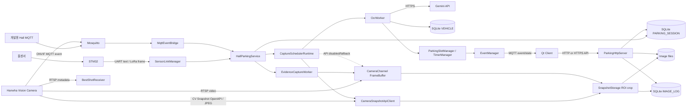
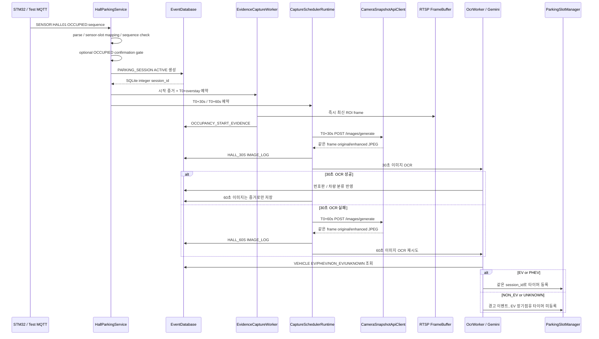

# Pi Server 코드 이해 가이드

> 이 파일은 자동 생성됩니다. 직접 수정하지 말고 C/C++ 소스의 Doxygen 주석 또는 `docs/architecture/README.md`를 수정한 뒤 문서 빌드를 다시 실행하십시오.

- 생성 기준: 현재 작업 트리
- 분석 파일 수: 137
- 생성 명령: `cmake --build cmake-build --target docs`

# Pi Server Architecture

기준일: 2026-07-28

기준 코드: CV Snapshot API 통합 작업 트리 (base `f6b8ac8`)

이 문서는 외부 발표 자료가 아니라 현재 `Pi_Server` C/C++ 코드에 실제로
연결된 런타임 아키텍처를 설명한다. 외부 기획서와 발표 자료는
`docs/reference/`에 보관한다.

## 1. 시스템 경계



Raspberry Pi는 카메라 RTSP를 Qt에 중계하지 않는다. Pi는 자신의 촬영·OCR·
증거 저장을 위해 최신 프레임을 메모리에 유지한다. Qt의 실시간 영상 표시는
카메라와 Qt 사이의 직접 RTSP 연결 책임이다.

## 2. 프로세스 시작 순서

`src/main.cpp`가 composition root다. 생성과 시작 순서는 다음과 같다.

```text
AppConfig 환경변수 로드
→ CameraChannel 생성
→ SQLite open / runtime migration
→ SystemEventReporter 시작
→ ParkingHttpServer 시작
→ RTSP, Snapshot, Scheduler, Timer, OCR 객체 구성
→ EvidenceCaptureWorker 시작
→ RtspStreamReceiver 시작
→ 최초 RTSP frame 대기
→ OcrWorker / BestShotReceiver 시작
→ MqttEventBridge 연결
→ CaptureSchedulerRuntime 시작
→ UART/LoRa SensorLinkManager 시작
→ 기존 ACTIVE 타이머 복구
→ SIGINT/SIGTERM 대기
```

RTSP URL이 하나도 없거나 설정된 시간 안에 최초 프레임을 받지 못하면
서버는 실패로 종료한다.

## 3. 홀센서 입차 및 OCR 흐름



### 3.1 입력 transport

| 입력 | 활성화 설정 | 처리 경로 |
|---|---|---|
| 개발용 MQTT | `HALL_MQTT_INPUT_ENABLED=true` | `MqttEventBridge → HallParkingService` |
| UART line | `SENSOR_LINK_MODE=uart-line` | `UartDriver → SensorLinkManager → HallParkingService` |
| LoRa frame | `SENSOR_LINK_MODE=lora-frame` | `UartDriver → LoRaDriver CRC16 → HallParkingService` |

`config/parking_slots.json`의 `sensor_id`가 STM32 메시지의 센서 ID와 일치해야 한다.

### 3.2 30초·60초 촬영 활성화

```bash
CAPTURE_SCHED_ENABLED=true
HALL_CAPTURE_OCR_ENABLED=true
CAPTURE_OFFSETS_SEC=30,60
CAPTURE_OCR_MAX_ATTEMPTS=2
CAMERA_SNAPSHOT_API_ENABLED=true
CAMERA_OPEN_API_BASE=http://CAMERA_IP/opensdk/APP_ID
CAMERA_IMAGE_BASE=http://CAMERA_IP:8080
CAMERA_IMAGE_SERVER_PORT=8080
```

`CAPTURE_SCHED_ENABLED`의 코드 기본값은 `false`다. 비활성 상태에서는 30/60초
경로 대신 `OCCUPANCY_START_EVIDENCE`를 OCR 입력으로 사용한다.

### 3.3 실제 촬영 의미

`CAMERA_SNAPSHOT_API_ENABLED=true`이면 `HallCaptureExecutor`는 CV5 CAP의
`/images/generate`를 호출하고 응답에 포함된 같은 run의 original/enhanced JPEG를 즉시
다운로드한다. `OcrWorker`는 제공된 enhanced 경로를 사용하므로 Pi OpenCV 화질 개선을
실행하지 않는다. API가 비활성이면 기존 `CameraChannel::latest_full_frame` ROI 촬영을
사용하며, API 실패 시 RTSP fallback은 별도 설정으로만 허용한다.

현재 CV Snapshot API 계약에는 ROI 입력이 없기 때문에 API 모드의 OCR 입력은 채널 전체
프레임이다. ROI가 필요하면 카메라 CAP 계약 확장 또는 Pi의 crop-only 정책을 별도로
결정해야 한다.

## 4. 조기 출차와 장기 점유

### 4.1 1시간 이전 VACANT

```text
HallParkingService VACANT
→ PARKING_SESSION 종료 / PARKING_SLOT VACANT
→ CaptureScheduler 30/60초 예약 취소
→ EvidenceCaptureWorker 장기점유 예약 취소
→ 진행 중 OCR 결과 반영 차단
→ TimerManager 취소
→ 위반 전이면 해당 session_id 이미지 파일 삭제
→ IMAGE_LOG 행 삭제
```

### 4.2 T0+1시간 이상 점유

```text
EvidenceCaptureWorker
→ RTSP 최신 ROI frame
→ OVERSTAY_EVIDENCE 파일 / IMAGE_LOG 저장

TimerManager
→ PARKING_SESSION.status = VIOLATION
→ violation_at 기록
→ VIOLATION_TRIGGERED
→ EventManager
→ Qt MQTT OVERTIME_VIOLATION
```

증거 worker와 타이머는 독립 스레드지만, 타이머가 먼저 깨어나 증거 경로가 비어 있으면
증거 작업을 즉시 앞당기고 500ms 간격으로 최대 5초만 기다린다. 이후에도 실패하면
`TIMER_ERROR`를 남기고 이미지 없이 위반 알림은 계속하여 알림 자체가 유실되지 않게 한다.

서버 재시작 시에는 SQLite의 활성 세션 `entry_time`을 원래 T0로 사용해 아직 없는 증거만
복원한 후 장기점유 타이머를 복원한다. VACANT 취소는 priority queue에서 해당 세션 Job을
즉시 제거해 용량을 회수한다.

홀센서 DB/파일 작업 큐는 `PARKING_HALL_WORK_QUEUE_CAPACITY`(기본 100)로 제한한다.
같은 슬롯의 대기 이벤트는 최신 상태로 병합하고, 서로 다른 슬롯의 신규 이벤트가 용량을
넘을 때만 상태 변경 전에 거부하여 `HALL_WORK_QUEUE_OVERFLOW`를 기록한다.

## 5. 카메라 이벤트 경로

### 5.1 IVA MQTT

```text
Camera ONVIF MQTT
→ MqttEventBridge
→ CameraEventParser
→ active IVA Area 확인
→ Area name 또는 channel로 EV01~EV04 매핑
→ RTSP 최신 frame ROI crop
→ scene JPEG + OpenCV enhanced 생성
→ EVENT_LOG / IMAGE_LOG
→ OcrWorker
→ Qt 카메라 이벤트 topic 발행
```

MotionAlarm, MotionDetection, ObjectDetection 등 비 IVA 이벤트는 중복 사진을 막기 위해
현재 Snapshot을 저장하지 않는다.

### 5.2 BestShot metadata

```text
Camera RTSP metadata track
→ BestShotReceiver
→ ONVIF XML Object / ImageRef 파싱
→ Camera HTTPS Digest 인증 JPEG 다운로드
→ Vehicle BestShot이 별도 PARKING_SESSION 생성
→ Plate BestShot을 같은 채널 세션에 연결
→ Gemini OCR
```

BestShot 경로는 홀센서 경로와 별개로 DB 세션을 생성한다. 동일 차량에 두 경로를
동시 운영하면 활성 세션 중복 정책을 추가로 확정해야 한다.

## 6. 저장 구조

### 6.1 SQLite

| 테이블 | 책임 |
|---|---|
| `VEHICLE` | 번호판, EV/PHEV 등록 정보 |
| `PARKING_SLOT` | 슬롯 종류, 점유 상태, 센서 종류 |
| `PARKING_SESSION` | 입차, 출차, 위반, 번호판, 차량 연결 |
| `IMAGE_LOG` | 원본/개선 파일 경로, OCR, 촬영 사유 |
| `EVENT_LOG` | 주차·OCR·오류·알림 이벤트 |

활성 세션은 슬롯당 하나만 허용하며, 증거 이미지는
`session_id + evidence_reason`당 하나만 허용한다.

### 6.2 이미지 파일

```text
data/snapshots/
└── ch1/
    ├── EV01/scene/
    ├── EV02/scene/
    ├── EV03/scene/
    └── EV04/scene/

data/bestshots/
├── vehicle/
└── plate/
```

DB에는 이미지 BLOB이 아니라 파일 경로와 메타데이터를 저장한다.

## 7. Qt 관제 연동

Pi → Qt MQTT:

```text
parking/v1/events/{slot_id}  QoS 1, retain false
parking/v1/state/{slot_id}   QoS 1, retain true
```

주차 이벤트 payload에는 `session_id`, `slot_id`, `plate_number`, `vehicle_type`,
`alarm_state`, ROI, `session_images_url`이 포함된다.

Qt → Pi HTTP/HTTPS:

```text
GET /api/v1/health
GET /api/v1/parking-slots
GET /api/v1/parking-slots/{slot_id}
GET /api/v1/parking-sessions/active
GET /api/v1/parking-sessions/{session_id}/images
GET /api/v1/images/{image_id}/original
GET /api/v1/images/{image_id}/enhanced
```

인증서와 개인키를 둘 다 설정하면 `cpp-httplib` `SSLServer`로 HTTPS를 사용하고,
둘 다 비우면 HTTP로 동작한다. 현재 API token, 로그인, 클라이언트 인증서는
구현되지 않았다.

## 8. 오류 보고와 동시성

`SystemEventReporter`는 센서·UART·LoRa 스레드와 SQLite 저장을 분리한다.

```text
report()
→ 최대 100개 bounded queue
→ 동일 key 오류 30초 중복 억제
→ worker thread에서 EVENT_LOG 저장
→ DB 실패 시 queue 앞에 넣고 재시도
```

주차 세션 상태, 타이머 만료, VACANT는 전이 mutex로 직렬화한다. 증거 촬영,
30/60초 촬영, OCR, RTSP 수신, MQTT loop는 각자의 worker thread에서 실행된다.

## 9. 현재 설정상 주의점

- `CAPTURE_SCHED_ENABLED`의 기본값은 `false`라 30/60초 경로는 운영 설정에서
  명시적으로 켜야 한다.
- EV01~EV04의 기본 카메라 채널은 모두 `ch01`이다.
- ROI 미설정 시 슬롯별 기본 ROI는 전체 프레임 `(0,0,1,1)`이다.
- `PARKING_HALL_ENABLED` 설정은 로드되지만 현재 `main.cpp`의 홀 경로 활성화
  조건으로 사용되지 않는다.
- `FIRE_ALARM_ENABLED`와 `FireAlarmManager`는 존재하지만 현재 `main.cpp`에 배선되지
  않았다.
- MQTT는 기본 `1883` 평문 연결이며 username/password/TLS 설정이 없다.
- HTTP API는 TLS를 선택할 수 있지만 API 인증은 없다.
- `SystemEventReporter`는 UART/LoRa/홀센서에 연결되어 있고 MQTT/RTSP 오류와는
  아직 연결되지 않았다.
- `/dev/parking_alert` 드라이버와 C++ adapter는 존재하지만 타이머 위반 callback에
  연결되지 않았다.
- 3~5초 clip 저장은 구현되지 않았다.

## 10. 핵심 코드 위치

| 책임 | 파일 |
|---|---|
| 런타임 조립 | `src/main.cpp` |
| 환경 설정 | `include/app/AppConfig.hpp`, `src/app/AppConfig.cpp` |
| RTSP 프레임 | `src/camera/RtspStreamReceiver.cpp`, `include/camera/CameraChannel.hpp` |
| MQTT 수신/발행 | `src/mqtt/MqttEventBridge.cpp` |
| 홀센서 세션 | `src/sensor/HallParkingService.cpp` |
| UART/LoRa | `src/device/SensorLinkManager.cpp`, `UartDriver.cpp`, `LoRaDriver.cpp` |
| 30/60초 스케줄 | `src/parking/CaptureScheduler.cpp`, `CaptureSchedulerRuntime.cpp` |
| Hall 촬영/OCR 조정 | `HallCaptureExecutor.cpp`, `HallCaptureCoordinator.cpp`, `HallOcrPolicy.cpp` |
| 카메라 내부 개선본 수신 | `CameraSnapshotApiClient.cpp`, `SnapshotStorage.cpp` |
| 시작/장기점유 증거 | `src/parking/EvidenceCaptureWorker.cpp` |
| OpenCV 저장/전처리 | `src/snapshot/SnapshotStorage.cpp`, `src/ocr/PlateImageEnhancer.cpp` |
| Gemini OCR | `src/ocr/GeminiOcrClient.cpp`, `OcrWorker.cpp` |
| DB | `src/database/EventDatabase.cpp`, `EventDatabaseTimer.cpp`, `db/schema.sql` |
| 타이머 | `src/timer/ParkingSlotManager.cpp`, `TimerManager.cpp` |
| Qt MQTT event | `src/timer/EventManager.cpp`, `src/main.cpp` |
| Qt HTTP/HTTPS API | `src/http/ParkingHttpServer.cpp` |
| IVA | `src/event/CameraEventParser.cpp`, `src/mqtt/MqttEventBridge.cpp` |
| BestShot | `src/bestshot/BestShotReceiver.cpp` |
| 시스템 오류 | `src/event/SystemEventReporter.cpp` |

## 11. 관련 문서

- `docs/ARCHITECTURE_TRACEABILITY.md`: 외부 인터페이스와 실제 코드 대응
- `docs/CAMERA_MQTT_CAPTURE_PROTOCOL.md`: 카메라 촬영 draft 규약과 30/60초 OCR
- `docs/HTTP_API.md`: Qt 조회 API
- `docs/DB_IMPLEMENTATION.md`: SQLite 구현
- `docs/SENSOR_COMMUNICATION_ERROR_HANDLING.md`: 센서·UART·LoRa 오류 처리
- `docs/TEST_SCENARIOS.md`: 자동·실기기 테스트
- `docs/reference/`: 승인된 외부 기획서·발표 자료


# 자동 생성 소스 파일·함수 참조

이 절은 Doxygen XML에서 추출한다. 함수 설명이 비어 있다면 해당 함수에 `/** @brief ... */` 주석을 추가한 후 문서를 다시 생성한다.

## driver/parking_alert

### driver/parking_alert/parking_alert.c

Linux 커널 드라이버 또는 사용자 공간 ABI를 구현한다.

- `MODULE_AUTHOR("VEDA Team 5")` — Doxygen 설명이 없어 선언과 호출부를 함께 확인해야 한다.
- `MODULE_DESCRIPTION("Smart parking alert character device")` — Doxygen 설명이 없어 선언과 호출부를 함께 확인해야 한다.
- `MODULE_LICENSE("GPL")` — Doxygen 설명이 없어 선언과 호출부를 함께 확인해야 한다.
- `MODULE_VERSION("1.0.0")` — Doxygen 설명이 없어 선언과 호출부를 함께 확인해야 한다.
- `module_exit(parking_alert_exit)` — Doxygen 설명이 없어 선언과 호출부를 함께 확인해야 한다.
- `module_init(parking_alert_init)` — Doxygen 설명이 없어 선언과 호출부를 함께 확인해야 한다.
- `static __poll_t parking_alert_poll(struct file *file, poll_table *wait)` — Doxygen 설명이 없어 선언과 호출부를 함께 확인해야 한다.
- `static int __init parking_alert_init(void)` — Doxygen 설명이 없어 선언과 호출부를 함께 확인해야 한다.
- `static int parking_alert_apply_command(const struct parking_alert_command *command)` — Doxygen 설명이 없어 선언과 호출부를 함께 확인해야 한다.
- `static int parking_alert_open(struct inode *inode, struct file *file)` — Doxygen 설명이 없어 선언과 호출부를 함께 확인해야 한다.
- `static int parking_alert_release(struct inode *inode, struct file *file)` — Doxygen 설명이 없어 선언과 호출부를 함께 확인해야 한다.
- `static int parking_alert_validate_command(const struct parking_alert_command *command)` — Doxygen 설명이 없어 선언과 호출부를 함께 확인해야 한다.
- `static long parking_alert_ioctl(struct file *file, unsigned int command, unsigned long argument)` — Doxygen 설명이 없어 선언과 호출부를 함께 확인해야 한다.
- `static ssize_t parking_alert_read(struct file *file, char __user *buffer, size_t count, loff_t *offset)` — Doxygen 설명이 없어 선언과 호출부를 함께 확인해야 한다.
- `static ssize_t parking_alert_write(struct file *file, const char __user *buffer, size_t count, loff_t *offset)` — Doxygen 설명이 없어 선언과 호출부를 함께 확인해야 한다.
- `static void __exit parking_alert_exit(void)` — Doxygen 설명이 없어 선언과 호출부를 함께 확인해야 한다.
- `static void parking_alert_fill_state_locked(struct parking_alert_state *state)` — Doxygen 설명이 없어 선언과 호출부를 함께 확인해야 한다.

## include/app

### include/app/AppConfig.hpp

공개 인터페이스, 타입 또는 클래스 선언을 정의한다.

- `AppConfig app::AppConfig::loadFromEnv()` — Doxygen 설명이 없어 선언과 호출부를 함께 확인해야 한다.

## include/bestshot

### include/bestshot/BestShotReceiver.hpp

공개 인터페이스, 타입 또는 클래스 선언을 정의한다.

- `bestshot::BestShotReceiver::BestShotReceiver(std::vector< std::shared_ptr< camera::CameraChannel > > &channels, database::EventDatabase &database, parking::ParkingTriggerCoordinator &trigger_coordinator, ocr::OcrWorker &ocr_worker, std::atomic< bool > &running, std::string output_root="data/bestshots")` — Doxygen 설명이 없어 선언과 호출부를 함께 확인해야 한다.
- `bestshot::BestShotReceiver::~BestShotReceiver()` — Doxygen 설명이 없어 선언과 호출부를 함께 확인해야 한다.
- `bool bestshot::BestShotReceiver::downloadImage(const std::string &rtsp_url, const std::string &image_ref, const std::string &destination)` — Doxygen 설명이 없어 선언과 호출부를 함께 확인해야 한다.
- `std::string bestshot::BestShotReceiver::slotIdForChannel(const std::string &channel_id)` — Doxygen 설명이 없어 선언과 호출부를 함께 확인해야 한다.
- `void bestshot::BestShotReceiver::processMetadata(const std::string &channel_id, const std::string &xml, const std::string &rtsp_url)` — Doxygen 설명이 없어 선언과 호출부를 함께 확인해야 한다.
- `void bestshot::BestShotReceiver::receiveLoop(const std::shared_ptr< camera::CameraChannel > &channel)` — Doxygen 설명이 없어 선언과 호출부를 함께 확인해야 한다.
- `void bestshot::BestShotReceiver::start()` — Doxygen 설명이 없어 선언과 호출부를 함께 확인해야 한다.
- `void bestshot::BestShotReceiver::stop()` — Doxygen 설명이 없어 선언과 호출부를 함께 확인해야 한다.

## include/camera

### include/camera/CameraChannel.hpp

공개 인터페이스, 타입 또는 클래스 선언을 정의한다.

- 함수 없음: 타입·상수·구조체 선언 또는 데이터 전용 파일

### include/camera/CameraSnapshotApiClient.hpp

공개 인터페이스, 타입 또는 클래스 선언을 정의한다.

- `CameraSnapshotApiClient::HttpResponse camera::CameraSnapshotApiClient::request(const std::string &method, const std::string &url, const std::string &jsonBody, int timeoutMs) const` — Doxygen 설명이 없어 선언과 호출부를 함께 확인해야 한다.
- `bool camera::CameraSnapshotApiClient::configured() const noexcept` — Doxygen 설명이 없어 선언과 호출부를 함께 확인해야 한다.
- `bool camera::CameraSnapshotApiClient::discoverChannels()` — Doxygen 설명이 없어 선언과 호출부를 함께 확인해야 한다.
- `bool camera::CameraSnapshotApiClient::discoverFilters()` — Doxygen 설명이 없어 선언과 호출부를 함께 확인해야 한다.
- `bool camera::CameraSnapshotApiClient::downloadJpeg(const std::string &path, std::size_t expectedBytes, std::vector< unsigned char > &output)` — Doxygen 설명이 없어 선언과 호출부를 함께 확인해야 한다.
- `bool camera::CameraSnapshotApiClient::generate(int channel, CameraGeneratedImages &images)` — 같은 카메라 프레임의 original/enhanced JPEG를 생성·다운로드한다.
- `bool camera::CameraSnapshotApiClient::initialize()` — 이미지 서버 시작과 channels/filters discovery를 수행한다.
- `bool camera::CameraSnapshotApiClient::startImageServer()` — Doxygen 설명이 없어 선언과 호출부를 함께 확인해야 한다.
- `camera::CameraSnapshotApiClient::CameraSnapshotApiClient(CameraSnapshotApiConfig config)` — Doxygen 설명이 없어 선언과 호출부를 함께 확인해야 한다.
- `const std::string & camera::CameraSnapshotApiClient::lastError() const noexcept` — Doxygen 설명이 없어 선언과 호출부를 함께 확인해야 한다.
- `const std::vector< int > & camera::CameraSnapshotApiClient::channels() const noexcept` — Doxygen 설명이 없어 선언과 호출부를 함께 확인해야 한다.
- `const std::vector< std::string > & camera::CameraSnapshotApiClient::filters() const noexcept` — Doxygen 설명이 없어 선언과 호출부를 함께 확인해야 한다.
- `void camera::CameraSnapshotApiClient::setError(std::string message)` — Doxygen 설명이 없어 선언과 호출부를 함께 확인해야 한다.

### include/camera/RtspStreamReceiver.hpp

공개 인터페이스, 타입 또는 클래스 선언을 정의한다.

- `bool camera::RtspStreamReceiver::waitForInitialFrames(int timeout_sec)` — Doxygen 설명이 없어 선언과 호출부를 함께 확인해야 한다.
- `camera::RtspStreamReceiver::RtspStreamReceiver(std::vector< std::shared_ptr< CameraChannel > > &channels, int preview_width, int preview_height, int rtsp_retry_delay_ms, int empty_frame_delay_ms, int max_consecutive_read_failures, std::atomic< bool > &running)` — Doxygen 설명이 없어 선언과 호출부를 함께 확인해야 한다.
- `void camera::RtspStreamReceiver::captureLoop(std::shared_ptr< CameraChannel > channel)` — Doxygen 설명이 없어 선언과 호출부를 함께 확인해야 한다.
- `void camera::RtspStreamReceiver::start()` — Doxygen 설명이 없어 선언과 호출부를 함께 확인해야 한다.
- `void camera::RtspStreamReceiver::stop()` — Doxygen 설명이 없어 선언과 호출부를 함께 확인해야 한다.

## include/database

### include/database/EventDatabase.hpp

공개 인터페이스, 타입 또는 클래스 선언을 정의한다.

- `EvidenceInsertResult database::EventDatabase::insertEvidenceImage(std::int64_t session_id, const std::string &original_path, const std::string &evidence_reason, const std::string &captured_at)` — 활성 세션에 종류별 증거 이미지 한 장만 원자적으로 연결한다.
- `EvidenceInsertResult database::EventDatabase::insertHallCaptureImage(std::int64_t session_id, const std::string &original_path, const std::string &enhanced_path, const std::string &enhancement_type, const std::string &captured_at)` — 활성 세션에 30/60초 ROI 촬영본을 단계별 최대 한 장 연결한다.
- `VehicleCategory database::EventDatabase::classifyVehicle(std::string_view car_number) const` — VEHICLE의 is_ev/is_phev로 차량 종류를 분류한다.
- `bool database::EventDatabase::attachEnhancedPlateImage(const std::string &image_path, const std::string &enhanced_image_path)` — 원본 IMAGE_LOG 행에 OpenCV 전처리 파일 경로를 연결한다.
- `bool database::EventDatabase::attachPlateBestShot(int session_id, const std::string &image_path, const std::string &plate_text)` — 번호판 BestShot과 선택적 카메라 plate text를 기존 세션에 연결한다.
- `bool database::EventDatabase::cancelUnscheduled(std::int64_t log_id, const std::string &canceled_at)` — DB 생성 뒤 timer enqueue 실패 시 세션을 보상 종료한다.
- `bool database::EventDatabase::createEntryWithBestShot(const std::string &slot_id, const std::string &image_path, const std::string &object_id, int *session_id)` — Vehicle BestShot을 근거로 OCCUPIED 슬롯과 ACTIVE 세션을 원자적으로 연결한다.
- `bool database::EventDatabase::createEntryWithSnapshot(const std::string &slot_id, const std::string &image_path, const std::string &source_id, int *session_id)` — 홀센서 입차 Snapshot으로 ACTIVE 세션과 IMAGE/EVENT 로그를 만든다.
- `bool database::EventDatabase::deleteSessionImageRecords(int session_id)` — 파일 삭제가 끝난 조기 출차 세션의 IMAGE_LOG 행을 모두 제거한다.
- `bool database::EventDatabase::getImage(int image_id, ImageView &row)` — image_id로 이미지 경로와 OCR 메타데이터를 조회한다.
- `bool database::EventDatabase::getParkingSlot(const std::string &slot_id, ParkingSlotView &row)` — slot_id 한 건의 상태를 조회한다.
- `bool database::EventDatabase::insertEvent(const EventRecord &record)` — 정규화된 카메라 이벤트와 선택적 Snapshot을 IMAGE_LOG/EVENT_LOG에 기록한다.
- `bool database::EventDatabase::insertSystemEvent(const std::string &event_type, const std::string &slot_id, const std::string &message)` — 센서·통신 운영 이벤트를 기존 EVENT_LOG schema에 저장한다.
- `bool database::EventDatabase::listParkingSlots(std::vector< ParkingSlotView > &rows)` — 전체 주차면과 활성 세션을 조회한다.
- `bool database::EventDatabase::listSessionImages(int session_id, std::vector< ImageView > &rows)` — 세션에 연결된 모든 이미지 메타데이터를 조회한다.
- `bool database::EventDatabase::markPlateOcrUnresolved(std::int64_t session_id, const std::string &slot_id, int attempts)` — OCR 시도 소진을 UNKNOWN으로 한 번만 EVENT_LOG에 기록한다.
- `bool database::EventDatabase::markViolation(std::int64_t log_id, const std::string &violation_at, const std::string &image_path_2)` — 아직 ACTIVE인 세션만 VIOLATION으로 조건부 갱신한다.
- `bool database::EventDatabase::open(const std::string &db_path)` — SQLite 파일을 열고 FK 검사를 활성화한다.
- `database::EventDatabase::EventDatabase()` — Doxygen 설명이 없어 선언과 호출부를 함께 확인해야 한다.
- `database::EventDatabase::EventDatabase(const std::filesystem::path &database_path)` — SQLite 이벤트 DB를 열고 프로토타입에 필요한 연결 옵션을 설정한다.
- `database::EventDatabase::~EventDatabase()` — Doxygen 설명이 없어 선언과 호출부를 함께 확인해야 한다.
- `std::int64_t database::EventDatabase::createHallSession(const std::string &slot_id, const std::string &source_id, const std::string &entry_time)` — 홀센서 입차의 ACTIVE 세션을 만들고 실제 SQLite ID를 반환한다.
- `std::int64_t database::EventDatabase::insertParked(const std::string &car_number, const std::string &slot_id, const std::string &parked_at, const std::string &image_path_1)` — EV/PHEV 장기 점유용 ACTIVE 세션과 최초 이미지를 트랜잭션으로 생성한다.
- `std::optional< LogRecord > database::EventDatabase::departActiveBySlot(const std::string &slot_id, const std::string &departed_at)` — slot_id의 활성 세션을 ENDED로 바꾸고 점유시간을 계산한다.
- `std::optional< LogRecord > database::EventDatabase::findActiveBySlot(const std::string &slot_id) const` — 주차면의 출차되지 않은 최신 세션을 조회한다.
- `std::optional< LogRecord > database::EventDatabase::findLogById(std::int64_t log_id) const` — 불변 session ID로 타이머 읽기 모델을 조회한다.
- `std::optional< std::string > database::EventDatabase::findEvidenceImagePath(std::int64_t session_id, const std::string &evidence_reason) const` — 이미 저장된 세션 증거 이미지 경로를 조회한다.
- `std::string database::EventDatabase::applyPlateOcr(int session_id, const std::string &slot_id, const std::string &image_path, const std::string &plate_number, double confidence)` — OCR 결과를 저장하고 VEHICLE 조회 결과(EV/NON_EV/UNKNOWN)를 반환한다.
- `std::string database::EventDatabase::readTextFile(const std::filesystem::path &path)` — SQL/config 보조 파일 전체를 문자열로 읽는다.
- `std::vector< LogRecord > database::EventDatabase::listLogs() const` — 타이머 CLI 표시용 전체 세션을 생성 순서로 반환한다.
- `std::vector< std::pair< std::string, std::string > > database::EventDatabase::listVehicles() const` — 차량번호와 EV/PHEV/NON_EV 문자열 목록을 반환한다.
- `void database::EventDatabase::clearTimerLogs()` — TIMER_ENTRY로 식별되는 데모 타이머 세션만 정리한다.
- `void database::EventDatabase::close()` — 열린 DB 연결을 닫는다.
- `void database::EventDatabase::executeSqlUnlocked(const std::string &sql)` — 준비 과정이 필요 없는 SQL 문자열을 SQLite 연결에서 직접 실행한다.
- `void database::EventDatabase::initialize(const std::filesystem::path &schema_file, const std::filesystem::path &seed_file)` — schema와 seed SQL을 적용하며 구형 컬럼을 먼저 호환 마이그레이션한다.
- `void database::EventDatabase::migrateRuntimeSchema()` — 서버 시작 시 운영 DB에 안전한 멱등 migration만 적용한다.

### include/database/db_manager.h

공개 인터페이스, 타입 또는 클래스 선언을 정의한다.

- `int db_assign_vehicle_to_session(int session_id, int vehicle_id, const char *plate_number)` — Doxygen 설명이 없어 선언과 호출부를 함께 확인해야 한다.
- `int db_create_parking_session(int vehicle_id, const char *slot_id, const char *plate_number, int *session_id)` — Doxygen 설명이 없어 선언과 호출부를 함께 확인해야 한다.
- `int db_delete_session_images(int session_id)` — Doxygen 설명이 없어 선언과 호출부를 함께 확인해야 한다.
- `int db_end_parking_session(int session_id)` — Doxygen 설명이 없어 선언과 호출부를 함께 확인해야 한다.
- `int db_get_image_by_id(int image_id, DbImageRow *row)` — Doxygen 설명이 없어 선언과 호출부를 함께 확인해야 한다.
- `int db_get_vehicle_by_plate(const char *plate_number, int *vehicle_id, int *is_ev, int *is_phev)` — Doxygen 설명이 없어 선언과 호출부를 함께 확인해야 한다.
- `int db_insert_event_log(int session_id, const char *slot_id, const char *event_type, const char *message)` — Doxygen 설명이 없어 선언과 호출부를 함께 확인해야 한다.
- `int db_insert_image_log(int session_id, const char *original_path, const char *enhanced_path, const char *enhancement_type, const char *ocr_result)` — Doxygen 설명이 없어 선언과 호출부를 함께 확인해야 한다.
- `int db_mark_event_handled(int event_id)` — Doxygen 설명이 없어 선언과 호출부를 함께 확인해야 한다.
- `int db_open(const char *path)` — Doxygen 설명이 없어 선언과 호출부를 함께 확인해야 한다.
- `int db_update_image_enhanced_by_path(const char *original_path, const char *enhanced_path)` — Doxygen 설명이 없어 선언과 호출부를 함께 확인해야 한다.
- `int db_update_image_ocr_by_path(const char *original_path, const char *ocr_result)` — Doxygen 설명이 없어 선언과 호출부를 함께 확인해야 한다.
- `int db_update_slot_status(const char *slot_id, const char *status)` — Doxygen 설명이 없어 선언과 호출부를 함께 확인해야 한다.
- `int db_visit_parking_slots(const char *slot_id, DbParkingSlotVisitor visitor, void *context)` — Doxygen 설명이 없어 선언과 호출부를 함께 확인해야 한다.
- `int db_visit_session_images(int session_id, DbImageVisitor visitor, void *context)` — Doxygen 설명이 없어 선언과 호출부를 함께 확인해야 한다.
- `struct sqlite3 * db_native_handle(void)` — Doxygen 설명이 없어 선언과 호출부를 함께 확인해야 한다.
- `void db_close(void)` — Doxygen 설명이 없어 선언과 호출부를 함께 확인해야 한다.

## include/device

### include/device/LinuxDriverAdapter.hpp

공개 인터페이스, 타입 또는 클래스 선언을 정의한다.

- `LinuxDriverAdapter & device::LinuxDriverAdapter::operator=(LinuxDriverAdapter &&other) noexcept` — Doxygen 설명이 없어 선언과 호출부를 함께 확인해야 한다.
- `LinuxDriverAdapter & device::LinuxDriverAdapter::operator=(const LinuxDriverAdapter &)=delete` — Doxygen 설명이 없어 선언과 호출부를 함께 확인해야 한다.
- `ParkingAlertState device::LinuxDriverAdapter::state() const` — Doxygen 설명이 없어 선언과 호출부를 함께 확인해야 한다.
- `bool device::LinuxDriverAdapter::isOpen() const noexcept` — Doxygen 설명이 없어 선언과 호출부를 함께 확인해야 한다.
- `const std::string & device::LinuxDriverAdapter::devicePath() const noexcept` — Doxygen 설명이 없어 선언과 호출부를 함께 확인해야 한다.
- `device::LinuxDriverAdapter::LinuxDriverAdapter(LinuxDriverAdapter &&other) noexcept` — Doxygen 설명이 없어 선언과 호출부를 함께 확인해야 한다.
- `device::LinuxDriverAdapter::LinuxDriverAdapter(const LinuxDriverAdapter &)=delete` — Doxygen 설명이 없어 선언과 호출부를 함께 확인해야 한다.
- `device::LinuxDriverAdapter::LinuxDriverAdapter(std::string devicePath="/dev/parking_alert")` — Doxygen 설명이 없어 선언과 호출부를 함께 확인해야 한다.
- `device::LinuxDriverAdapter::~LinuxDriverAdapter()` — Doxygen 설명이 없어 선언과 호출부를 함께 확인해야 한다.
- `void device::LinuxDriverAdapter::clearAll()` — Doxygen 설명이 없어 선언과 호출부를 함께 확인해야 한다.
- `void device::LinuxDriverAdapter::clearSlot(std::uint32_t slotIndex, std::uint64_t eventId=0)` — Doxygen 설명이 없어 선언과 호출부를 함께 확인해야 한다.
- `void device::LinuxDriverAdapter::closeDevice() noexcept` — Doxygen 설명이 없어 선언과 호출부를 함께 확인해야 한다.
- `void device::LinuxDriverAdapter::openDevice()` — Doxygen 설명이 없어 선언과 호출부를 함께 확인해야 한다.
- `void device::LinuxDriverAdapter::requireOpen() const` — Doxygen 설명이 없어 선언과 호출부를 함께 확인해야 한다.
- `void device::LinuxDriverAdapter::setSlot(std::uint32_t slotIndex, std::uint64_t eventId=0)` — Doxygen 설명이 없어 선언과 호출부를 함께 확인해야 한다.
- `void device::LinuxDriverAdapter::updateSlot(unsigned long request, std::uint16_t operation, std::uint32_t slotIndex, std::uint64_t eventId)` — Doxygen 설명이 없어 선언과 호출부를 함께 확인해야 한다.

### include/device/LoRaDriver.hpp

공개 인터페이스, 타입 또는 클래스 선언을 정의한다.

- `bool device::LoRaDriver::send(const LoRaFrame &frame, std::string *error=nullptr)` — Doxygen 설명이 없어 선언과 호출부를 함께 확인해야 한다.
- `device::LoRaDriver::LoRaDriver(UartDriver &uart)` — Doxygen 설명이 없어 선언과 호출부를 함께 확인해야 한다.
- `std::uint16_t device::LoRaDriver::crc16Ccitt(std::span< const std::uint8_t > bytes)` — Doxygen 설명이 없어 선언과 호출부를 함께 확인해야 한다.
- `std::uint64_t device::LoRaDriver::rejectedFrames() const` — Doxygen 설명이 없어 선언과 호출부를 함께 확인해야 한다.
- `std::vector< LoRaFrame > device::LoRaDriver::consume(std::span< const std::uint8_t > bytes)` — Doxygen 설명이 없어 선언과 호출부를 함께 확인해야 한다.
- `std::vector< std::uint8_t > device::LoRaDriver::encode(const LoRaFrame &frame)` — Doxygen 설명이 없어 선언과 호출부를 함께 확인해야 한다.

### include/device/SensorLinkManager.hpp

공개 인터페이스, 타입 또는 클래스 선언을 정의한다.

- `SensorLinkManager & device::SensorLinkManager::operator=(const SensorLinkManager &)=delete` — Doxygen 설명이 없어 선언과 호출부를 함께 확인해야 한다.
- `SensorLinkMode device::SensorLinkManager::parseMode(const std::string &value)` — Doxygen 설명이 없어 선언과 호출부를 함께 확인해야 한다.
- `bool device::SensorLinkManager::connected() const` — Doxygen 설명이 없어 선언과 호출부를 함께 확인해야 한다.
- `bool device::SensorLinkManager::running() const` — Doxygen 설명이 없어 선언과 호출부를 함께 확인해야 한다.
- `bool device::SensorLinkManager::sendAlertCommand(const std::string &command, std::uint32_t sequence, std::string *error=nullptr)` — STM32/LoRa 반대 방향으로 경고 명령을 전송한다.
- `bool device::SensorLinkManager::start()` — Doxygen 설명이 없어 선언과 호출부를 함께 확인해야 한다.
- `bool device::SensorLinkManager::waitReconnect()` — Doxygen 설명이 없어 선언과 호출부를 함께 확인해야 한다.
- `device::SensorLinkManager::SensorLinkManager(Config config, SensorLineHandler handler, event::SystemEventReporter *reporter=nullptr)` — Doxygen 설명이 없어 선언과 호출부를 함께 확인해야 한다.
- `device::SensorLinkManager::SensorLinkManager(const SensorLinkManager &)=delete` — Doxygen 설명이 없어 선언과 호출부를 함께 확인해야 한다.
- `device::SensorLinkManager::~SensorLinkManager()` — Doxygen 설명이 없어 선언과 호출부를 함께 확인해야 한다.
- `std::string device::SensorLinkManager::modeName(SensorLinkMode mode)` — Doxygen 설명이 없어 선언과 호출부를 함께 확인해야 한다.
- `void device::SensorLinkManager::consumeLoRaFrames(const std::uint8_t *data, std::size_t size)` — Doxygen 설명이 없어 선언과 호출부를 함께 확인해야 한다.
- `void device::SensorLinkManager::consumeUartLines(const std::uint8_t *data, std::size_t size)` — Doxygen 설명이 없어 선언과 호출부를 함께 확인해야 한다.
- `void device::SensorLinkManager::report(event::SystemEventCode code, event::SystemEventSeverity severity, const std::string &message, std::uint32_t retry_count=0, bool recovered=false) noexcept` — Doxygen 설명이 없어 선언과 호출부를 함께 확인해야 한다.
- `void device::SensorLinkManager::run()` — Doxygen 설명이 없어 선언과 호출부를 함께 확인해야 한다.
- `void device::SensorLinkManager::stop()` — Doxygen 설명이 없어 선언과 호출부를 함께 확인해야 한다.

### include/device/UartDriver.hpp

공개 인터페이스, 타입 또는 클래스 선언을 정의한다.

- `UartDriver & device::UartDriver::operator=(const UartDriver &)=delete` — Doxygen 설명이 없어 선언과 호출부를 함께 확인해야 한다.
- `bool device::UartDriver::connect(std::string *error=nullptr)` — UART 장치를 non-blocking raw 8N1 모드로 연다.
- `bool device::UartDriver::connected() const` — Doxygen 설명이 없어 선언과 호출부를 함께 확인해야 한다.
- `bool device::UartDriver::writeAll(std::span< const std::uint8_t > data, std::string *error=nullptr)` — 전체 byte가 전송될 때까지 partial write를 처리한다.
- `const Config & device::UartDriver::config() const` — Doxygen 설명이 없어 선언과 호출부를 함께 확인해야 한다.
- `device::UartDriver::UartDriver(Config config)` — Doxygen 설명이 없어 선언과 호출부를 함께 확인해야 한다.
- `device::UartDriver::UartDriver(const UartDriver &)=delete` — Doxygen 설명이 없어 선언과 호출부를 함께 확인해야 한다.
- `device::UartDriver::~UartDriver()` — Doxygen 설명이 없어 선언과 호출부를 함께 확인해야 한다.
- `int device::UartDriver::readSome(std::span< std::uint8_t > output, std::string *error=nullptr)` — poll 후 수신 가능한 byte를 읽는다.
- `void device::UartDriver::disconnect()` — 열려 있는 descriptor를 닫는다.

## include/event

### include/event/CameraEvent.hpp

공개 인터페이스, 타입 또는 클래스 선언을 정의한다.

- 함수 없음: 타입·상수·구조체 선언 또는 데이터 전용 파일

### include/event/CameraEventParser.hpp

공개 인터페이스, 타입 또는 클래스 선언을 정의한다.

- `CameraEvent event::CameraEventParser::parse(const std::string &raw_topic, const std::string &raw_payload, const std::string &default_channel_id)` — Doxygen 설명이 없어 선언과 호출부를 함께 확인해야 한다.
- `std::string event::CameraEventParser::parseEventChannelId(const std::string &topic, const std::string &default_channel_id)` — Doxygen 설명이 없어 선언과 호출부를 함께 확인해야 한다.
- `std::string event::CameraEventParser::parseEventType(const std::string &topic, const std::string &payload)` — Doxygen 설명이 없어 선언과 호출부를 함께 확인해야 한다.
- `std::string event::CameraEventParser::parseSeverity(const std::string &event_type)` — Doxygen 설명이 없어 선언과 호출부를 함께 확인해야 한다.
- `std::string event::CameraEventParser::parseSourceId(const std::string &topic)` — Doxygen 설명이 없어 선언과 호출부를 함께 확인해야 한다.

### include/event/EventPayloadBuilder.hpp

공개 인터페이스, 타입 또는 클래스 선언을 정의한다.

- `std::string event::EventPayloadBuilder::buildFireJson(const std::string &camera_id, const std::string &channel_id, const std::string &slot_id, const FireSignal &signal)` — Doxygen 설명이 없어 선언과 호출부를 함께 확인해야 한다.
- `std::string event::EventPayloadBuilder::buildJson(const std::string &camera_id, const std::string &channel_id, const CameraEvent &event, const std::string &snapshot_path)` — Doxygen 설명이 없어 선언과 호출부를 함께 확인해야 한다.

### include/event/FireAlarmEvent.hpp

공개 인터페이스, 타입 또는 클래스 선언을 정의한다.

- 함수 없음: 타입·상수·구조체 선언 또는 데이터 전용 파일

### include/event/FireAlarmManager.hpp

공개 인터페이스, 타입 또는 클래스 선언을 정의한다.

- `bool event::FireAlarmManager::onFireSignal(const FireSignal &signal)` — Doxygen 설명이 없어 선언과 호출부를 함께 확인해야 한다.
- `const FireSensorBinding * event::FireAlarmManager::findBinding(const std::string &sensorId) const` — Doxygen 설명이 없어 선언과 호출부를 함께 확인해야 한다.
- `event::FireAlarmManager::FireAlarmManager(std::string cameraId, std::string defaultChannelId, std::string topicPrefix, std::vector< FireSensorBinding > bindings, Publisher publisher)` — Doxygen 설명이 없어 선언과 호출부를 함께 확인해야 한다.
- `std::size_t event::FireAlarmManager::bindingCount() const` — Doxygen 설명이 없어 선언과 호출부를 함께 확인해야 한다.

### include/event/SystemEventReporter.hpp

공개 인터페이스, 타입 또는 클래스 선언을 정의한다.

- `SystemEventReporter & event::SystemEventReporter::operator=(const SystemEventReporter &)=delete` — Doxygen 설명이 없어 선언과 호출부를 함께 확인해야 한다.
- `bool event::SystemEventReporter::persist(const SystemEvent &event) noexcept` — Doxygen 설명이 없어 선언과 호출부를 함께 확인해야 한다.
- `bool event::SystemEventReporter::running() const noexcept` — Doxygen 설명이 없어 선언과 호출부를 함께 확인해야 한다.
- `bool event::SystemEventReporter::start()` — Doxygen 설명이 없어 선언과 호출부를 함께 확인해야 한다.
- `event::SystemEventReporter::SystemEventReporter(Sink sink)` — Doxygen 설명이 없어 선언과 호출부를 함께 확인해야 한다.
- `event::SystemEventReporter::SystemEventReporter(Sink sink, Config config)` — Doxygen 설명이 없어 선언과 호출부를 함께 확인해야 한다.
- `event::SystemEventReporter::SystemEventReporter(const SystemEventReporter &)=delete` — Doxygen 설명이 없어 선언과 호출부를 함께 확인해야 한다.
- `event::SystemEventReporter::~SystemEventReporter()` — Doxygen 설명이 없어 선언과 호출부를 함께 확인해야 한다.
- `std::size_t event::SystemEventReporter::queuedCount() const noexcept` — Doxygen 설명이 없어 선언과 호출부를 함께 확인해야 한다.
- `std::string event::SystemEventReporter::deduplicationKey(const SystemEvent &event)` — Doxygen 설명이 없어 선언과 호출부를 함께 확인해야 한다.
- `void event::SystemEventReporter::clearRecoveredStateLocked(const SystemEvent &event)` — Doxygen 설명이 없어 선언과 호출부를 함께 확인해야 한다.
- `void event::SystemEventReporter::enqueueLocked(SystemEvent event)` — Doxygen 설명이 없어 선언과 호출부를 함께 확인해야 한다.
- `void event::SystemEventReporter::report(SystemEvent event) noexcept` — Doxygen 설명이 없어 선언과 호출부를 함께 확인해야 한다.
- `void event::SystemEventReporter::run() noexcept` — Doxygen 설명이 없어 선언과 호출부를 함께 확인해야 한다.
- `void event::SystemEventReporter::stop() noexcept` — Doxygen 설명이 없어 선언과 호출부를 함께 확인해야 한다.

## include/http

### include/http/ParkingHttpServer.hpp

공개 인터페이스, 타입 또는 클래스 선언을 정의한다.

- `ParkingHttpServer & http::ParkingHttpServer::operator=(const ParkingHttpServer &)=delete` — Doxygen 설명이 없어 선언과 호출부를 함께 확인해야 한다.
- `bool http::ParkingHttpServer::start()` — Doxygen 설명이 없어 선언과 호출부를 함께 확인해야 한다.
- `bool http::ParkingHttpServer::usesTls() const` — Doxygen 설명이 없어 선언과 호출부를 함께 확인해야 한다.
- `http::ParkingHttpServer::ParkingHttpServer(const ParkingHttpServer &)=delete` — Doxygen 설명이 없어 선언과 호출부를 함께 확인해야 한다.
- `http::ParkingHttpServer::ParkingHttpServer(database::EventDatabase &database, ServerConfig config)` — Doxygen 설명이 없어 선언과 호출부를 함께 확인해야 한다.
- `http::ParkingHttpServer::~ParkingHttpServer()` — Doxygen 설명이 없어 선언과 호출부를 함께 확인해야 한다.
- `void http::ParkingHttpServer::registerRoutes()` — Doxygen 설명이 없어 선언과 호출부를 함께 확인해야 한다.
- `void http::ParkingHttpServer::stop()` — Doxygen 설명이 없어 선언과 호출부를 함께 확인해야 한다.

## include/mqtt

### include/mqtt/MqttEventBridge.hpp

공개 인터페이스, 타입 또는 클래스 선언을 정의한다.

- `bool mqtt::MqttEventBridge::publish(const std::string &topic, const std::string &payload, int qos=1, bool retain=false)` — 화재 알림 등 상위 계층의 일반 MQTT 메시지를 발행한다.
- `bool mqtt::MqttEventBridge::publishApplicationEvent(const std::string &topic, const std::string &payload, int qos=1, bool retain=false)` — 카메라 촬영 요청 등 서버 application 메시지를 발행한다.
- `bool mqtt::MqttEventBridge::publishQtEvent(const std::string &topic, const std::string &payload, int qos=1, bool retain=false)` — Qt 관제 클라이언트용 상태·이벤트를 발행한다.
- `bool mqtt::MqttEventBridge::start()` — Broker 연결, topic 구독과 network loop를 시작한다.
- `mqtt::MqttEventBridge::MqttEventBridge(const app::AppConfig &config, std::vector< std::shared_ptr< camera::CameraChannel > > &channels, database::EventDatabase &database, snapshot::SnapshotStorage &snapshot_storage, parking::ParkingTriggerCoordinator &trigger_coordinator, ocr::OcrWorker &ocr_worker, SensorMessageHandler sensor_message_handler={})` — Doxygen 설명이 없어 선언과 호출부를 함께 확인해야 한다.
- `void mqtt::MqttEventBridge::onMessage(mosquitto *mosq, const mosquitto_message *message)` — 수신 메시지를 정규화하고 이벤트별 처리 흐름을 실행한다.
- `void mqtt::MqttEventBridge::onMessageStatic(mosquitto *mosq, void *userdata, const mosquitto_message *message)` — Mosquitto C callback에서 객체의 메시지 처리 함수로 연결한다.
- `void mqtt::MqttEventBridge::stop()` — Mosquitto loop와 연결을 종료하고 자원을 해제한다.

## include/ocr

### include/ocr/GeminiOcrClient.hpp

공개 인터페이스, 타입 또는 클래스 선언을 정의한다.

- `OcrResult ocr::GeminiOcrClient::recognizePlate(const std::string &image_path, const std::string &enhanced_image_path="") const` — Doxygen 설명이 없어 선언과 호출부를 함께 확인해야 한다.
- `OcrResult ocr::GeminiOcrClient::recognizePlateWithModel(const std::string &model, const std::string &image_path, const std::string &enhanced_image_path) const` — Doxygen 설명이 없어 선언과 호출부를 함께 확인해야 한다.
- `bool ocr::GeminiOcrClient::configured() const` — Doxygen 설명이 없어 선언과 호출부를 함께 확인해야 한다.
- `ocr::GeminiOcrClient::GeminiOcrClient(std::string api_key, std::string model, long connect_timeout_sec, long request_timeout_sec, std::string fallback_model="")` — Doxygen 설명이 없어 선언과 호출부를 함께 확인해야 한다.

### include/ocr/OcrWorker.hpp

공개 인터페이스, 타입 또는 클래스 선언을 정의한다.

- `bool ocr::OcrWorker::enabled() const` — Gemini client가 실제 요청 가능한 상태인지 반환한다.
- `ocr::OcrWorker::OcrWorker(GeminiOcrClient client, database::EventDatabase &database, bool preprocess_enabled, ResultCallback result_callback={})` — Doxygen 설명이 없어 선언과 호출부를 함께 확인해야 한다.
- `ocr::OcrWorker::~OcrWorker()` — Doxygen 설명이 없어 선언과 호출부를 함께 확인해야 한다.
- `void ocr::OcrWorker::cancelSession(int session_id)` — 조기 출차 세션의 대기/진행 OCR 결과가 DB와 타이머에 반영되지 않게 한다.
- `void ocr::OcrWorker::enqueue(int session_id, const std::string &slot_id, const std::string &image_path)` — BestShot 이미지를 기존 session의 OCR 작업으로 등록한다.
- `void ocr::OcrWorker::enqueueHallCapture(const HallCaptureTask &task)` — 30/60초 홀 촬영본을 전용 결과 callback이 있는 OCR 작업으로 등록한다.
- `void ocr::OcrWorker::enqueueScene(const std::string &slot_id, const std::string &image_path, const std::string &enhanced_image_path)` — 세션이 아직 없는 IVA scene을 후보 탐색 OCR 작업으로 등록한다.
- `void ocr::OcrWorker::process(const Task &task, HallCaptureResult &hall_result)` — Doxygen 설명이 없어 선언과 호출부를 함께 확인해야 한다.
- `void ocr::OcrWorker::run()` — queue 대기, 전처리, OCR, 정규화와 DB 반영을 반복한다.
- `void ocr::OcrWorker::setHallCaptureCallback(HallCaptureCallback callback)` — Doxygen 설명이 없어 선언과 호출부를 함께 확인해야 한다.
- `void ocr::OcrWorker::start()` — OCR worker thread를 시작한다.
- `void ocr::OcrWorker::stop()` — 남은 worker를 깨워 종료하고 join한다.

### include/ocr/PlateImageEnhancer.hpp

공개 인터페이스, 타입 또는 클래스 선언을 정의한다.

- 함수 없음: 타입·상수·구조체 선언 또는 데이터 전용 파일

### include/ocr/PlateNormalizer.hpp

공개 인터페이스, 타입 또는 클래스 선언을 정의한다.

- 함수 없음: 타입·상수·구조체 선언 또는 데이터 전용 파일

## include/parking

### include/parking/ActiveParkingSessionIndex.hpp

공개 인터페이스, 타입 또는 클래스 선언을 정의한다.

- `std::optional< std::string > parking::ActiveParkingSessionIndex::findActiveSessionId(const std::string &slotId) const` — Doxygen 설명이 없어 선언과 호출부를 함께 확인해야 한다.
- `std::size_t parking::ActiveParkingSessionIndex::size() const` — Doxygen 설명이 없어 선언과 호출부를 함께 확인해야 한다.
- `void parking::ActiveParkingSessionIndex::apply(const ParkingTransitionResult &transition)` — Doxygen 설명이 없어 선언과 호출부를 함께 확인해야 한다.
- `void parking::ActiveParkingSessionIndex::clear()` — Doxygen 설명이 없어 선언과 호출부를 함께 확인해야 한다.
- `void parking::ActiveParkingSessionIndex::clearActive(const std::string &slotId, const std::string &expectedParkingSessionId={})` — Doxygen 설명이 없어 선언과 호출부를 함께 확인해야 한다.
- `void parking::ActiveParkingSessionIndex::setActive(const std::string &slotId, const std::string &parkingSessionId)` — Doxygen 설명이 없어 선언과 호출부를 함께 확인해야 한다.

### include/parking/CaptureRequest.hpp

공개 인터페이스, 타입 또는 클래스 선언을 정의한다.

- `const char * parking::toReasonString(const CaptureReason reason) noexcept` — Doxygen 설명이 없어 선언과 호출부를 함께 확인해야 한다.

### include/parking/CaptureScheduler.hpp

공개 인터페이스, 타입 또는 클래스 선언을 정의한다.

- `CaptureRequest parking::CaptureScheduler::buildRequest(const std::string &sessionId, const SessionState &session, const CaptureState &capture) const` — Doxygen 설명이 없어 선언과 호출부를 함께 확인해야 한다.
- `CaptureScheduler::ScheduleReport parking::CaptureScheduler::onTransition(const ParkingTransitionResult &transition)` — Doxygen 설명이 없어 선언과 호출부를 함께 확인해야 한다.
- `DispatchOutcome parking::CaptureScheduler::onDispatchResult(const CaptureRequest &request, bool accepted, std::chrono::steady_clock::time_point now)` — Doxygen 설명이 없어 선언과 호출부를 함께 확인해야 한다.
- `parking::CaptureScheduler::CaptureScheduler(CaptureSchedulerConfig config, CaptureTargetResolver resolver)` — Doxygen 설명이 없어 선언과 호출부를 함께 확인해야 한다.
- `std::optional< std::chrono::steady_clock::time_point > parking::CaptureScheduler::nextDeadline() const` — Doxygen 설명이 없어 선언과 호출부를 함께 확인해야 한다.
- `std::size_t parking::CaptureScheduler::trackedSessions() const` — Doxygen 설명이 없어 선언과 호출부를 함께 확인해야 한다.
- `std::vector< CaptureRequest > parking::CaptureScheduler::due(std::chrono::steady_clock::time_point now)` — Doxygen 설명이 없어 선언과 호출부를 함께 확인해야 한다.

### include/parking/CaptureSchedulerRuntime.hpp

공개 인터페이스, 타입 또는 클래스 선언을 정의한다.

- `CaptureSchedulerRuntime & parking::CaptureSchedulerRuntime::operator=(const CaptureSchedulerRuntime &)=delete` — Doxygen 설명이 없어 선언과 호출부를 함께 확인해야 한다.
- `parking::CaptureSchedulerRuntime::CaptureSchedulerRuntime(CaptureScheduler &scheduler, CapturePublisher publisher)` — Doxygen 설명이 없어 선언과 호출부를 함께 확인해야 한다.
- `parking::CaptureSchedulerRuntime::CaptureSchedulerRuntime(const CaptureSchedulerRuntime &)=delete` — Doxygen 설명이 없어 선언과 호출부를 함께 확인해야 한다.
- `parking::CaptureSchedulerRuntime::~CaptureSchedulerRuntime()` — Doxygen 설명이 없어 선언과 호출부를 함께 확인해야 한다.
- `void parking::CaptureSchedulerRuntime::onTransition(const ParkingTransitionResult &transition)` — Doxygen 설명이 없어 선언과 호출부를 함께 확인해야 한다.
- `void parking::CaptureSchedulerRuntime::run()` — Doxygen 설명이 없어 선언과 호출부를 함께 확인해야 한다.
- `void parking::CaptureSchedulerRuntime::start()` — Doxygen 설명이 없어 선언과 호출부를 함께 확인해야 한다.
- `void parking::CaptureSchedulerRuntime::stop()` — Doxygen 설명이 없어 선언과 호출부를 함께 확인해야 한다.

### include/parking/EvidenceCaptureWorker.hpp

공개 인터페이스, 타입 또는 클래스 선언을 정의한다.

- `EvidenceCaptureWorker & parking::EvidenceCaptureWorker::operator=(const EvidenceCaptureWorker &)=delete` — Doxygen 설명이 없어 선언과 호출부를 함께 확인해야 한다.
- `bool parking::EvidenceCaptureWorker::Later::operator()(const Job &left, const Job &right) const noexcept` — Doxygen 설명이 없어 선언과 호출부를 함께 확인해야 한다.
- `bool parking::EvidenceCaptureWorker::canceled(std::int64_t session_id) const` — Doxygen 설명이 없어 선언과 호출부를 함께 확인해야 한다.
- `bool parking::EvidenceCaptureWorker::expediteOverstay(std::int64_t session_id)` — 타이머가 먼저 만료되면 기존 초과 증거 작업을 즉시 실행 대상으로 만든다.
- `bool parking::EvidenceCaptureWorker::restoreSession(EvidenceCaptureRequest request)` — 재시작 시 DB에 없는 증거만 원래 T0 기준으로 다시 예약한다.
- `bool parking::EvidenceCaptureWorker::scheduleSession(EvidenceCaptureRequest request)` — 시작 즉시 한 장과 T0+지연 한 장을 세션당 한 번 예약한다.
- `bool parking::EvidenceCaptureWorker::scheduleSessionImpl(EvidenceCaptureRequest request, bool include_start, bool include_overstay, bool restored)` — Doxygen 설명이 없어 선언과 호출부를 함께 확인해야 한다.
- `bool parking::EvidenceCaptureWorker::start()` — Doxygen 설명이 없어 선언과 호출부를 함께 확인해야 한다.
- `parking::EvidenceCaptureWorker::EvidenceCaptureWorker(const EvidenceCaptureWorker &)=delete` — Doxygen 설명이 없어 선언과 호출부를 함께 확인해야 한다.
- `parking::EvidenceCaptureWorker::EvidenceCaptureWorker(snapshot::SnapshotStorage &storage, database::EventDatabase &database, Config config, Completion completion={})` — Doxygen 설명이 없어 선언과 호출부를 함께 확인해야 한다.
- `parking::EvidenceCaptureWorker::~EvidenceCaptureWorker()` — Doxygen 설명이 없어 선언과 호출부를 함께 확인해야 한다.
- `std::size_t parking::EvidenceCaptureWorker::pendingCount() const` — Doxygen 설명이 없어 선언과 호출부를 함께 확인해야 한다.
- `void parking::EvidenceCaptureWorker::cancelSession(std::int64_t session_id)` — VACANT 세션의 아직 실행되지 않은 작업을 취소한다.
- `void parking::EvidenceCaptureWorker::emit(EvidenceCaptureResult result) noexcept` — Doxygen 설명이 없어 선언과 호출부를 함께 확인해야 한다.
- `void parking::EvidenceCaptureWorker::process(Job job) noexcept` — Doxygen 설명이 없어 선언과 호출부를 함께 확인해야 한다.
- `void parking::EvidenceCaptureWorker::run() noexcept` — Doxygen 설명이 없어 선언과 호출부를 함께 확인해야 한다.
- `void parking::EvidenceCaptureWorker::stop()` — Doxygen 설명이 없어 선언과 호출부를 함께 확인해야 한다.

### include/parking/HallCaptureCoordinator.hpp

공개 인터페이스, 타입 또는 클래스 선언을 정의한다.

- `CaptureImageResult parking::HallCaptureCoordinator::onCaptureImage(const CapturedImage &image)` — Doxygen 설명이 없어 선언과 호출부를 함께 확인해야 한다.
- `parking::HallCaptureCoordinator::HallCaptureCoordinator(HallCapturePorts ports, int maxOcrAttempts=2)` — Doxygen 설명이 없어 선언과 호출부를 함께 확인해야 한다.
- `std::optional< std::int64_t > parking::HallCaptureCoordinator::parseSessionId(const std::string &value) noexcept` — Doxygen 설명이 없어 선언과 호출부를 함께 확인해야 한다.
- `std::size_t parking::HallCaptureCoordinator::trackedSessions() const` — Doxygen 설명이 없어 선언과 호출부를 함께 확인해야 한다.
- `void parking::HallCaptureCoordinator::onOcrOutcome(const HallOcrOutcome &outcome)` — Doxygen 설명이 없어 선언과 호출부를 함께 확인해야 한다.
- `void parking::HallCaptureCoordinator::onTransition(const ParkingTransitionResult &transition)` — Doxygen 설명이 없어 선언과 호출부를 함께 확인해야 한다.

### include/parking/HallCaptureExecutor.hpp

공개 인터페이스, 타입 또는 클래스 선언을 정의한다.

- `bool parking::HallCaptureExecutor::execute(const CaptureRequest &request) noexcept` — Doxygen 설명이 없어 선언과 호출부를 함께 확인해야 한다.
- `parking::HallCaptureExecutor::HallCaptureExecutor(std::vector< std::shared_ptr< camera::CameraChannel > > &channels, snapshot::SnapshotStorage &storage, HallCaptureCoordinator &coordinator, DraftPublisher draftPublisher, camera::CameraSnapshotApiClient *snapshotApiClient=nullptr, bool rtspFallback=false)` — Doxygen 설명이 없어 선언과 호출부를 함께 확인해야 한다.

### include/parking/HallCaptureTypes.hpp

공개 인터페이스, 타입 또는 클래스 선언을 정의한다.

- `CaptureStage parking::toStage(const CaptureReason reason) noexcept` — Doxygen 설명이 없어 선언과 호출부를 함께 확인해야 한다.
- `const char * parking::toEnhancementType(const CaptureStage stage) noexcept` — Doxygen 설명이 없어 선언과 호출부를 함께 확인해야 한다.

### include/parking/HallOcrPolicy.hpp

공개 인터페이스, 타입 또는 클래스 선언을 정의한다.

- `HallOcrPolicy::CloseReport parking::HallOcrPolicy::closeSession(const std::string &sessionId)` — Doxygen 설명이 없어 선언과 호출부를 함께 확인해야 한다.
- `HallOcrPolicy::OcrFold parking::HallOcrPolicy::onOcrResult(const std::string &sessionId, CaptureStage stage, bool recognized)` — Doxygen 설명이 없어 선언과 호출부를 함께 확인해야 한다.
- `HallOcrPolicy::StageState & parking::HallOcrPolicy::stageRef(SessionState &session, CaptureStage stage) noexcept` — Doxygen 설명이 없어 선언과 호출부를 함께 확인해야 한다.
- `ImageAction parking::HallOcrPolicy::onImageArrived(const std::string &sessionId, CaptureStage stage)` — Doxygen 설명이 없어 선언과 호출부를 함께 확인해야 한다.
- `OcrSessionState parking::HallOcrPolicy::state(const std::string &sessionId) const` — Doxygen 설명이 없어 선언과 호출부를 함께 확인해야 한다.
- `parking::HallOcrPolicy::HallOcrPolicy(int maxAttempts=2)` — Doxygen 설명이 없어 선언과 호출부를 함께 확인해야 한다.
- `std::size_t parking::HallOcrPolicy::trackedSessions() const` — Doxygen 설명이 없어 선언과 호출부를 함께 확인해야 한다.
- `void parking::HallOcrPolicy::openSession(const std::string &sessionId)` — Doxygen 설명이 없어 선언과 호출부를 함께 확인해야 한다.

### include/parking/ParkingOccupancyConfirmationGate.hpp

공개 인터페이스, 타입 또는 클래스 선언을 정의한다.

- `ParkingOccupancyConfirmationGate::Decision parking::ParkingOccupancyConfirmationGate::evaluate(const ParkingSensorEvent &event, bool slotAlreadyOccupied)` — Doxygen 설명이 없어 선언과 호출부를 함께 확인해야 한다.
- `parking::ParkingOccupancyConfirmationGate::ParkingOccupancyConfirmationGate(std::chrono::milliseconds confirmThreshold)` — Doxygen 설명이 없어 선언과 호출부를 함께 확인해야 한다.
- `std::optional< std::chrono::steady_clock::time_point > parking::ParkingOccupancyConfirmationGate::nextDeadline() const` — Doxygen 설명이 없어 선언과 호출부를 함께 확인해야 한다.
- `std::vector< ParkingSensorEvent > parking::ParkingOccupancyConfirmationGate::takeDue(std::chrono::steady_clock::time_point monotonicNow, std::chrono::system_clock::time_point wallNow)` — Doxygen 설명이 없어 선언과 호출부를 함께 확인해야 한다.

### include/parking/ParkingOccupancySession.hpp

공개 인터페이스, 타입 또는 클래스 선언을 정의한다.

- `ParkingSessionState parking::ParkingOccupancySession::state() const noexcept` — Doxygen 설명이 없어 선언과 호출부를 함께 확인해야 한다.
- `bool parking::ParkingOccupancySession::active() const noexcept` — Doxygen 설명이 없어 선언과 호출부를 함께 확인해야 한다.
- `const std::optional< std::chrono::system_clock::time_point > & parking::ParkingOccupancySession::endedAt() const noexcept` — Doxygen 설명이 없어 선언과 호출부를 함께 확인해야 한다.
- `const std::string & parking::ParkingOccupancySession::sensorId() const noexcept` — Doxygen 설명이 없어 선언과 호출부를 함께 확인해야 한다.
- `const std::string & parking::ParkingOccupancySession::sessionId() const noexcept` — Doxygen 설명이 없어 선언과 호출부를 함께 확인해야 한다.
- `const std::string & parking::ParkingOccupancySession::slotId() const noexcept` — Doxygen 설명이 없어 선언과 호출부를 함께 확인해야 한다.
- `parking::ParkingOccupancySession::ParkingOccupancySession(std::string sessionId, std::string slotId, std::string sensorId, std::chrono::system_clock::time_point startedAt, std::chrono::steady_clock::time_point startedAtMonotonic)` — Doxygen 설명이 없어 선언과 호출부를 함께 확인해야 한다.
- `std::chrono::steady_clock::time_point parking::ParkingOccupancySession::startedAtMonotonic() const noexcept` — Doxygen 설명이 없어 선언과 호출부를 함께 확인해야 한다.
- `std::chrono::system_clock::time_point parking::ParkingOccupancySession::startedAt() const noexcept` — Doxygen 설명이 없어 선언과 호출부를 함께 확인해야 한다.
- `void parking::ParkingOccupancySession::complete(std::chrono::system_clock::time_point endedAt)` — 활성 세션을 완료하며 시작보다 이른 종료 시각은 허용하지 않는다.

### include/parking/ParkingSensorEvent.hpp

공개 인터페이스, 타입 또는 클래스 선언을 정의한다.

- `const char * parking::toString(ParkingSensorState state) noexcept` — Doxygen 설명이 없어 선언과 호출부를 함께 확인해야 한다.

### include/parking/ParkingSensorSequenceGuard.hpp

공개 인터페이스, 타입 또는 클래스 선언을 정의한다.

- `bool parking::ParkingSensorSequenceGuard::accept(const ParkingSensorEvent &event, std::string *reason=nullptr)` — Doxygen 설명이 없어 선언과 호출부를 함께 확인해야 한다.
- `void parking::ParkingSensorSequenceGuard::clear()` — Doxygen 설명이 없어 선언과 호출부를 함께 확인해야 한다.
- `void parking::ParkingSensorSequenceGuard::reset(const std::string &sensorId)` — Doxygen 설명이 없어 선언과 호출부를 함께 확인해야 한다.

### include/parking/ParkingSessionWorker.hpp

공개 인터페이스, 타입 또는 클래스 선언을 정의한다.

- `parking::ParkingSessionWorker::ParkingSessionWorker(std::vector< ParkingSlotConfig > slotConfigs, std::chrono::milliseconds confirmThreshold=std::chrono::milliseconds::zero())` — Doxygen 설명이 없어 선언과 호출부를 함께 확인해야 한다.
- `std::optional< ParkingTransitionResult > parking::ParkingSessionWorker::onSensorEvent(const ParkingSensorEvent &event)` — Doxygen 설명이 없어 선언과 호출부를 함께 확인해야 한다.
- `std::size_t parking::ParkingSessionWorker::slotCount() const noexcept` — Doxygen 설명이 없어 선언과 호출부를 함께 확인해야 한다.
- `void parking::ParkingSessionWorker::addSink(TransitionSink sink)` — Doxygen 설명이 없어 선언과 호출부를 함께 확인해야 한다.

### include/parking/ParkingSlot.hpp

공개 인터페이스, 타입 또는 클래스 선언을 정의한다.

- `bool parking::ParkingSlot::occupied() const noexcept` — Doxygen 설명이 없어 선언과 호출부를 함께 확인해야 한다.
- `parking::ParkingSlot::ParkingSlot(ParkingSlotConfig value)` — Doxygen 설명이 없어 선언과 호출부를 함께 확인해야 한다.

### include/parking/ParkingSlotConfig.hpp

공개 인터페이스, 타입 또는 클래스 선언을 정의한다.

- `std::vector< ParkingSlotConfig > parking::ParkingSlotConfigLoader::loadFromFile(const std::string &path)` — Doxygen 설명이 없어 선언과 호출부를 함께 확인해야 한다.
- `std::vector< ParkingSlotConfig > parking::ParkingSlotConfigLoader::parse(const std::string &jsonText)` — Doxygen 설명이 없어 선언과 호출부를 함께 확인해야 한다.

### include/parking/ParkingSlotManager.hpp

공개 인터페이스, 타입 또는 클래스 선언을 정의한다.

- `ParkingTransitionResult parking::ParkingSlotManager::handle(const ParkingSensorEvent &event)` — Doxygen 설명이 없어 선언과 호출부를 함께 확인해야 한다.
- `bool parking::ParkingTransitionResult::changed() const noexcept` — Doxygen 설명이 없어 선언과 호출부를 함께 확인해야 한다.
- `const ParkingSlot * parking::ParkingSlotManager::findSlot(const std::string &slotId) const noexcept` — Doxygen 설명이 없어 선언과 호출부를 함께 확인해야 한다.
- `parking::ParkingSlotManager::ParkingSlotManager(std::vector< ParkingSlotConfig > configs)` — Doxygen 설명이 없어 선언과 호출부를 함께 확인해야 한다.
- `std::size_t parking::ParkingSlotManager::activeSlotCount() const noexcept` — Doxygen 설명이 없어 선언과 호출부를 함께 확인해야 한다.
- `std::size_t parking::ParkingSlotManager::slotCount() const noexcept` — Doxygen 설명이 없어 선언과 호출부를 함께 확인해야 한다.
- `std::string parking::ParkingSlotManager::createSessionId(const std::string &slotId, std::chrono::system_clock::time_point startedAt)` — Doxygen 설명이 없어 선언과 호출부를 함께 확인해야 한다.

### include/parking/ParkingTriggerCoordinator.hpp

공개 인터페이스, 타입 또는 클래스 선언을 정의한다.

- `bool parking::ParkingTriggerCoordinator::recordCameraIva(const std::string &slot_id, const std::string &channel_id)` — Doxygen 설명이 없어 선언과 호출부를 함께 확인해야 한다.
- `parking::ParkingTriggerCoordinator::ParkingTriggerCoordinator(int correlation_window_ms, int duplicate_suppression_ms)` — Doxygen 설명이 없어 선언과 호출부를 함께 확인해야 한다.
- `std::optional< std::string > parking::ParkingTriggerCoordinator::claimSlotForVehicle(const std::string &channel_id)` — Doxygen 설명이 없어 선언과 호출부를 함께 확인해야 한다.
- `void parking::ParkingTriggerCoordinator::clearSlot(const std::string &slot_id)` — Doxygen 설명이 없어 선언과 호출부를 함께 확인해야 한다.
- `void parking::ParkingTriggerCoordinator::recordHallState(const std::string &slot_id, const std::string &channel_id, bool occupied)` — Doxygen 설명이 없어 선언과 호출부를 함께 확인해야 한다.

### include/parking/SensorSlotIndex.hpp

공개 인터페이스, 타입 또는 클래스 선언을 정의한다.

- `parking::SensorSlotIndex::SensorSlotIndex(const std::vector< ParkingSlotConfig > &configs)` — Doxygen 설명이 없어 선언과 호출부를 함께 확인해야 한다.
- `std::optional< SensorSlotMatch > parking::SensorSlotIndex::findBySensorId(const std::string &sensorId) const` — Doxygen 설명이 없어 선언과 호출부를 함께 확인해야 한다.
- `std::size_t parking::SensorSlotIndex::size() const noexcept` — Doxygen 설명이 없어 선언과 호출부를 함께 확인해야 한다.

## include/parking_timer

### include/parking_timer/EventDatabase.hpp

공개 인터페이스, 타입 또는 클래스 선언을 정의한다.

- 함수 없음: 타입·상수·구조체 선언 또는 데이터 전용 파일

### include/parking_timer/EventManager.hpp

공개 인터페이스, 타입 또는 클래스 선언을 정의한다.

- `void parking_timer::EventManager::publish(std::string_view event_type, std::string_view slot_id, std::string_view car_number, std::string_view occurred_at, std::string_view detail={}, std::int64_t session_id=-1)` — slot_id, 차량, 시각과 상세 근거를 JSON 이벤트로 출력한다.
- `void parking_timer::EventManager::setPublisher(Publisher publisher)` — JSON 로그 외에 MQTT 등 외부 전달 callback을 설정한다.

### include/parking_timer/ParkingSlotManager.hpp

공개 인터페이스, 타입 또는 클래스 선언을 정의한다.

- `EntryResult parking_timer::ParkingSlotManager::handleEntry(const std::string &slot_id, const std::string &car_number, const std::string &image_path_1={})` — EV/PHEV 입차만 세션과 타이머로 등록하고 중복 입차를 거부한다.
- `EntryResult parking_timer::ParkingSlotManager::handleRecognizedSession(std::int64_t session_id, const std::string &slot_id, const std::string &car_number)` — 카메라 흐름이 이미 만든 세션을 중복 INSERT 없이 타이머에 등록한다.
- `parking_timer::ParkingSlotManager::ParkingSlotManager(EventDatabase &database, EventManager &events, std::chrono::milliseconds parking_timeout, TimerManager::EvidenceProvider evidence_provider={})` — 입·출차 상태 전이와 EV 점유 타이머를 조정하는 관리자를 생성한다.
- `std::optional< LogRecord > parking_timer::ParkingSlotManager::handleExit(const std::string &slot_id)` — 활성 세션을 출차 처리하며 없으면 nullopt를 반환한다.
- `std::size_t parking_timer::ParkingSlotManager::pendingTimerCount() const` — lazy-canceled 항목을 포함한 현재 우선순위 큐 크기를 반환한다.
- `std::size_t parking_timer::ParkingSlotManager::restoreActiveSessions()` — 서버 재시작 시 DB의 EV/PHEV 활성 세션을 타이머 큐에 복구한다.

### include/parking_timer/RuntimeConfig.hpp

공개 인터페이스, 타입 또는 클래스 선언을 정의한다.

- `RuntimeConfig parking_timer::RuntimeConfig::load(const std::filesystem::path &file)` — KEY=VALUE 형식의 설정 파일을 읽어 런타임 설정을 만든다.
- `void parking_timer::RuntimeConfig::applyEnvironment()` — 지원하는 환경변수로 현재 런타임 설정을 덮어쓴다.

### include/parking_timer/TimerManager.hpp

공개 인터페이스, 타입 또는 클래스 선언을 정의한다.

- `TimerManager & parking_timer::TimerManager::operator=(const TimerManager &)=delete` — Doxygen 설명이 없어 선언과 호출부를 함께 확인해야 한다.
- `bool parking_timer::TimerManager::LaterDeadline::operator()(const TimerItem &left, const TimerItem &right) const noexcept` — priority_queue 에서 더 늦은 항목의 우선순위를 낮추는 비교 연산자.
- `parking_timer::TimerManager::TimerManager(EventDatabase &database, ViolationCallback callback, ErrorCallback error_callback={}, std::mutex *transition_mutex=nullptr, EvidenceProvider evidence_provider={})` — DB와 callback을 연결하고 단일 타이머 worker 스레드를 시작한다.
- `parking_timer::TimerManager::TimerManager(const TimerManager &)=delete` — Doxygen 설명이 없어 선언과 호출부를 함께 확인해야 한다.
- `parking_timer::TimerManager::~TimerManager()` — worker에 종료를 알리고 스레드가 완전히 끝날 때까지 기다린다.
- `std::size_t parking_timer::TimerManager::pendingCount() const` — 아직 worker가 소비하지 않은 큐 항목 수를 반환한다.
- `void parking_timer::TimerManager::processExpired(TimerItem item)` — 만료 노드를 DB 조건부 UPDATE로 검증하고 위반 callback을 발생시킨다.
- `void parking_timer::TimerManager::reportError(const TimerItem &item, std::string message) noexcept` — 타이머 오류를 등록된 callback 또는 표준 오류 출력으로 안전하게 보고한다.
- `void parking_timer::TimerManager::retryAfterDatabaseError(TimerItem item, std::string message) noexcept` — 일시적인 SQLite 오류가 난 타이머를 지수 backoff로 다시 예약한다.
- `void parking_timer::TimerManager::retryAfterEvidencePending(TimerItem item) noexcept` — Doxygen 설명이 없어 선언과 호출부를 함께 확인해야 한다.
- `void parking_timer::TimerManager::run()` — 가장 이른 deadline만 기다리며 만료 노드를 처리하는 worker 루프.
- `void parking_timer::TimerManager::schedule(std::int64_t log_id, std::string slot_id, std::string car_number, std::chrono::milliseconds delay)` — 불변 session ID의 위반 deadline을 큐에 등록하고 worker를 깨운다.

### include/parking_timer/Types.hpp

공개 인터페이스, 타입 또는 클래스 선언을 정의한다.

- 함수 없음: 타입·상수·구조체 선언 또는 데이터 전용 파일

## include/sensor

### include/sensor/FireSensorMessage.hpp

공개 인터페이스, 타입 또는 클래스 선언을 정의한다.

- 함수 없음: 타입·상수·구조체 선언 또는 데이터 전용 파일

### include/sensor/HallParkingService.hpp

공개 인터페이스, 타입 또는 클래스 선언을 정의한다.

- `HallParkingService & sensor::HallParkingService::operator=(const HallParkingService &)=delete` — Doxygen 설명이 없어 선언과 호출부를 함께 확인해야 한다.
- `HallParkingWorkQueue::PushResult sensor::HallParkingWorkQueue::push(HallParkingWorkItem item)` — Doxygen 설명이 없어 선언과 호출부를 함께 확인해야 한다.
- `bool sensor::HallParkingService::canEnqueueWorkLocked(const parking::ParkingSensorEvent &event)` — Doxygen 설명이 없어 선언과 호출부를 함께 확인해야 한다.
- `bool sensor::HallParkingService::enqueueWorkLocked(HallParkingWorkItem item)` — Doxygen 설명이 없어 선언과 호출부를 함께 확인해야 한다.
- `bool sensor::HallParkingService::handleLine(const std::string &line, const std::string &transport="mqtt-test")` — SENSOR:HALLxx:OCCUPIED/VACANT 메시지 한 줄을 처리한다.
- `bool sensor::HallParkingService::handleOccupied(const parking::ParkingSensorEvent &event, const parking::ParkingTransitionResult &transition)` — Doxygen 설명이 없어 선언과 호출부를 함께 확인해야 한다.
- `bool sensor::HallParkingService::handleVacant(const parking::ParkingSensorEvent &event, const parking::ParkingTransitionResult &transition)` — Doxygen 설명이 없어 선언과 호출부를 함께 확인해야 한다.
- `bool sensor::HallParkingService::processEventLocked(const parking::ParkingSensorEvent &event, bool apply_confirmation_gate)` — Doxygen 설명이 없어 선언과 호출부를 함께 확인해야 한다.
- `bool sensor::HallParkingService::removeEarlyDepartureImages(std::int64_t session_id)` — Doxygen 설명이 없어 선언과 호출부를 함께 확인해야 한다.
- `bool sensor::HallParkingWorkQueue::canAccept(const std::string &slot_id) const` — Doxygen 설명이 없어 선언과 호출부를 함께 확인해야 한다.
- `bool sensor::HallParkingWorkQueue::empty() const noexcept` — Doxygen 설명이 없어 선언과 호출부를 함께 확인해야 한다.
- `sensor::HallParkingService::HallParkingService(const HallParkingService &)=delete` — Doxygen 설명이 없어 선언과 호출부를 함께 확인해야 한다.
- `sensor::HallParkingService::HallParkingService(std::vector< parking::ParkingSlotConfig > slot_configs, const app::AppConfig &app_config, std::vector< std::shared_ptr< camera::CameraChannel > > &channels, database::EventDatabase &database, OcrCancel ocr_cancel, parking_timer::ParkingSlotManager &timer_manager, parking_timer::EventManager &event_manager, parking::EvidenceCaptureWorker &evidence_worker, event::SystemEventReporter *system_event_reporter=nullptr, TransitionSink transition_sink={})` — Doxygen 설명이 없어 선언과 호출부를 함께 확인해야 한다.
- `sensor::HallParkingService::~HallParkingService()` — Doxygen 설명이 없어 선언과 호출부를 함께 확인해야 한다.
- `sensor::HallParkingWorkQueue::HallParkingWorkQueue(std::size_t capacity)` — Doxygen 설명이 없어 선언과 호출부를 함께 확인해야 한다.
- `std::optional< HallParkingWorkItem > sensor::HallParkingWorkQueue::pop()` — Doxygen 설명이 없어 선언과 호출부를 함께 확인해야 한다.
- `std::size_t sensor::HallParkingWorkQueue::capacity() const noexcept` — Doxygen 설명이 없어 선언과 호출부를 함께 확인해야 한다.
- `std::size_t sensor::HallParkingWorkQueue::size() const noexcept` — Doxygen 설명이 없어 선언과 호출부를 함께 확인해야 한다.
- `void sensor::HallParkingService::confirmationLoop()` — Doxygen 설명이 없어 선언과 호출부를 함께 확인해야 한다.
- `void sensor::HallParkingService::report(event::SystemEventCode code, event::SystemEventSeverity severity, const std::string &message, const std::string &transport, const std::string &slot_id={}) noexcept` — Doxygen 설명이 없어 선언과 호출부를 함께 확인해야 한다.
- `void sensor::HallParkingService::workLoop()` — Doxygen 설명이 없어 선언과 호출부를 함께 확인해야 한다.

### include/sensor/ParkingSensorEventAdapter.hpp

공개 인터페이스, 타입 또는 클래스 선언을 정의한다.

- `sensor::ParkingSensorEventAdapter::ParkingSensorEventAdapter(const parking::SensorSlotIndex &slotIndex)` — Doxygen 설명이 없어 선언과 호출부를 함께 확인해야 한다.
- `std::optional< parking::ParkingSensorEvent > sensor::ParkingSensorEventAdapter::adapt(const SensorProtocolMessage &message, std::string *error=nullptr) const` — 미등록 sensor_id면 nullopt와 선택적 오류 문자열을 반환한다.

### include/sensor/SensorLinkManager.hpp

공개 인터페이스, 타입 또는 클래스 선언을 정의한다.

- `SensorLinkManager & sensor::SensorLinkManager::operator=(const SensorLinkManager &)=delete` — Doxygen 설명이 없어 선언과 호출부를 함께 확인해야 한다.
- `bool sensor::SensorLinkManager::start()` — Doxygen 설명이 없어 선언과 호출부를 함께 확인해야 한다.
- `int sensor::SensorLinkManager::openDevice() const` — Doxygen 설명이 없어 선언과 호출부를 함께 확인해야 한다.
- `sensor::SensorLinkManager::SensorLinkManager(SensorLinkConfig config, std::atomic< bool > &running)` — Doxygen 설명이 없어 선언과 호출부를 함께 확인해야 한다.
- `sensor::SensorLinkManager::SensorLinkManager(const SensorLinkManager &)=delete` — Doxygen 설명이 없어 선언과 호출부를 함께 확인해야 한다.
- `sensor::SensorLinkManager::~SensorLinkManager()` — Doxygen 설명이 없어 선언과 호출부를 함께 확인해야 한다.
- `void sensor::SensorLinkManager::dispatchLine(const std::string &line) const` — Doxygen 설명이 없어 선언과 호출부를 함께 확인해야 한다.
- `void sensor::SensorLinkManager::run()` — Doxygen 설명이 없어 선언과 호출부를 함께 확인해야 한다.
- `void sensor::SensorLinkManager::setFireHandler(FireHandler handler)` — Doxygen 설명이 없어 선언과 호출부를 함께 확인해야 한다.
- `void sensor::SensorLinkManager::setParkingHandler(ParkingHandler handler)` — Doxygen 설명이 없어 선언과 호출부를 함께 확인해야 한다.
- `void sensor::SensorLinkManager::stop()` — Doxygen 설명이 없어 선언과 호출부를 함께 확인해야 한다.

### include/sensor/SensorProtocolMessage.hpp

공개 인터페이스, 타입 또는 클래스 선언을 정의한다.

- 함수 없음: 타입·상수·구조체 선언 또는 데이터 전용 파일

### include/sensor/SensorProtocolParser.hpp

공개 인터페이스, 타입 또는 클래스 선언을 정의한다.

- `bool sensor::SensorProtocolParser::isFireLine(const std::string &line)` — Doxygen 설명이 없어 선언과 호출부를 함께 확인해야 한다.
- `std::optional< FireSensorMessage > sensor::SensorProtocolParser::parseFire(const std::string &line, std::chrono::system_clock::time_point receivedAt, std::string *error=nullptr) const` — Doxygen 설명이 없어 선언과 호출부를 함께 확인해야 한다.
- `std::optional< SensorProtocolMessage > sensor::SensorProtocolParser::parse(const std::string &line, std::chrono::system_clock::time_point receivedAt, std::string *error=nullptr) const` — Doxygen 설명이 없어 선언과 호출부를 함께 확인해야 한다.

## include/snapshot

### include/snapshot/SnapshotStorage.hpp

공개 인터페이스, 타입 또는 클래스 선언을 정의한다.

- `StoredImagePair snapshot::SnapshotStorage::saveCameraApiHallCapture(const std::string &channel_id, std::int64_t session_id, const std::string &slot_id, const std::string &capture_stage, const std::vector< unsigned char > &original_jpeg, const std::vector< unsigned char > &enhanced_jpeg)` — 카메라 CAP에서 받은 original/enhanced JPEG를 원자적으로 저장한다.
- `cv::Mat snapshot::SnapshotStorage::waitForFullFrame(const std::shared_ptr< camera::CameraChannel > &channel)` — Doxygen 설명이 없어 선언과 호출부를 함께 확인해야 한다.
- `snapshot::SnapshotStorage::SnapshotStorage(const std::string &snapshot_dir, int snapshot_frame_wait_ms, std::atomic< bool > &running)` — Doxygen 설명이 없어 선언과 호출부를 함께 확인해야 한다.
- `std::string snapshot::SnapshotStorage::saveAreaSnapshot(const std::shared_ptr< camera::CameraChannel > &channel, const std::string &slot_id, const NormalizedRoi &roi, const std::string &filename_prefix)` — Doxygen 설명이 없어 선언과 호출부를 함께 확인해야 한다.
- `std::string snapshot::SnapshotStorage::saveEvidenceSnapshot(const std::shared_ptr< camera::CameraChannel > &channel, std::int64_t session_id, const std::string &slot_id, const std::string &evidence_reason, const NormalizedRoi &roi)` — 세션·증거 종류가 포함된 이름으로 최신 ROI 원본을 저장한다.
- `std::string snapshot::SnapshotStorage::saveFullSizeSnapshot(const std::shared_ptr< camera::CameraChannel > &channel)` — Doxygen 설명이 없어 선언과 호출부를 함께 확인해야 한다.
- `std::string snapshot::SnapshotStorage::saveHallCaptureSnapshot(const std::shared_ptr< camera::CameraChannel > &channel, std::int64_t session_id, const std::string &slot_id, const std::string &capture_stage, const NormalizedRoi &roi)` — 30/60초 홀 촬영본을 실제 DB 세션 ID가 포함된 이름으로 저장한다.
- `std::string snapshot::SnapshotStorage::saveIvaAreaSnapshot(const std::shared_ptr< camera::CameraChannel > &channel, const std::string &slot_id, const NormalizedRoi &roi)` — Doxygen 설명이 없어 선언과 호출부를 함께 확인해야 한다.

## include/uapi

### include/uapi/parking_alert.h

공개 인터페이스, 타입 또는 클래스 선언을 정의한다.

- 함수 없음: 타입·상수·구조체 선언 또는 데이터 전용 파일

## include/util

### include/util/Logger.hpp

공개 인터페이스, 타입 또는 클래스 선언을 정의한다.

- 함수 없음: 타입·상수·구조체 선언 또는 데이터 전용 파일

### include/util/StringUtil.hpp

공개 인터페이스, 타입 또는 클래스 선언을 정의한다.

- 함수 없음: 타입·상수·구조체 선언 또는 데이터 전용 파일

### include/util/TimeUtil.hpp

공개 인터페이스, 타입 또는 클래스 선언을 정의한다.

- 함수 없음: 타입·상수·구조체 선언 또는 데이터 전용 파일

### include/util/UrlMasker.hpp

공개 인터페이스, 타입 또는 클래스 선언을 정의한다.

- 함수 없음: 타입·상수·구조체 선언 또는 데이터 전용 파일

## src/app

### src/app/AppConfig.cpp

Raspberry Pi 서버의 런타임 구현을 담당한다.

- `AppConfig app::AppConfig::loadFromEnv()` — Doxygen 설명이 없어 선언과 호출부를 함께 확인해야 한다.

## src/bestshot

### src/bestshot/BestShotReceiver.cpp

Raspberry Pi 서버의 런타임 구현을 담당한다.

- `bestshot::BestShotReceiver::BestShotReceiver(std::vector< std::shared_ptr< camera::CameraChannel > > &channels, database::EventDatabase &database, parking::ParkingTriggerCoordinator &trigger_coordinator, ocr::OcrWorker &ocr_worker, std::atomic< bool > &running, std::string output_root="data/bestshots")` — Doxygen 설명이 없어 선언과 호출부를 함께 확인해야 한다.
- `bestshot::BestShotReceiver::~BestShotReceiver()` — Doxygen 설명이 없어 선언과 호출부를 함께 확인해야 한다.
- `bool bestshot::BestShotReceiver::downloadImage(const std::string &rtsp_url, const std::string &image_ref, const std::string &destination)` — Doxygen 설명이 없어 선언과 호출부를 함께 확인해야 한다.
- `std::string bestshot::BestShotReceiver::slotIdForChannel(const std::string &channel_id)` — Doxygen 설명이 없어 선언과 호출부를 함께 확인해야 한다.
- `void bestshot::BestShotReceiver::processMetadata(const std::string &channel_id, const std::string &xml, const std::string &rtsp_url)` — Doxygen 설명이 없어 선언과 호출부를 함께 확인해야 한다.
- `void bestshot::BestShotReceiver::receiveLoop(const std::shared_ptr< camera::CameraChannel > &channel)` — Doxygen 설명이 없어 선언과 호출부를 함께 확인해야 한다.
- `void bestshot::BestShotReceiver::start()` — Doxygen 설명이 없어 선언과 호출부를 함께 확인해야 한다.
- `void bestshot::BestShotReceiver::stop()` — Doxygen 설명이 없어 선언과 호출부를 함께 확인해야 한다.

## src/camera

### src/camera/CameraSnapshotApiClient.cpp

Raspberry Pi 서버의 런타임 구현을 담당한다.

- `CameraSnapshotApiClient::HttpResponse camera::CameraSnapshotApiClient::request(const std::string &method, const std::string &url, const std::string &jsonBody, int timeoutMs) const` — Doxygen 설명이 없어 선언과 호출부를 함께 확인해야 한다.
- `bool camera::CameraSnapshotApiClient::configured() const noexcept` — Doxygen 설명이 없어 선언과 호출부를 함께 확인해야 한다.
- `bool camera::CameraSnapshotApiClient::discoverChannels()` — Doxygen 설명이 없어 선언과 호출부를 함께 확인해야 한다.
- `bool camera::CameraSnapshotApiClient::discoverFilters()` — Doxygen 설명이 없어 선언과 호출부를 함께 확인해야 한다.
- `bool camera::CameraSnapshotApiClient::downloadJpeg(const std::string &path, std::size_t expectedBytes, std::vector< unsigned char > &output)` — Doxygen 설명이 없어 선언과 호출부를 함께 확인해야 한다.
- `bool camera::CameraSnapshotApiClient::generate(int channel, CameraGeneratedImages &images)` — 같은 카메라 프레임의 original/enhanced JPEG를 생성·다운로드한다.
- `bool camera::CameraSnapshotApiClient::initialize()` — 이미지 서버 시작과 channels/filters discovery를 수행한다.
- `bool camera::CameraSnapshotApiClient::startImageServer()` — Doxygen 설명이 없어 선언과 호출부를 함께 확인해야 한다.
- `camera::CameraSnapshotApiClient::CameraSnapshotApiClient(CameraSnapshotApiConfig config)` — Doxygen 설명이 없어 선언과 호출부를 함께 확인해야 한다.
- `const std::string & camera::CameraSnapshotApiClient::lastError() const noexcept` — Doxygen 설명이 없어 선언과 호출부를 함께 확인해야 한다.
- `const std::vector< int > & camera::CameraSnapshotApiClient::channels() const noexcept` — Doxygen 설명이 없어 선언과 호출부를 함께 확인해야 한다.
- `const std::vector< std::string > & camera::CameraSnapshotApiClient::filters() const noexcept` — Doxygen 설명이 없어 선언과 호출부를 함께 확인해야 한다.
- `void camera::CameraSnapshotApiClient::setError(std::string message)` — Doxygen 설명이 없어 선언과 호출부를 함께 확인해야 한다.

### src/camera/RtspStreamReceiver.cpp

Raspberry Pi 서버의 런타임 구현을 담당한다.

- `bool camera::RtspStreamReceiver::waitForInitialFrames(int timeout_sec)` — Doxygen 설명이 없어 선언과 호출부를 함께 확인해야 한다.
- `camera::RtspStreamReceiver::RtspStreamReceiver(std::vector< std::shared_ptr< CameraChannel > > &channels, int preview_width, int preview_height, int rtsp_retry_delay_ms, int empty_frame_delay_ms, int max_consecutive_read_failures, std::atomic< bool > &running)` — Doxygen 설명이 없어 선언과 호출부를 함께 확인해야 한다.
- `void camera::RtspStreamReceiver::captureLoop(std::shared_ptr< CameraChannel > channel)` — Doxygen 설명이 없어 선언과 호출부를 함께 확인해야 한다.
- `void camera::RtspStreamReceiver::start()` — Doxygen 설명이 없어 선언과 호출부를 함께 확인해야 한다.
- `void camera::RtspStreamReceiver::stop()` — Doxygen 설명이 없어 선언과 호출부를 함께 확인해야 한다.

## src/database

### src/database/EventDatabase.cpp

Raspberry Pi 서버의 런타임 구현을 담당한다.

- `bool database::EventDatabase::attachEnhancedPlateImage(const std::string &image_path, const std::string &enhanced_image_path)` — 원본 IMAGE_LOG 행에 OpenCV 전처리 파일 경로를 연결한다.
- `bool database::EventDatabase::attachPlateBestShot(int session_id, const std::string &image_path, const std::string &plate_text)` — 번호판 BestShot과 선택적 카메라 plate text를 기존 세션에 연결한다.
- `bool database::EventDatabase::createEntryWithBestShot(const std::string &slot_id, const std::string &image_path, const std::string &object_id, int *session_id)` — Vehicle BestShot을 근거로 OCCUPIED 슬롯과 ACTIVE 세션을 원자적으로 연결한다.
- `bool database::EventDatabase::createEntryWithSnapshot(const std::string &slot_id, const std::string &image_path, const std::string &source_id, int *session_id)` — 홀센서 입차 Snapshot으로 ACTIVE 세션과 IMAGE/EVENT 로그를 만든다.
- `bool database::EventDatabase::deleteSessionImageRecords(int session_id)` — 파일 삭제가 끝난 조기 출차 세션의 IMAGE_LOG 행을 모두 제거한다.
- `bool database::EventDatabase::getImage(int image_id, ImageView &row)` — image_id로 이미지 경로와 OCR 메타데이터를 조회한다.
- `bool database::EventDatabase::getParkingSlot(const std::string &slot_id, ParkingSlotView &row)` — slot_id 한 건의 상태를 조회한다.
- `bool database::EventDatabase::insertEvent(const EventRecord &record)` — 정규화된 카메라 이벤트와 선택적 Snapshot을 IMAGE_LOG/EVENT_LOG에 기록한다.
- `bool database::EventDatabase::insertSystemEvent(const std::string &event_type, const std::string &slot_id, const std::string &message)` — 센서·통신 운영 이벤트를 기존 EVENT_LOG schema에 저장한다.
- `bool database::EventDatabase::listParkingSlots(std::vector< ParkingSlotView > &rows)` — 전체 주차면과 활성 세션을 조회한다.
- `bool database::EventDatabase::listSessionImages(int session_id, std::vector< ImageView > &rows)` — 세션에 연결된 모든 이미지 메타데이터를 조회한다.
- `bool database::EventDatabase::open(const std::string &db_path)` — SQLite 파일을 열고 FK 검사를 활성화한다.
- `database::EventDatabase::EventDatabase()` — Doxygen 설명이 없어 선언과 호출부를 함께 확인해야 한다.
- `database::EventDatabase::~EventDatabase()` — Doxygen 설명이 없어 선언과 호출부를 함께 확인해야 한다.
- `std::string database::EventDatabase::applyPlateOcr(int session_id, const std::string &slot_id, const std::string &image_path, const std::string &plate_number, double confidence)` — OCR 결과를 저장하고 VEHICLE 조회 결과(EV/NON_EV/UNKNOWN)를 반환한다.
- `void database::EventDatabase::close()` — 열린 DB 연결을 닫는다.

### src/database/EventDatabaseTimer.cpp

Raspberry Pi 서버의 런타임 구현을 담당한다.

- `EvidenceInsertResult database::EventDatabase::insertEvidenceImage(std::int64_t session_id, const std::string &original_path, const std::string &evidence_reason, const std::string &captured_at)` — 활성 세션에 종류별 증거 이미지 한 장만 원자적으로 연결한다.
- `EvidenceInsertResult database::EventDatabase::insertHallCaptureImage(std::int64_t session_id, const std::string &original_path, const std::string &enhanced_path, const std::string &enhancement_type, const std::string &captured_at)` — 활성 세션에 30/60초 ROI 촬영본을 단계별 최대 한 장 연결한다.
- `VehicleCategory database::EventDatabase::classifyVehicle(std::string_view car_number) const` — VEHICLE의 is_ev/is_phev로 차량 종류를 분류한다.
- `bool database::EventDatabase::cancelUnscheduled(std::int64_t log_id, const std::string &canceled_at)` — DB 생성 뒤 timer enqueue 실패 시 세션을 보상 종료한다.
- `bool database::EventDatabase::markPlateOcrUnresolved(std::int64_t session_id, const std::string &slot_id, int attempts)` — OCR 시도 소진을 UNKNOWN으로 한 번만 EVENT_LOG에 기록한다.
- `bool database::EventDatabase::markViolation(std::int64_t log_id, const std::string &violation_at, const std::string &image_path_2)` — 아직 ACTIVE인 세션만 VIOLATION으로 조건부 갱신한다.
- `database::EventDatabase::EventDatabase(const std::filesystem::path &database_path)` — SQLite 이벤트 DB를 열고 프로토타입에 필요한 연결 옵션을 설정한다.
- `std::int64_t database::EventDatabase::createHallSession(const std::string &slot_id, const std::string &source_id, const std::string &entry_time)` — 홀센서 입차의 ACTIVE 세션을 만들고 실제 SQLite ID를 반환한다.
- `std::int64_t database::EventDatabase::insertParked(const std::string &car_number, const std::string &slot_id, const std::string &parked_at, const std::string &image_path_1)` — EV/PHEV 장기 점유용 ACTIVE 세션과 최초 이미지를 트랜잭션으로 생성한다.
- `std::optional< LogRecord > database::EventDatabase::departActiveBySlot(const std::string &slot_id, const std::string &departed_at)` — slot_id의 활성 세션을 ENDED로 바꾸고 점유시간을 계산한다.
- `std::optional< LogRecord > database::EventDatabase::findActiveBySlot(const std::string &slot_id) const` — 주차면의 출차되지 않은 최신 세션을 조회한다.
- `std::optional< LogRecord > database::EventDatabase::findLogById(std::int64_t log_id) const` — 불변 session ID로 타이머 읽기 모델을 조회한다.
- `std::optional< std::string > database::EventDatabase::findEvidenceImagePath(std::int64_t session_id, const std::string &evidence_reason) const` — 이미 저장된 세션 증거 이미지 경로를 조회한다.
- `std::string database::EventDatabase::readTextFile(const std::filesystem::path &path)` — SQL/config 보조 파일 전체를 문자열로 읽는다.
- `std::vector< LogRecord > database::EventDatabase::listLogs() const` — 타이머 CLI 표시용 전체 세션을 생성 순서로 반환한다.
- `std::vector< std::pair< std::string, std::string > > database::EventDatabase::listVehicles() const` — 차량번호와 EV/PHEV/NON_EV 문자열 목록을 반환한다.
- `void database::EventDatabase::clearTimerLogs()` — TIMER_ENTRY로 식별되는 데모 타이머 세션만 정리한다.
- `void database::EventDatabase::executeSqlUnlocked(const std::string &sql)` — 준비 과정이 필요 없는 SQL 문자열을 SQLite 연결에서 직접 실행한다.
- `void database::EventDatabase::initialize(const std::filesystem::path &schema_file, const std::filesystem::path &seed_file)` — schema와 seed SQL을 적용하며 구형 컬럼을 먼저 호환 마이그레이션한다.
- `void database::EventDatabase::migrateRuntimeSchema()` — 서버 시작 시 운영 DB에 안전한 멱등 migration만 적용한다.

### src/database/db_manager.c

Raspberry Pi 서버의 런타임 구현을 담당한다.

- `int db_assign_vehicle_to_session(int session_id, int vehicle_id, const char *plate_number)` — Doxygen 설명이 없어 선언과 호출부를 함께 확인해야 한다.
- `int db_create_parking_session(int vehicle_id, const char *slot_id, const char *plate_number, int *session_id)` — Doxygen 설명이 없어 선언과 호출부를 함께 확인해야 한다.
- `int db_delete_session_images(int session_id)` — Doxygen 설명이 없어 선언과 호출부를 함께 확인해야 한다.
- `int db_end_parking_session(int session_id)` — Doxygen 설명이 없어 선언과 호출부를 함께 확인해야 한다.
- `int db_get_image_by_id(int image_id, DbImageRow *row)` — Doxygen 설명이 없어 선언과 호출부를 함께 확인해야 한다.
- `int db_get_vehicle_by_plate(const char *plate_number, int *vehicle_id, int *is_ev, int *is_phev)` — Doxygen 설명이 없어 선언과 호출부를 함께 확인해야 한다.
- `int db_insert_event_log(int session_id, const char *slot_id, const char *event_type, const char *message)` — Doxygen 설명이 없어 선언과 호출부를 함께 확인해야 한다.
- `int db_insert_image_log(int session_id, const char *original_path, const char *enhanced_path, const char *enhancement_type, const char *ocr_result)` — Doxygen 설명이 없어 선언과 호출부를 함께 확인해야 한다.
- `int db_mark_event_handled(int event_id)` — Doxygen 설명이 없어 선언과 호출부를 함께 확인해야 한다.
- `int db_open(const char *path)` — Doxygen 설명이 없어 선언과 호출부를 함께 확인해야 한다.
- `int db_update_image_enhanced_by_path(const char *original_path, const char *enhanced_path)` — Doxygen 설명이 없어 선언과 호출부를 함께 확인해야 한다.
- `int db_update_image_ocr_by_path(const char *original_path, const char *ocr_result)` — Doxygen 설명이 없어 선언과 호출부를 함께 확인해야 한다.
- `int db_update_slot_status(const char *slot_id, const char *status)` — Doxygen 설명이 없어 선언과 호출부를 함께 확인해야 한다.
- `int db_visit_parking_slots(const char *slot_id, DbParkingSlotVisitor visitor, void *context)` — Doxygen 설명이 없어 선언과 호출부를 함께 확인해야 한다.
- `int db_visit_session_images(int session_id, DbImageVisitor visitor, void *context)` — Doxygen 설명이 없어 선언과 호출부를 함께 확인해야 한다.
- `sqlite3 * db_native_handle(void)` — Doxygen 설명이 없어 선언과 호출부를 함께 확인해야 한다.
- `static int bind_id_or_null(sqlite3_stmt *stmt, int index, int value)` — Doxygen 설명이 없어 선언과 호출부를 함께 확인해야 한다.
- `static int bind_text_or_null(sqlite3_stmt *stmt, int index, const char *value)` — Doxygen 설명이 없어 선언과 호출부를 함께 확인해야 한다.
- `static int finish_update(sqlite3_stmt *stmt, const char *context, int require_change)` — Doxygen 설명이 없어 선언과 호출부를 함께 확인해야 한다.
- `static int prepare(sqlite3_stmt **stmt, const char *sql, const char *context)` — Doxygen 설명이 없어 선언과 호출부를 함께 확인해야 한다.
- `static int require_db(const char *context)` — Doxygen 설명이 없어 선언과 호출부를 함께 확인해야 한다.
- `static void copy_column_text(sqlite3_stmt *stmt, int column, char *destination, size_t capacity)` — Doxygen 설명이 없어 선언과 호출부를 함께 확인해야 한다.
- `static void fill_image_row(sqlite3_stmt *stmt, DbImageRow *row)` — Doxygen 설명이 없어 선언과 호출부를 함께 확인해야 한다.
- `struct sqlite3 * db_native_handle(void)` — Doxygen 설명이 없어 선언과 호출부를 함께 확인해야 한다.
- `void db_close(void)` — Doxygen 설명이 없어 선언과 호출부를 함께 확인해야 한다.

## src/device

### src/device/LinuxDriverAdapter.cpp

Raspberry Pi 서버의 런타임 구현을 담당한다.

- `LinuxDriverAdapter & device::LinuxDriverAdapter::operator=(LinuxDriverAdapter &&other) noexcept` — Doxygen 설명이 없어 선언과 호출부를 함께 확인해야 한다.
- `ParkingAlertState device::LinuxDriverAdapter::state() const` — Doxygen 설명이 없어 선언과 호출부를 함께 확인해야 한다.
- `bool device::LinuxDriverAdapter::isOpen() const noexcept` — Doxygen 설명이 없어 선언과 호출부를 함께 확인해야 한다.
- `const std::string & device::LinuxDriverAdapter::devicePath() const noexcept` — Doxygen 설명이 없어 선언과 호출부를 함께 확인해야 한다.
- `device::LinuxDriverAdapter::LinuxDriverAdapter(LinuxDriverAdapter &&other) noexcept` — Doxygen 설명이 없어 선언과 호출부를 함께 확인해야 한다.
- `device::LinuxDriverAdapter::LinuxDriverAdapter(std::string devicePath="/dev/parking_alert")` — Doxygen 설명이 없어 선언과 호출부를 함께 확인해야 한다.
- `device::LinuxDriverAdapter::~LinuxDriverAdapter()` — Doxygen 설명이 없어 선언과 호출부를 함께 확인해야 한다.
- `void device::LinuxDriverAdapter::clearAll()` — Doxygen 설명이 없어 선언과 호출부를 함께 확인해야 한다.
- `void device::LinuxDriverAdapter::clearSlot(std::uint32_t slotIndex, std::uint64_t eventId=0)` — Doxygen 설명이 없어 선언과 호출부를 함께 확인해야 한다.
- `void device::LinuxDriverAdapter::closeDevice() noexcept` — Doxygen 설명이 없어 선언과 호출부를 함께 확인해야 한다.
- `void device::LinuxDriverAdapter::openDevice()` — Doxygen 설명이 없어 선언과 호출부를 함께 확인해야 한다.
- `void device::LinuxDriverAdapter::requireOpen() const` — Doxygen 설명이 없어 선언과 호출부를 함께 확인해야 한다.
- `void device::LinuxDriverAdapter::setSlot(std::uint32_t slotIndex, std::uint64_t eventId=0)` — Doxygen 설명이 없어 선언과 호출부를 함께 확인해야 한다.
- `void device::LinuxDriverAdapter::updateSlot(unsigned long request, std::uint16_t operation, std::uint32_t slotIndex, std::uint64_t eventId)` — Doxygen 설명이 없어 선언과 호출부를 함께 확인해야 한다.

### src/device/LoRaDriver.cpp

Raspberry Pi 서버의 런타임 구현을 담당한다.

- `bool device::LoRaDriver::send(const LoRaFrame &frame, std::string *error=nullptr)` — Doxygen 설명이 없어 선언과 호출부를 함께 확인해야 한다.
- `std::uint16_t device::LoRaDriver::crc16Ccitt(std::span< const std::uint8_t > bytes)` — Doxygen 설명이 없어 선언과 호출부를 함께 확인해야 한다.
- `std::vector< LoRaFrame > device::LoRaDriver::consume(std::span< const std::uint8_t > bytes)` — Doxygen 설명이 없어 선언과 호출부를 함께 확인해야 한다.
- `std::vector< std::uint8_t > device::LoRaDriver::encode(const LoRaFrame &frame)` — Doxygen 설명이 없어 선언과 호출부를 함께 확인해야 한다.

### src/device/SensorLinkManager.cpp

Raspberry Pi 서버의 런타임 구현을 담당한다.

- `SensorLinkMode device::SensorLinkManager::parseMode(const std::string &value)` — Doxygen 설명이 없어 선언과 호출부를 함께 확인해야 한다.
- `bool device::SensorLinkManager::connected() const` — Doxygen 설명이 없어 선언과 호출부를 함께 확인해야 한다.
- `bool device::SensorLinkManager::sendAlertCommand(const std::string &command, std::uint32_t sequence, std::string *error=nullptr)` — STM32/LoRa 반대 방향으로 경고 명령을 전송한다.
- `bool device::SensorLinkManager::start()` — Doxygen 설명이 없어 선언과 호출부를 함께 확인해야 한다.
- `bool device::SensorLinkManager::waitReconnect()` — Doxygen 설명이 없어 선언과 호출부를 함께 확인해야 한다.
- `device::SensorLinkManager::SensorLinkManager(Config config, SensorLineHandler handler, event::SystemEventReporter *reporter=nullptr)` — Doxygen 설명이 없어 선언과 호출부를 함께 확인해야 한다.
- `device::SensorLinkManager::~SensorLinkManager()` — Doxygen 설명이 없어 선언과 호출부를 함께 확인해야 한다.
- `std::string device::SensorLinkManager::modeName(SensorLinkMode mode)` — Doxygen 설명이 없어 선언과 호출부를 함께 확인해야 한다.
- `void device::SensorLinkManager::consumeLoRaFrames(const std::uint8_t *data, std::size_t size)` — Doxygen 설명이 없어 선언과 호출부를 함께 확인해야 한다.
- `void device::SensorLinkManager::consumeUartLines(const std::uint8_t *data, std::size_t size)` — Doxygen 설명이 없어 선언과 호출부를 함께 확인해야 한다.
- `void device::SensorLinkManager::report(event::SystemEventCode code, event::SystemEventSeverity severity, const std::string &message, std::uint32_t retry_count=0, bool recovered=false) noexcept` — Doxygen 설명이 없어 선언과 호출부를 함께 확인해야 한다.
- `void device::SensorLinkManager::run()` — Doxygen 설명이 없어 선언과 호출부를 함께 확인해야 한다.
- `void device::SensorLinkManager::stop()` — Doxygen 설명이 없어 선언과 호출부를 함께 확인해야 한다.

### src/device/UartDriver.cpp

Raspberry Pi 서버의 런타임 구현을 담당한다.

- `bool device::UartDriver::connect(std::string *error=nullptr)` — UART 장치를 non-blocking raw 8N1 모드로 연다.
- `bool device::UartDriver::connected() const` — Doxygen 설명이 없어 선언과 호출부를 함께 확인해야 한다.
- `bool device::UartDriver::writeAll(std::span< const std::uint8_t > data, std::string *error=nullptr)` — 전체 byte가 전송될 때까지 partial write를 처리한다.
- `device::UartDriver::UartDriver(Config config)` — Doxygen 설명이 없어 선언과 호출부를 함께 확인해야 한다.
- `device::UartDriver::~UartDriver()` — Doxygen 설명이 없어 선언과 호출부를 함께 확인해야 한다.
- `int device::UartDriver::readSome(std::span< std::uint8_t > output, std::string *error=nullptr)` — poll 후 수신 가능한 byte를 읽는다.
- `void device::UartDriver::disconnect()` — 열려 있는 descriptor를 닫는다.

## src/event

### src/event/CameraEventParser.cpp

Raspberry Pi 서버의 런타임 구현을 담당한다.

- `CameraEvent event::CameraEventParser::parse(const std::string &raw_topic, const std::string &raw_payload, const std::string &default_channel_id)` — Doxygen 설명이 없어 선언과 호출부를 함께 확인해야 한다.
- `std::string event::CameraEventParser::parseEventChannelId(const std::string &topic, const std::string &default_channel_id)` — Doxygen 설명이 없어 선언과 호출부를 함께 확인해야 한다.
- `std::string event::CameraEventParser::parseEventType(const std::string &topic, const std::string &payload)` — Doxygen 설명이 없어 선언과 호출부를 함께 확인해야 한다.
- `std::string event::CameraEventParser::parseSeverity(const std::string &event_type)` — Doxygen 설명이 없어 선언과 호출부를 함께 확인해야 한다.
- `std::string event::CameraEventParser::parseSourceId(const std::string &topic)` — Doxygen 설명이 없어 선언과 호출부를 함께 확인해야 한다.

### src/event/EventPayloadBuilder.cpp

Raspberry Pi 서버의 런타임 구현을 담당한다.

- `std::string event::EventPayloadBuilder::buildFireJson(const std::string &camera_id, const std::string &channel_id, const std::string &slot_id, const FireSignal &signal)` — Doxygen 설명이 없어 선언과 호출부를 함께 확인해야 한다.
- `std::string event::EventPayloadBuilder::buildJson(const std::string &camera_id, const std::string &channel_id, const CameraEvent &event, const std::string &snapshot_path)` — Doxygen 설명이 없어 선언과 호출부를 함께 확인해야 한다.

### src/event/FireAlarmManager.cpp

Raspberry Pi 서버의 런타임 구현을 담당한다.

- `bool event::FireAlarmManager::onFireSignal(const FireSignal &signal)` — Doxygen 설명이 없어 선언과 호출부를 함께 확인해야 한다.
- `const FireSensorBinding * event::FireAlarmManager::findBinding(const std::string &sensorId) const` — Doxygen 설명이 없어 선언과 호출부를 함께 확인해야 한다.
- `event::FireAlarmManager::FireAlarmManager(std::string cameraId, std::string defaultChannelId, std::string topicPrefix, std::vector< FireSensorBinding > bindings, Publisher publisher)` — Doxygen 설명이 없어 선언과 호출부를 함께 확인해야 한다.
- `std::size_t event::FireAlarmManager::bindingCount() const` — Doxygen 설명이 없어 선언과 호출부를 함께 확인해야 한다.
- `std::vector< FireSensorBinding > event::parseFireSensorBindings(const std::string &spec)` — Doxygen 설명이 없어 선언과 호출부를 함께 확인해야 한다.

### src/event/SystemEventReporter.cpp

Raspberry Pi 서버의 런타임 구현을 담당한다.

- `bool event::SystemEventReporter::persist(const SystemEvent &event) noexcept` — Doxygen 설명이 없어 선언과 호출부를 함께 확인해야 한다.
- `bool event::SystemEventReporter::running() const noexcept` — Doxygen 설명이 없어 선언과 호출부를 함께 확인해야 한다.
- `bool event::SystemEventReporter::start()` — Doxygen 설명이 없어 선언과 호출부를 함께 확인해야 한다.
- `event::SystemEventReporter::SystemEventReporter(Sink sink)` — Doxygen 설명이 없어 선언과 호출부를 함께 확인해야 한다.
- `event::SystemEventReporter::SystemEventReporter(Sink sink, Config config)` — Doxygen 설명이 없어 선언과 호출부를 함께 확인해야 한다.
- `event::SystemEventReporter::~SystemEventReporter()` — Doxygen 설명이 없어 선언과 호출부를 함께 확인해야 한다.
- `std::size_t event::SystemEventReporter::queuedCount() const noexcept` — Doxygen 설명이 없어 선언과 호출부를 함께 확인해야 한다.
- `std::string event::SystemEventReporter::deduplicationKey(const SystemEvent &event)` — Doxygen 설명이 없어 선언과 호출부를 함께 확인해야 한다.
- `std::string event::serializeSystemEvent(const SystemEvent &event)` — Doxygen 설명이 없어 선언과 호출부를 함께 확인해야 한다.
- `std::string event::systemAlarmKind(const SystemEvent &event)` — Qt 관제에서 사용하는 센서 오류 공통 분류를 반환한다.
- `std::string event::systemAlarmState(const SystemEvent &event)` — 오류와 복구 여부를 Qt 알람 상태 문자열로 변환한다.
- `std::string event::toString(SystemEventCode code)` — Doxygen 설명이 없어 선언과 호출부를 함께 확인해야 한다.
- `std::string event::toString(SystemEventSeverity severity)` — Doxygen 설명이 없어 선언과 호출부를 함께 확인해야 한다.
- `std::string event::toString(SystemEventSource source)` — Doxygen 설명이 없어 선언과 호출부를 함께 확인해야 한다.
- `void event::SystemEventReporter::clearRecoveredStateLocked(const SystemEvent &event)` — Doxygen 설명이 없어 선언과 호출부를 함께 확인해야 한다.
- `void event::SystemEventReporter::enqueueLocked(SystemEvent event)` — Doxygen 설명이 없어 선언과 호출부를 함께 확인해야 한다.
- `void event::SystemEventReporter::report(SystemEvent event) noexcept` — Doxygen 설명이 없어 선언과 호출부를 함께 확인해야 한다.
- `void event::SystemEventReporter::run() noexcept` — Doxygen 설명이 없어 선언과 호출부를 함께 확인해야 한다.
- `void event::SystemEventReporter::stop() noexcept` — Doxygen 설명이 없어 선언과 호출부를 함께 확인해야 한다.

## src/http

### src/http/ParkingHttpServer.cpp

Raspberry Pi 서버의 런타임 구현을 담당한다.

- `bool http::ParkingHttpServer::start()` — Doxygen 설명이 없어 선언과 호출부를 함께 확인해야 한다.
- `bool http::ParkingHttpServer::usesTls() const` — Doxygen 설명이 없어 선언과 호출부를 함께 확인해야 한다.
- `http::ParkingHttpServer::ParkingHttpServer(database::EventDatabase &database, ServerConfig config)` — Doxygen 설명이 없어 선언과 호출부를 함께 확인해야 한다.
- `http::ParkingHttpServer::~ParkingHttpServer()` — Doxygen 설명이 없어 선언과 호출부를 함께 확인해야 한다.
- `void http::ParkingHttpServer::registerRoutes()` — Doxygen 설명이 없어 선언과 호출부를 함께 확인해야 한다.
- `void http::ParkingHttpServer::stop()` — Doxygen 설명이 없어 선언과 호출부를 함께 확인해야 한다.

## src

### src/main.cpp

Raspberry Pi 서버의 런타임 구현을 담당한다.

- `int main()` — Doxygen 설명이 없어 선언과 호출부를 함께 확인해야 한다.

## src/mqtt

### src/mqtt/MqttEventBridge.cpp

Raspberry Pi 서버의 런타임 구현을 담당한다.

- `bool mqtt::MqttEventBridge::publish(const std::string &topic, const std::string &payload, int qos=1, bool retain=false)` — 화재 알림 등 상위 계층의 일반 MQTT 메시지를 발행한다.
- `bool mqtt::MqttEventBridge::publishApplicationEvent(const std::string &topic, const std::string &payload, int qos=1, bool retain=false)` — 카메라 촬영 요청 등 서버 application 메시지를 발행한다.
- `bool mqtt::MqttEventBridge::publishQtEvent(const std::string &topic, const std::string &payload, int qos=1, bool retain=false)` — Qt 관제 클라이언트용 상태·이벤트를 발행한다.
- `bool mqtt::MqttEventBridge::start()` — Broker 연결, topic 구독과 network loop를 시작한다.
- `mqtt::MqttEventBridge::MqttEventBridge(const app::AppConfig &config, std::vector< std::shared_ptr< camera::CameraChannel > > &channels, database::EventDatabase &database, snapshot::SnapshotStorage &snapshot_storage, parking::ParkingTriggerCoordinator &trigger_coordinator, ocr::OcrWorker &ocr_worker, SensorMessageHandler sensor_message_handler={})` — Doxygen 설명이 없어 선언과 호출부를 함께 확인해야 한다.
- `void mqtt::MqttEventBridge::onMessage(mosquitto *mosq, const mosquitto_message *message)` — 수신 메시지를 정규화하고 이벤트별 처리 흐름을 실행한다.
- `void mqtt::MqttEventBridge::onMessageStatic(mosquitto *mosq, void *userdata, const mosquitto_message *message)` — Mosquitto C callback에서 객체의 메시지 처리 함수로 연결한다.
- `void mqtt::MqttEventBridge::stop()` — Mosquitto loop와 연결을 종료하고 자원을 해제한다.

## src/ocr

### src/ocr/GeminiOcrClient.cpp

Raspberry Pi 서버의 런타임 구현을 담당한다.

- `OcrResult ocr::GeminiOcrClient::recognizePlate(const std::string &image_path, const std::string &enhanced_image_path="") const` — Doxygen 설명이 없어 선언과 호출부를 함께 확인해야 한다.
- `OcrResult ocr::GeminiOcrClient::recognizePlateWithModel(const std::string &model, const std::string &image_path, const std::string &enhanced_image_path) const` — Doxygen 설명이 없어 선언과 호출부를 함께 확인해야 한다.
- `bool ocr::GeminiOcrClient::configured() const` — Doxygen 설명이 없어 선언과 호출부를 함께 확인해야 한다.
- `ocr::GeminiOcrClient::GeminiOcrClient(std::string api_key, std::string model, long connect_timeout_sec, long request_timeout_sec, std::string fallback_model="")` — Doxygen 설명이 없어 선언과 호출부를 함께 확인해야 한다.

### src/ocr/OcrWorker.cpp

이미지 전처리·Gemini OCR·DB 반영 비동기 worker 구현.

- `bool ocr::OcrWorker::enabled() const` — Gemini client가 실제 요청 가능한 상태인지 반환한다.
- `ocr::OcrWorker::OcrWorker(GeminiOcrClient client, database::EventDatabase &database, bool preprocess_enabled, ResultCallback result_callback={})` — Doxygen 설명이 없어 선언과 호출부를 함께 확인해야 한다.
- `ocr::OcrWorker::~OcrWorker()` — Doxygen 설명이 없어 선언과 호출부를 함께 확인해야 한다.
- `void ocr::OcrWorker::cancelSession(int session_id)` — 조기 출차 세션의 대기/진행 OCR 결과가 DB와 타이머에 반영되지 않게 한다.
- `void ocr::OcrWorker::enqueue(int session_id, const std::string &slot_id, const std::string &image_path)` — BestShot 이미지를 기존 session의 OCR 작업으로 등록한다.
- `void ocr::OcrWorker::enqueueHallCapture(const HallCaptureTask &task)` — 30/60초 홀 촬영본을 전용 결과 callback이 있는 OCR 작업으로 등록한다.
- `void ocr::OcrWorker::enqueueScene(const std::string &slot_id, const std::string &image_path, const std::string &enhanced_image_path)` — 세션이 아직 없는 IVA scene을 후보 탐색 OCR 작업으로 등록한다.
- `void ocr::OcrWorker::process(const Task &task, HallCaptureResult &hall_result)` — Doxygen 설명이 없어 선언과 호출부를 함께 확인해야 한다.
- `void ocr::OcrWorker::run()` — queue 대기, 전처리, OCR, 정규화와 DB 반영을 반복한다.
- `void ocr::OcrWorker::setHallCaptureCallback(HallCaptureCallback callback)` — Doxygen 설명이 없어 선언과 호출부를 함께 확인해야 한다.
- `void ocr::OcrWorker::start()` — OCR worker thread를 시작한다.
- `void ocr::OcrWorker::stop()` — 남은 worker를 깨워 종료하고 join한다.

### src/ocr/PlateImageEnhancer.cpp

Raspberry Pi 서버의 런타임 구현을 담당한다.

- `PlatePreprocessResult ocr::preprocessPlateImage(const std::string &original_path, bool detect_candidate)` — Doxygen 설명이 없어 선언과 호출부를 함께 확인해야 한다.
- `std::string ocr::enhanceIvaSceneImage(const std::string &original_path)` — Doxygen 설명이 없어 선언과 호출부를 함께 확인해야 한다.
- `std::string ocr::enhancePlateImage(const std::string &original_path)` — Doxygen 설명이 없어 선언과 호출부를 함께 확인해야 한다.

### src/ocr/PlateNormalizer.cpp

Raspberry Pi 서버의 런타임 구현을 담당한다.

- `bool ocr::isPlausibleKoreanPlate(const std::string &value)` — Doxygen 설명이 없어 선언과 호출부를 함께 확인해야 한다.
- `std::string ocr::normalizePlateNumber(const std::string &value)` — Doxygen 설명이 없어 선언과 호출부를 함께 확인해야 한다.

## src/parking

### src/parking/ActiveParkingSessionIndex.cpp

Raspberry Pi 서버의 런타임 구현을 담당한다.

- `std::optional< std::string > parking::ActiveParkingSessionIndex::findActiveSessionId(const std::string &slotId) const` — Doxygen 설명이 없어 선언과 호출부를 함께 확인해야 한다.
- `std::size_t parking::ActiveParkingSessionIndex::size() const` — Doxygen 설명이 없어 선언과 호출부를 함께 확인해야 한다.
- `void parking::ActiveParkingSessionIndex::apply(const ParkingTransitionResult &transition)` — Doxygen 설명이 없어 선언과 호출부를 함께 확인해야 한다.
- `void parking::ActiveParkingSessionIndex::clear()` — Doxygen 설명이 없어 선언과 호출부를 함께 확인해야 한다.
- `void parking::ActiveParkingSessionIndex::clearActive(const std::string &slotId, const std::string &expectedParkingSessionId={})` — Doxygen 설명이 없어 선언과 호출부를 함께 확인해야 한다.
- `void parking::ActiveParkingSessionIndex::setActive(const std::string &slotId, const std::string &parkingSessionId)` — Doxygen 설명이 없어 선언과 호출부를 함께 확인해야 한다.

### src/parking/CaptureScheduler.cpp

Raspberry Pi 서버의 런타임 구현을 담당한다.

- `CaptureRequest parking::CaptureScheduler::buildRequest(const std::string &sessionId, const SessionState &session, const CaptureState &capture) const` — Doxygen 설명이 없어 선언과 호출부를 함께 확인해야 한다.
- `CaptureScheduler::ScheduleReport parking::CaptureScheduler::onTransition(const ParkingTransitionResult &transition)` — Doxygen 설명이 없어 선언과 호출부를 함께 확인해야 한다.
- `DispatchOutcome parking::CaptureScheduler::onDispatchResult(const CaptureRequest &request, bool accepted, std::chrono::steady_clock::time_point now)` — Doxygen 설명이 없어 선언과 호출부를 함께 확인해야 한다.
- `parking::CaptureScheduler::CaptureScheduler(CaptureSchedulerConfig config, CaptureTargetResolver resolver)` — Doxygen 설명이 없어 선언과 호출부를 함께 확인해야 한다.
- `std::optional< std::chrono::steady_clock::time_point > parking::CaptureScheduler::nextDeadline() const` — Doxygen 설명이 없어 선언과 호출부를 함께 확인해야 한다.
- `std::size_t parking::CaptureScheduler::trackedSessions() const` — Doxygen 설명이 없어 선언과 호출부를 함께 확인해야 한다.
- `std::vector< CaptureRequest > parking::CaptureScheduler::due(std::chrono::steady_clock::time_point now)` — Doxygen 설명이 없어 선언과 호출부를 함께 확인해야 한다.

### src/parking/CaptureSchedulerRuntime.cpp

Raspberry Pi 서버의 런타임 구현을 담당한다.

- `parking::CaptureSchedulerRuntime::CaptureSchedulerRuntime(CaptureScheduler &scheduler, CapturePublisher publisher)` — Doxygen 설명이 없어 선언과 호출부를 함께 확인해야 한다.
- `parking::CaptureSchedulerRuntime::~CaptureSchedulerRuntime()` — Doxygen 설명이 없어 선언과 호출부를 함께 확인해야 한다.
- `void parking::CaptureSchedulerRuntime::onTransition(const ParkingTransitionResult &transition)` — Doxygen 설명이 없어 선언과 호출부를 함께 확인해야 한다.
- `void parking::CaptureSchedulerRuntime::run()` — Doxygen 설명이 없어 선언과 호출부를 함께 확인해야 한다.
- `void parking::CaptureSchedulerRuntime::start()` — Doxygen 설명이 없어 선언과 호출부를 함께 확인해야 한다.
- `void parking::CaptureSchedulerRuntime::stop()` — Doxygen 설명이 없어 선언과 호출부를 함께 확인해야 한다.

### src/parking/EvidenceCaptureWorker.cpp

Raspberry Pi 서버의 런타임 구현을 담당한다.

- `bool parking::EvidenceCaptureWorker::Later::operator()(const Job &left, const Job &right) const noexcept` — Doxygen 설명이 없어 선언과 호출부를 함께 확인해야 한다.
- `bool parking::EvidenceCaptureWorker::canceled(std::int64_t session_id) const` — Doxygen 설명이 없어 선언과 호출부를 함께 확인해야 한다.
- `bool parking::EvidenceCaptureWorker::expediteOverstay(std::int64_t session_id)` — 타이머가 먼저 만료되면 기존 초과 증거 작업을 즉시 실행 대상으로 만든다.
- `bool parking::EvidenceCaptureWorker::restoreSession(EvidenceCaptureRequest request)` — 재시작 시 DB에 없는 증거만 원래 T0 기준으로 다시 예약한다.
- `bool parking::EvidenceCaptureWorker::scheduleSession(EvidenceCaptureRequest request)` — 시작 즉시 한 장과 T0+지연 한 장을 세션당 한 번 예약한다.
- `bool parking::EvidenceCaptureWorker::scheduleSessionImpl(EvidenceCaptureRequest request, bool include_start, bool include_overstay, bool restored)` — Doxygen 설명이 없어 선언과 호출부를 함께 확인해야 한다.
- `bool parking::EvidenceCaptureWorker::start()` — Doxygen 설명이 없어 선언과 호출부를 함께 확인해야 한다.
- `const char * parking::toString(EvidenceReason reason) noexcept` — Doxygen 설명이 없어 선언과 호출부를 함께 확인해야 한다.
- `parking::EvidenceCaptureWorker::EvidenceCaptureWorker(snapshot::SnapshotStorage &storage, database::EventDatabase &database, Config config, Completion completion={})` — Doxygen 설명이 없어 선언과 호출부를 함께 확인해야 한다.
- `parking::EvidenceCaptureWorker::~EvidenceCaptureWorker()` — Doxygen 설명이 없어 선언과 호출부를 함께 확인해야 한다.
- `std::size_t parking::EvidenceCaptureWorker::pendingCount() const` — Doxygen 설명이 없어 선언과 호출부를 함께 확인해야 한다.
- `void parking::EvidenceCaptureWorker::cancelSession(std::int64_t session_id)` — VACANT 세션의 아직 실행되지 않은 작업을 취소한다.
- `void parking::EvidenceCaptureWorker::emit(EvidenceCaptureResult result) noexcept` — Doxygen 설명이 없어 선언과 호출부를 함께 확인해야 한다.
- `void parking::EvidenceCaptureWorker::process(Job job) noexcept` — Doxygen 설명이 없어 선언과 호출부를 함께 확인해야 한다.
- `void parking::EvidenceCaptureWorker::run() noexcept` — Doxygen 설명이 없어 선언과 호출부를 함께 확인해야 한다.
- `void parking::EvidenceCaptureWorker::stop()` — Doxygen 설명이 없어 선언과 호출부를 함께 확인해야 한다.

### src/parking/HallCaptureCoordinator.cpp

Raspberry Pi 서버의 런타임 구현을 담당한다.

- `CaptureImageResult parking::HallCaptureCoordinator::onCaptureImage(const CapturedImage &image)` — Doxygen 설명이 없어 선언과 호출부를 함께 확인해야 한다.
- `parking::HallCaptureCoordinator::HallCaptureCoordinator(HallCapturePorts ports, int maxOcrAttempts=2)` — Doxygen 설명이 없어 선언과 호출부를 함께 확인해야 한다.
- `std::optional< std::int64_t > parking::HallCaptureCoordinator::parseSessionId(const std::string &value) noexcept` — Doxygen 설명이 없어 선언과 호출부를 함께 확인해야 한다.
- `std::size_t parking::HallCaptureCoordinator::trackedSessions() const` — Doxygen 설명이 없어 선언과 호출부를 함께 확인해야 한다.
- `void parking::HallCaptureCoordinator::onOcrOutcome(const HallOcrOutcome &outcome)` — Doxygen 설명이 없어 선언과 호출부를 함께 확인해야 한다.
- `void parking::HallCaptureCoordinator::onTransition(const ParkingTransitionResult &transition)` — Doxygen 설명이 없어 선언과 호출부를 함께 확인해야 한다.

### src/parking/HallCaptureExecutor.cpp

Raspberry Pi 서버의 런타임 구현을 담당한다.

- `bool parking::HallCaptureExecutor::execute(const CaptureRequest &request) noexcept` — Doxygen 설명이 없어 선언과 호출부를 함께 확인해야 한다.
- `parking::HallCaptureExecutor::HallCaptureExecutor(std::vector< std::shared_ptr< camera::CameraChannel > > &channels, snapshot::SnapshotStorage &storage, HallCaptureCoordinator &coordinator, DraftPublisher draftPublisher, camera::CameraSnapshotApiClient *snapshotApiClient=nullptr, bool rtspFallback=false)` — Doxygen 설명이 없어 선언과 호출부를 함께 확인해야 한다.

### src/parking/HallOcrPolicy.cpp

Raspberry Pi 서버의 런타임 구현을 담당한다.

- `HallOcrPolicy::CloseReport parking::HallOcrPolicy::closeSession(const std::string &sessionId)` — Doxygen 설명이 없어 선언과 호출부를 함께 확인해야 한다.
- `HallOcrPolicy::OcrFold parking::HallOcrPolicy::onOcrResult(const std::string &sessionId, CaptureStage stage, bool recognized)` — Doxygen 설명이 없어 선언과 호출부를 함께 확인해야 한다.
- `HallOcrPolicy::StageState & parking::HallOcrPolicy::stageRef(SessionState &session, CaptureStage stage) noexcept` — Doxygen 설명이 없어 선언과 호출부를 함께 확인해야 한다.
- `ImageAction parking::HallOcrPolicy::onImageArrived(const std::string &sessionId, CaptureStage stage)` — Doxygen 설명이 없어 선언과 호출부를 함께 확인해야 한다.
- `OcrSessionState parking::HallOcrPolicy::state(const std::string &sessionId) const` — Doxygen 설명이 없어 선언과 호출부를 함께 확인해야 한다.
- `const char * parking::toString(ImageAction action) noexcept` — Doxygen 설명이 없어 선언과 호출부를 함께 확인해야 한다.
- `const char * parking::toString(OcrSessionState state) noexcept` — Doxygen 설명이 없어 선언과 호출부를 함께 확인해야 한다.
- `parking::HallOcrPolicy::HallOcrPolicy(int maxAttempts=2)` — Doxygen 설명이 없어 선언과 호출부를 함께 확인해야 한다.
- `std::size_t parking::HallOcrPolicy::trackedSessions() const` — Doxygen 설명이 없어 선언과 호출부를 함께 확인해야 한다.
- `void parking::HallOcrPolicy::openSession(const std::string &sessionId)` — Doxygen 설명이 없어 선언과 호출부를 함께 확인해야 한다.

### src/parking/ParkingOccupancyConfirmationGate.cpp

Raspberry Pi 서버의 런타임 구현을 담당한다.

- `ParkingOccupancyConfirmationGate::Decision parking::ParkingOccupancyConfirmationGate::evaluate(const ParkingSensorEvent &event, bool slotAlreadyOccupied)` — Doxygen 설명이 없어 선언과 호출부를 함께 확인해야 한다.
- `parking::ParkingOccupancyConfirmationGate::ParkingOccupancyConfirmationGate(std::chrono::milliseconds confirmThreshold)` — Doxygen 설명이 없어 선언과 호출부를 함께 확인해야 한다.
- `std::optional< std::chrono::steady_clock::time_point > parking::ParkingOccupancyConfirmationGate::nextDeadline() const` — Doxygen 설명이 없어 선언과 호출부를 함께 확인해야 한다.
- `std::vector< ParkingSensorEvent > parking::ParkingOccupancyConfirmationGate::takeDue(std::chrono::steady_clock::time_point monotonicNow, std::chrono::system_clock::time_point wallNow)` — Doxygen 설명이 없어 선언과 호출부를 함께 확인해야 한다.

### src/parking/ParkingOccupancySession.cpp

센서 기반 주차 세션의 시간·완료 상태 불변식 구현.

- `ParkingSessionState parking::ParkingOccupancySession::state() const noexcept` — Doxygen 설명이 없어 선언과 호출부를 함께 확인해야 한다.
- `bool parking::ParkingOccupancySession::active() const noexcept` — Doxygen 설명이 없어 선언과 호출부를 함께 확인해야 한다.
- `const std::optional< std::chrono::system_clock::time_point > & parking::ParkingOccupancySession::endedAt() const noexcept` — Doxygen 설명이 없어 선언과 호출부를 함께 확인해야 한다.
- `const std::string & parking::ParkingOccupancySession::sensorId() const noexcept` — Doxygen 설명이 없어 선언과 호출부를 함께 확인해야 한다.
- `const std::string & parking::ParkingOccupancySession::sessionId() const noexcept` — Doxygen 설명이 없어 선언과 호출부를 함께 확인해야 한다.
- `const std::string & parking::ParkingOccupancySession::slotId() const noexcept` — Doxygen 설명이 없어 선언과 호출부를 함께 확인해야 한다.
- `parking::ParkingOccupancySession::ParkingOccupancySession(std::string sessionId, std::string slotId, std::string sensorId, std::chrono::system_clock::time_point startedAt, std::chrono::steady_clock::time_point startedAtMonotonic)` — Doxygen 설명이 없어 선언과 호출부를 함께 확인해야 한다.
- `std::chrono::steady_clock::time_point parking::ParkingOccupancySession::startedAtMonotonic() const noexcept` — Doxygen 설명이 없어 선언과 호출부를 함께 확인해야 한다.
- `std::chrono::system_clock::time_point parking::ParkingOccupancySession::startedAt() const noexcept` — Doxygen 설명이 없어 선언과 호출부를 함께 확인해야 한다.
- `void parking::ParkingOccupancySession::complete(std::chrono::system_clock::time_point endedAt)` — 활성 세션을 완료하며 시작보다 이른 종료 시각은 허용하지 않는다.

### src/parking/ParkingSensorSequenceGuard.cpp

Raspberry Pi 서버의 런타임 구현을 담당한다.

- `bool parking::ParkingSensorSequenceGuard::accept(const ParkingSensorEvent &event, std::string *reason=nullptr)` — Doxygen 설명이 없어 선언과 호출부를 함께 확인해야 한다.
- `void parking::ParkingSensorSequenceGuard::clear()` — Doxygen 설명이 없어 선언과 호출부를 함께 확인해야 한다.
- `void parking::ParkingSensorSequenceGuard::reset(const std::string &sensorId)` — Doxygen 설명이 없어 선언과 호출부를 함께 확인해야 한다.

### src/parking/ParkingSessionWorker.cpp

Raspberry Pi 서버의 런타임 구현을 담당한다.

- `parking::ParkingSessionWorker::ParkingSessionWorker(std::vector< ParkingSlotConfig > slotConfigs, std::chrono::milliseconds confirmThreshold=std::chrono::milliseconds::zero())` — Doxygen 설명이 없어 선언과 호출부를 함께 확인해야 한다.
- `std::optional< ParkingTransitionResult > parking::ParkingSessionWorker::onSensorEvent(const ParkingSensorEvent &event)` — Doxygen 설명이 없어 선언과 호출부를 함께 확인해야 한다.
- `std::size_t parking::ParkingSessionWorker::slotCount() const noexcept` — Doxygen 설명이 없어 선언과 호출부를 함께 확인해야 한다.
- `void parking::ParkingSessionWorker::addSink(TransitionSink sink)` — Doxygen 설명이 없어 선언과 호출부를 함께 확인해야 한다.

### src/parking/ParkingSlotConfig.cpp

Raspberry Pi 서버의 런타임 구현을 담당한다.

- `std::vector< ParkingSlotConfig > parking::ParkingSlotConfigLoader::loadFromFile(const std::string &path)` — Doxygen 설명이 없어 선언과 호출부를 함께 확인해야 한다.
- `std::vector< ParkingSlotConfig > parking::ParkingSlotConfigLoader::parse(const std::string &jsonText)` — Doxygen 설명이 없어 선언과 호출부를 함께 확인해야 한다.

### src/parking/ParkingSlotManager.cpp

OCCUPIED/VACANT 이벤트의 주차 세션 상태 전이 구현.

- `ParkingTransitionResult parking::ParkingSlotManager::handle(const ParkingSensorEvent &event)` — Doxygen 설명이 없어 선언과 호출부를 함께 확인해야 한다.
- `const ParkingSlot * parking::ParkingSlotManager::findSlot(const std::string &slotId) const noexcept` — Doxygen 설명이 없어 선언과 호출부를 함께 확인해야 한다.
- `const char * parking::toString(ParkingTransitionCode code) noexcept` — Doxygen 설명이 없어 선언과 호출부를 함께 확인해야 한다.
- `parking::ParkingSlotManager::ParkingSlotManager(std::vector< ParkingSlotConfig > configs)` — Doxygen 설명이 없어 선언과 호출부를 함께 확인해야 한다.
- `std::size_t parking::ParkingSlotManager::activeSlotCount() const noexcept` — Doxygen 설명이 없어 선언과 호출부를 함께 확인해야 한다.
- `std::size_t parking::ParkingSlotManager::slotCount() const noexcept` — Doxygen 설명이 없어 선언과 호출부를 함께 확인해야 한다.
- `std::string parking::ParkingSlotManager::createSessionId(const std::string &slotId, std::chrono::system_clock::time_point startedAt)` — Doxygen 설명이 없어 선언과 호출부를 함께 확인해야 한다.

### src/parking/ParkingTriggerCoordinator.cpp

Raspberry Pi 서버의 런타임 구현을 담당한다.

- `bool parking::ParkingTriggerCoordinator::recordCameraIva(const std::string &slot_id, const std::string &channel_id)` — Doxygen 설명이 없어 선언과 호출부를 함께 확인해야 한다.
- `parking::ParkingTriggerCoordinator::ParkingTriggerCoordinator(int correlation_window_ms, int duplicate_suppression_ms)` — Doxygen 설명이 없어 선언과 호출부를 함께 확인해야 한다.
- `std::optional< std::string > parking::ParkingTriggerCoordinator::claimSlotForVehicle(const std::string &channel_id)` — Doxygen 설명이 없어 선언과 호출부를 함께 확인해야 한다.
- `void parking::ParkingTriggerCoordinator::clearSlot(const std::string &slot_id)` — Doxygen 설명이 없어 선언과 호출부를 함께 확인해야 한다.
- `void parking::ParkingTriggerCoordinator::recordHallState(const std::string &slot_id, const std::string &channel_id, bool occupied)` — Doxygen 설명이 없어 선언과 호출부를 함께 확인해야 한다.

### src/parking/SensorSlotIndex.cpp

Raspberry Pi 서버의 런타임 구현을 담당한다.

- `parking::SensorSlotIndex::SensorSlotIndex(const std::vector< ParkingSlotConfig > &configs)` — Doxygen 설명이 없어 선언과 호출부를 함께 확인해야 한다.
- `std::optional< SensorSlotMatch > parking::SensorSlotIndex::findBySensorId(const std::string &sensorId) const` — Doxygen 설명이 없어 선언과 호출부를 함께 확인해야 한다.
- `std::size_t parking::SensorSlotIndex::size() const noexcept` — Doxygen 설명이 없어 선언과 호출부를 함께 확인해야 한다.

## src/sensor

### src/sensor/FireSensorMessage.cpp

Raspberry Pi 서버의 런타임 구현을 담당한다.

- `const char * sensor::toString(FireSensorState state) noexcept` — Doxygen 설명이 없어 선언과 호출부를 함께 확인해야 한다.

### src/sensor/HallParkingService.cpp

Raspberry Pi 서버의 런타임 구현을 담당한다.

- `HallParkingWorkQueue::PushResult sensor::HallParkingWorkQueue::push(HallParkingWorkItem item)` — Doxygen 설명이 없어 선언과 호출부를 함께 확인해야 한다.
- `bool sensor::HallParkingService::canEnqueueWorkLocked(const parking::ParkingSensorEvent &event)` — Doxygen 설명이 없어 선언과 호출부를 함께 확인해야 한다.
- `bool sensor::HallParkingService::enqueueWorkLocked(HallParkingWorkItem item)` — Doxygen 설명이 없어 선언과 호출부를 함께 확인해야 한다.
- `bool sensor::HallParkingService::handleLine(const std::string &line, const std::string &transport="mqtt-test")` — SENSOR:HALLxx:OCCUPIED/VACANT 메시지 한 줄을 처리한다.
- `bool sensor::HallParkingService::handleOccupied(const parking::ParkingSensorEvent &event, const parking::ParkingTransitionResult &transition)` — Doxygen 설명이 없어 선언과 호출부를 함께 확인해야 한다.
- `bool sensor::HallParkingService::handleVacant(const parking::ParkingSensorEvent &event, const parking::ParkingTransitionResult &transition)` — Doxygen 설명이 없어 선언과 호출부를 함께 확인해야 한다.
- `bool sensor::HallParkingService::processEventLocked(const parking::ParkingSensorEvent &event, bool apply_confirmation_gate)` — Doxygen 설명이 없어 선언과 호출부를 함께 확인해야 한다.
- `bool sensor::HallParkingService::removeEarlyDepartureImages(std::int64_t session_id)` — Doxygen 설명이 없어 선언과 호출부를 함께 확인해야 한다.
- `bool sensor::HallParkingWorkQueue::canAccept(const std::string &slot_id) const` — Doxygen 설명이 없어 선언과 호출부를 함께 확인해야 한다.
- `bool sensor::HallParkingWorkQueue::empty() const noexcept` — Doxygen 설명이 없어 선언과 호출부를 함께 확인해야 한다.
- `sensor::HallParkingService::~HallParkingService()` — Doxygen 설명이 없어 선언과 호출부를 함께 확인해야 한다.
- `sensor::HallParkingWorkQueue::HallParkingWorkQueue(std::size_t capacity)` — Doxygen 설명이 없어 선언과 호출부를 함께 확인해야 한다.
- `std::optional< HallParkingWorkItem > sensor::HallParkingWorkQueue::pop()` — Doxygen 설명이 없어 선언과 호출부를 함께 확인해야 한다.
- `std::size_t sensor::HallParkingWorkQueue::capacity() const noexcept` — Doxygen 설명이 없어 선언과 호출부를 함께 확인해야 한다.
- `std::size_t sensor::HallParkingWorkQueue::size() const noexcept` — Doxygen 설명이 없어 선언과 호출부를 함께 확인해야 한다.
- `void sensor::HallParkingService::confirmationLoop()` — Doxygen 설명이 없어 선언과 호출부를 함께 확인해야 한다.
- `void sensor::HallParkingService::report(event::SystemEventCode code, event::SystemEventSeverity severity, const std::string &message, const std::string &transport, const std::string &slot_id={}) noexcept` — Doxygen 설명이 없어 선언과 호출부를 함께 확인해야 한다.
- `void sensor::HallParkingService::workLoop()` — Doxygen 설명이 없어 선언과 호출부를 함께 확인해야 한다.

### src/sensor/ParkingSensorEventAdapter.cpp

transport 메시지를 주차 도메인 이벤트로 변환한다.

- `sensor::ParkingSensorEventAdapter::ParkingSensorEventAdapter(const parking::SensorSlotIndex &slotIndex)` — Doxygen 설명이 없어 선언과 호출부를 함께 확인해야 한다.
- `std::optional< parking::ParkingSensorEvent > sensor::ParkingSensorEventAdapter::adapt(const SensorProtocolMessage &message, std::string *error=nullptr) const` — 미등록 sensor_id면 nullopt와 선택적 오류 문자열을 반환한다.

### src/sensor/SensorLinkManager.cpp

Raspberry Pi 서버의 런타임 구현을 담당한다.

- `bool sensor::SensorLinkManager::start()` — Doxygen 설명이 없어 선언과 호출부를 함께 확인해야 한다.
- `int sensor::SensorLinkManager::openDevice() const` — Doxygen 설명이 없어 선언과 호출부를 함께 확인해야 한다.
- `sensor::SensorLinkManager::SensorLinkManager(SensorLinkConfig config, std::atomic< bool > &running)` — Doxygen 설명이 없어 선언과 호출부를 함께 확인해야 한다.
- `sensor::SensorLinkManager::~SensorLinkManager()` — Doxygen 설명이 없어 선언과 호출부를 함께 확인해야 한다.
- `void sensor::SensorLinkManager::dispatchLine(const std::string &line) const` — Doxygen 설명이 없어 선언과 호출부를 함께 확인해야 한다.
- `void sensor::SensorLinkManager::run()` — Doxygen 설명이 없어 선언과 호출부를 함께 확인해야 한다.
- `void sensor::SensorLinkManager::setFireHandler(FireHandler handler)` — Doxygen 설명이 없어 선언과 호출부를 함께 확인해야 한다.
- `void sensor::SensorLinkManager::setParkingHandler(ParkingHandler handler)` — Doxygen 설명이 없어 선언과 호출부를 함께 확인해야 한다.
- `void sensor::SensorLinkManager::stop()` — Doxygen 설명이 없어 선언과 호출부를 함께 확인해야 한다.

### src/sensor/SensorProtocolParser.cpp

Raspberry Pi 서버의 런타임 구현을 담당한다.

- `bool sensor::SensorProtocolParser::isFireLine(const std::string &line)` — Doxygen 설명이 없어 선언과 호출부를 함께 확인해야 한다.
- `std::optional< FireSensorMessage > sensor::SensorProtocolParser::parseFire(const std::string &line, std::chrono::system_clock::time_point receivedAt, std::string *error=nullptr) const` — Doxygen 설명이 없어 선언과 호출부를 함께 확인해야 한다.
- `std::optional< SensorProtocolMessage > sensor::SensorProtocolParser::parse(const std::string &line, std::chrono::system_clock::time_point receivedAt, std::string *error=nullptr) const` — Doxygen 설명이 없어 선언과 호출부를 함께 확인해야 한다.

## src/snapshot

### src/snapshot/SnapshotStorage.cpp

Raspberry Pi 서버의 런타임 구현을 담당한다.

- `StoredImagePair snapshot::SnapshotStorage::saveCameraApiHallCapture(const std::string &channel_id, std::int64_t session_id, const std::string &slot_id, const std::string &capture_stage, const std::vector< unsigned char > &original_jpeg, const std::vector< unsigned char > &enhanced_jpeg)` — 카메라 CAP에서 받은 original/enhanced JPEG를 원자적으로 저장한다.
- `cv::Mat snapshot::SnapshotStorage::waitForFullFrame(const std::shared_ptr< camera::CameraChannel > &channel)` — Doxygen 설명이 없어 선언과 호출부를 함께 확인해야 한다.
- `snapshot::SnapshotStorage::SnapshotStorage(const std::string &snapshot_dir, int snapshot_frame_wait_ms, std::atomic< bool > &running)` — Doxygen 설명이 없어 선언과 호출부를 함께 확인해야 한다.
- `std::string snapshot::SnapshotStorage::saveAreaSnapshot(const std::shared_ptr< camera::CameraChannel > &channel, const std::string &slot_id, const NormalizedRoi &roi, const std::string &filename_prefix)` — Doxygen 설명이 없어 선언과 호출부를 함께 확인해야 한다.
- `std::string snapshot::SnapshotStorage::saveEvidenceSnapshot(const std::shared_ptr< camera::CameraChannel > &channel, std::int64_t session_id, const std::string &slot_id, const std::string &evidence_reason, const NormalizedRoi &roi)` — 세션·증거 종류가 포함된 이름으로 최신 ROI 원본을 저장한다.
- `std::string snapshot::SnapshotStorage::saveFullSizeSnapshot(const std::shared_ptr< camera::CameraChannel > &channel)` — Doxygen 설명이 없어 선언과 호출부를 함께 확인해야 한다.
- `std::string snapshot::SnapshotStorage::saveHallCaptureSnapshot(const std::shared_ptr< camera::CameraChannel > &channel, std::int64_t session_id, const std::string &slot_id, const std::string &capture_stage, const NormalizedRoi &roi)` — 30/60초 홀 촬영본을 실제 DB 세션 ID가 포함된 이름으로 저장한다.
- `std::string snapshot::SnapshotStorage::saveIvaAreaSnapshot(const std::shared_ptr< camera::CameraChannel > &channel, const std::string &slot_id, const NormalizedRoi &roi)` — Doxygen 설명이 없어 선언과 호출부를 함께 확인해야 한다.

## src/timer

### src/timer/EventManager.cpp

Raspberry Pi 서버의 런타임 구현을 담당한다.

- `void parking_timer::EventManager::publish(std::string_view event_type, std::string_view slot_id, std::string_view car_number, std::string_view occurred_at, std::string_view detail={}, std::int64_t session_id=-1)` — slot_id, 차량, 시각과 상세 근거를 JSON 이벤트로 출력한다.
- `void parking_timer::EventManager::setPublisher(Publisher publisher)` — JSON 로그 외에 MQTT 등 외부 전달 callback을 설정한다.

### src/timer/ParkingSlotManager.cpp

Raspberry Pi 서버의 런타임 구현을 담당한다.

- `EntryResult parking_timer::ParkingSlotManager::handleEntry(const std::string &slot_id, const std::string &car_number, const std::string &image_path_1={})` — EV/PHEV 입차만 세션과 타이머로 등록하고 중복 입차를 거부한다.
- `EntryResult parking_timer::ParkingSlotManager::handleRecognizedSession(std::int64_t session_id, const std::string &slot_id, const std::string &car_number)` — 카메라 흐름이 이미 만든 세션을 중복 INSERT 없이 타이머에 등록한다.
- `parking_timer::ParkingSlotManager::ParkingSlotManager(EventDatabase &database, EventManager &events, std::chrono::milliseconds parking_timeout, TimerManager::EvidenceProvider evidence_provider={})` — 입·출차 상태 전이와 EV 점유 타이머를 조정하는 관리자를 생성한다.
- `std::optional< LogRecord > parking_timer::ParkingSlotManager::handleExit(const std::string &slot_id)` — 활성 세션을 출차 처리하며 없으면 nullopt를 반환한다.
- `std::size_t parking_timer::ParkingSlotManager::pendingTimerCount() const` — lazy-canceled 항목을 포함한 현재 우선순위 큐 크기를 반환한다.
- `std::size_t parking_timer::ParkingSlotManager::restoreActiveSessions()` — 서버 재시작 시 DB의 EV/PHEV 활성 세션을 타이머 큐에 복구한다.

### src/timer/RuntimeConfig.cpp

Raspberry Pi 서버의 런타임 구현을 담당한다.

- `RuntimeConfig parking_timer::RuntimeConfig::load(const std::filesystem::path &file)` — KEY=VALUE 형식의 설정 파일을 읽어 런타임 설정을 만든다.
- `void parking_timer::RuntimeConfig::applyEnvironment()` — 지원하는 환경변수로 현재 런타임 설정을 덮어쓴다.

### src/timer/TimerManager.cpp

Raspberry Pi 서버의 런타임 구현을 담당한다.

- `bool parking_timer::TimerManager::LaterDeadline::operator()(const TimerItem &left, const TimerItem &right) const noexcept` — priority_queue 에서 더 늦은 항목의 우선순위를 낮추는 비교 연산자.
- `parking_timer::TimerManager::TimerManager(EventDatabase &database, ViolationCallback callback, ErrorCallback error_callback={}, std::mutex *transition_mutex=nullptr, EvidenceProvider evidence_provider={})` — DB와 callback을 연결하고 단일 타이머 worker 스레드를 시작한다.
- `parking_timer::TimerManager::~TimerManager()` — worker에 종료를 알리고 스레드가 완전히 끝날 때까지 기다린다.
- `std::size_t parking_timer::TimerManager::pendingCount() const` — 아직 worker가 소비하지 않은 큐 항목 수를 반환한다.
- `void parking_timer::TimerManager::processExpired(TimerItem item)` — 만료 노드를 DB 조건부 UPDATE로 검증하고 위반 callback을 발생시킨다.
- `void parking_timer::TimerManager::reportError(const TimerItem &item, std::string message) noexcept` — 타이머 오류를 등록된 callback 또는 표준 오류 출력으로 안전하게 보고한다.
- `void parking_timer::TimerManager::retryAfterDatabaseError(TimerItem item, std::string message) noexcept` — 일시적인 SQLite 오류가 난 타이머를 지수 backoff로 다시 예약한다.
- `void parking_timer::TimerManager::retryAfterEvidencePending(TimerItem item) noexcept` — Doxygen 설명이 없어 선언과 호출부를 함께 확인해야 한다.
- `void parking_timer::TimerManager::run()` — 가장 이른 deadline만 기다리며 만료 노드를 처리하는 worker 루프.
- `void parking_timer::TimerManager::schedule(std::int64_t log_id, std::string slot_id, std::string car_number, std::chrono::milliseconds delay)` — 불변 session ID의 위반 deadline을 큐에 등록하고 worker를 깨운다.

### src/timer/Types.cpp

Raspberry Pi 서버의 런타임 구현을 담당한다.

- `const char * parking_timer::toString(const VehicleCategory category) noexcept` — 차량 분류 열거형을 로그와 화면에 사용할 문자열로 변환한다.
- `std::string parking_timer::utcNow()` — Doxygen 설명이 없어 선언과 호출부를 함께 확인해야 한다.
- `std::string parking_timer::utcString(const std::chrono::system_clock::time_point now)` — 현재 시스템 시각을 밀리초 정밀도의 ISO-8601 UTC 문자열로 만든다.

### src/timer/main.cpp

Raspberry Pi 서버의 런타임 구현을 담당한다.

- `int main(int argc, char *argv[])` — 설정·SQLite·타이머 관리자를 초기화하고 자동 데모 또는 REPL을 실행한다.

## src/util

### src/util/Logger.cpp

Raspberry Pi 서버의 런타임 구현을 담당한다.

- `void util::logError(const std::string &message)` — Doxygen 설명이 없어 선언과 호출부를 함께 확인해야 한다.
- `void util::logInfo(const std::string &message)` — Doxygen 설명이 없어 선언과 호출부를 함께 확인해야 한다.
- `void util::logLine(const std::string &level, const std::string &message)` — Doxygen 설명이 없어 선언과 호출부를 함께 확인해야 한다.
- `void util::logWarn(const std::string &message)` — Doxygen 설명이 없어 선언과 호출부를 함께 확인해야 한다.

### src/util/StringUtil.cpp

Raspberry Pi 서버의 런타임 구현을 담당한다.

- `std::string util::jsonEscape(const std::string &input)` — Doxygen 설명이 없어 선언과 호출부를 함께 확인해야 한다.

### src/util/TimeUtil.cpp

이벤트와 파일명에 사용하는 시각 변환 구현.

- `std::string util::isoString(std::chrono::system_clock::time_point value)` — 지정한 system_clock 시각을 로컬 ISO-8601 문자열로 변환한다.
- `std::string util::nowIsoString()` — 이벤트 payload와 DB에 사용할 ISO 형식 현재 시각을 반환한다.
- `std::string util::nowStringForFilename()` — 파일명에 안전한 현재 시각 문자열을 반환한다.

### src/util/UrlMasker.cpp

Raspberry Pi 서버의 런타임 구현을 담당한다.

- `std::string util::hideUrlForLog(const std::string &url)` — Doxygen 설명이 없어 선언과 호출부를 함께 확인해야 한다.

## tests/integration

### tests/integration/CameraSnapshotApiClientTest.cpp

자동 테스트와 회귀 검증 시나리오를 구현한다.

- `int main()` — Doxygen 설명이 없어 선언과 호출부를 함께 확인해야 한다.

### tests/integration/DbManagerTest.c

자동 테스트와 회귀 검증 시나리오를 구현한다.

- `int main(int argc, char **argv)` — Doxygen 설명이 없어 선언과 호출부를 함께 확인해야 한다.
- `static int check(const char *name, int result)` — Doxygen 설명이 없어 선언과 호출부를 함께 확인해야 한다.

### tests/integration/EvidenceCaptureWorkerTest.cpp

자동 테스트와 회귀 검증 시나리오를 구현한다.

- `int main()` — Doxygen 설명이 없어 선언과 호출부를 함께 확인해야 한다.

### tests/integration/FirePipelineTool.cpp

자동 테스트와 회귀 검증 시나리오를 구현한다.

- `int main()` — Doxygen 설명이 없어 선언과 호출부를 함께 확인해야 한다.

### tests/integration/GeminiOcrTest.cpp

자동 테스트와 회귀 검증 시나리오를 구현한다.

- `int main(int argc, char **argv)` — Doxygen 설명이 없어 선언과 호출부를 함께 확인해야 한다.

### tests/integration/HallCapturePipelineTest.cpp

자동 테스트와 회귀 검증 시나리오를 구현한다.

- `int main()` — Doxygen 설명이 없어 선언과 호출부를 함께 확인해야 한다.

### tests/integration/HallTimerIntegrationTest.cpp

자동 테스트와 회귀 검증 시나리오를 구현한다.

- `int main(int argc, char *argv[])` — Doxygen 설명이 없어 선언과 호출부를 함께 확인해야 한다.

### tests/integration/HttpApiTest.cpp

자동 테스트와 회귀 검증 시나리오를 구현한다.

- `int main()` — Doxygen 설명이 없어 선언과 호출부를 함께 확인해야 한다.

### tests/integration/UartFireListenerTool.cpp

자동 테스트와 회귀 검증 시나리오를 구현한다.

- `int main()` — Doxygen 설명이 없어 선언과 호출부를 함께 확인해야 한다.

## tests/timer

### tests/timer/timer_tests.cpp

모든 타이머 단위/통합 테스트를 실행한다.

- `int main()` — 모든 타이머 단위/통합 테스트를 실행한다.

## tests/unit

### tests/unit/CaptureSchedulerTest.cpp

자동 테스트와 회귀 검증 시나리오를 구현한다.

- `int main()` — Doxygen 설명이 없어 선언과 호출부를 함께 확인해야 한다.

### tests/unit/FireAlarmTest.cpp

자동 테스트와 회귀 검증 시나리오를 구현한다.

- `int main()` — Doxygen 설명이 없어 선언과 호출부를 함께 확인해야 한다.

### tests/unit/HallCaptureCoordinatorTest.cpp

자동 테스트와 회귀 검증 시나리오를 구현한다.

- `int main()` — Doxygen 설명이 없어 선언과 호출부를 함께 확인해야 한다.

### tests/unit/HallOcrPolicyTest.cpp

자동 테스트와 회귀 검증 시나리오를 구현한다.

- `int main()` — Doxygen 설명이 없어 선언과 호출부를 함께 확인해야 한다.

### tests/unit/ParkingDomainTest.cpp

자동 테스트와 회귀 검증 시나리오를 구현한다.

- `int main(int argc, char *argv[])` — Doxygen 설명이 없어 선언과 호출부를 함께 확인해야 한다.

### tests/unit/ParkingOccupancyConfirmationGateTest.cpp

자동 테스트와 회귀 검증 시나리오를 구현한다.

- `int main()` — Doxygen 설명이 없어 선언과 호출부를 함께 확인해야 한다.

### tests/unit/ParkingSessionWorkerTest.cpp

자동 테스트와 회귀 검증 시나리오를 구현한다.

- `int main()` — Doxygen 설명이 없어 선언과 호출부를 함께 확인해야 한다.

### tests/unit/SensorParkingPipelineTest.cpp

자동 테스트와 회귀 검증 시나리오를 구현한다.

- `int main(int argc, char *argv[])` — Doxygen 설명이 없어 선언과 호출부를 함께 확인해야 한다.

### tests/unit/SystemEventReporterTest.cpp

자동 테스트와 회귀 검증 시나리오를 구현한다.

- `int main()` — Doxygen 설명이 없어 선언과 호출부를 함께 확인해야 한다.

### tests/unit/UartLoRaDriverTest.cpp

자동 테스트와 회귀 검증 시나리오를 구현한다.

- `int main()` — Doxygen 설명이 없어 선언과 호출부를 함께 확인해야 한다.

## tools

### tools/code_doc_generator.cpp

개발·운영·문서화를 지원하는 독립 도구다.

- `int main(int argc, char *argv[])` — Doxygen 설명이 없어 선언과 호출부를 함께 확인해야 한다.

### tools/parking_alert_ctl.c

개발·운영·문서화를 지원하는 독립 도구다.

- `int main(int argc, char **argv)` — Doxygen 설명이 없어 선언과 호출부를 함께 확인해야 한다.
- `static const char * device_path(void)` — Doxygen 설명이 없어 선언과 호출부를 함께 확인해야 한다.
- `static int get_state(int fd)` — Doxygen 설명이 없어 선언과 호출부를 함께 확인해야 한다.
- `static int parse_u32(const char *text, __u32 *value)` — Doxygen 설명이 없어 선언과 호출부를 함께 확인해야 한다.
- `static int parse_u64(const char *text, __u64 *value)` — Doxygen 설명이 없어 선언과 호출부를 함께 확인해야 한다.
- `static int update_slot(int fd, unsigned long request, __u16 operation, int argc, char **argv, int use_write)` — Doxygen 설명이 없어 선언과 호출부를 함께 확인해야 한다.
- `static int watch_states(int fd)` — Doxygen 설명이 없어 선언과 호출부를 함께 확인해야 한다.
- `static void print_state(const struct parking_alert_state *state)` — Doxygen 설명이 없어 선언과 호출부를 함께 확인해야 한다.
- `static void print_usage(const char *program)` — Doxygen 설명이 없어 선언과 호출부를 함께 확인해야 한다.

### tools/parking_link_tool.cpp

개발·운영·문서화를 지원하는 독립 도구다.

- `int main(int argc, char **argv)` — Doxygen 설명이 없어 선언과 호출부를 함께 확인해야 한다.
