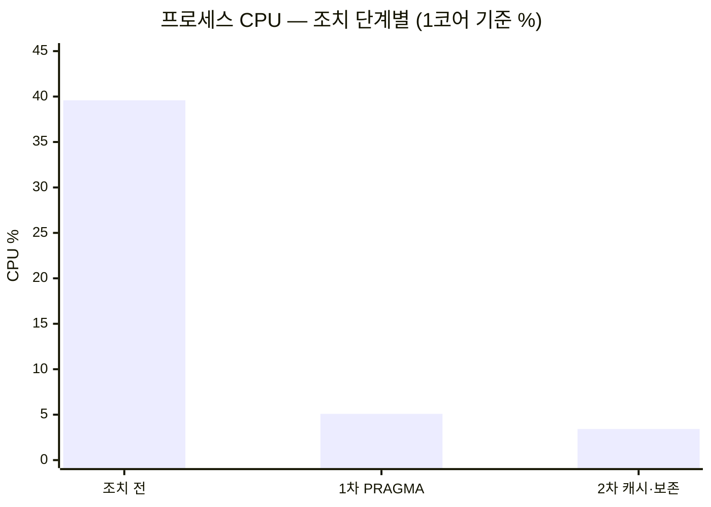
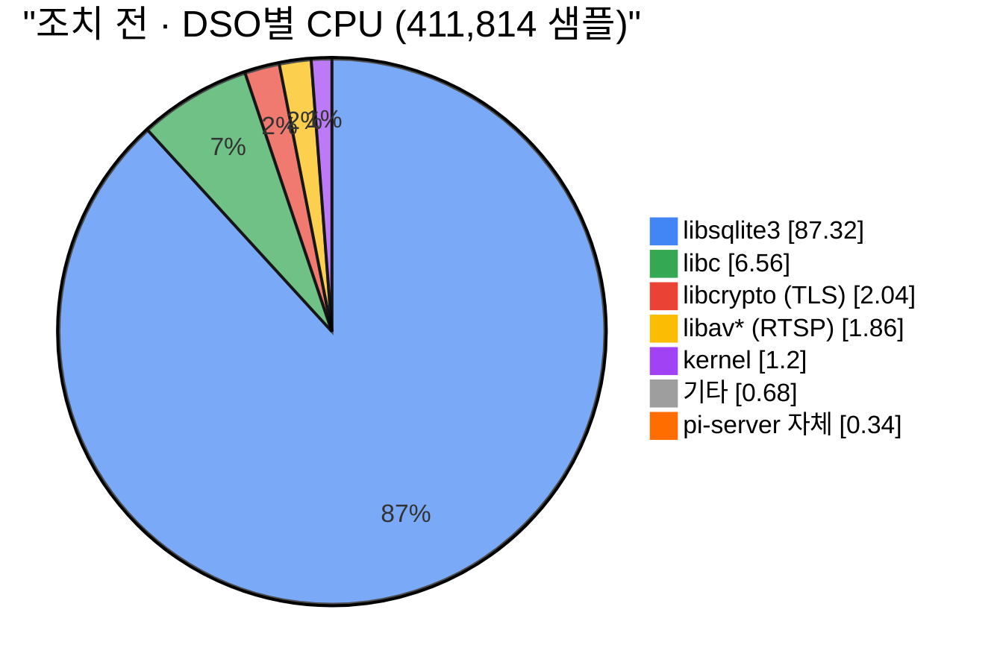
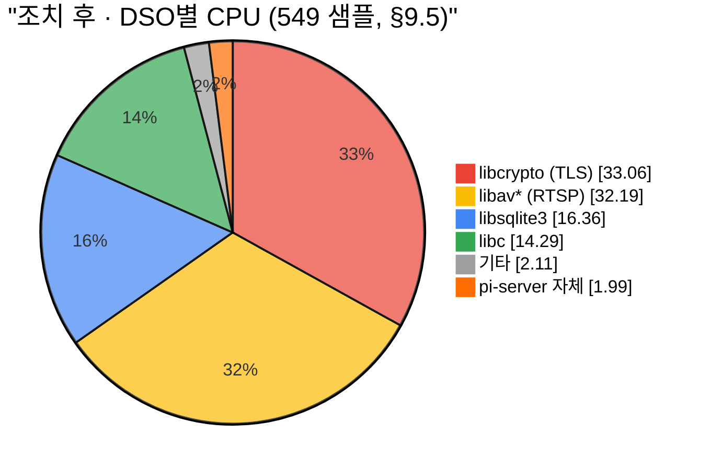
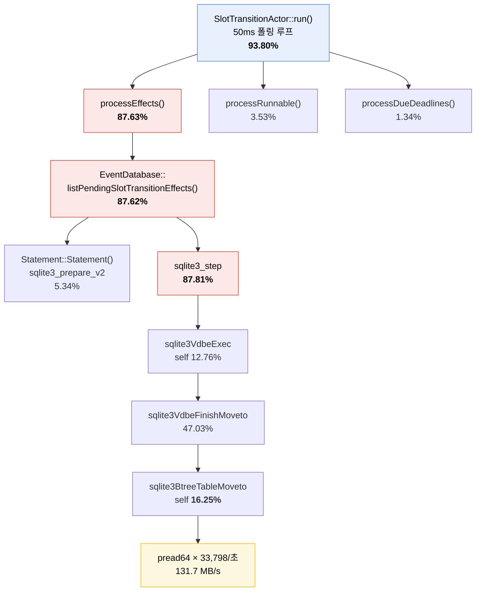
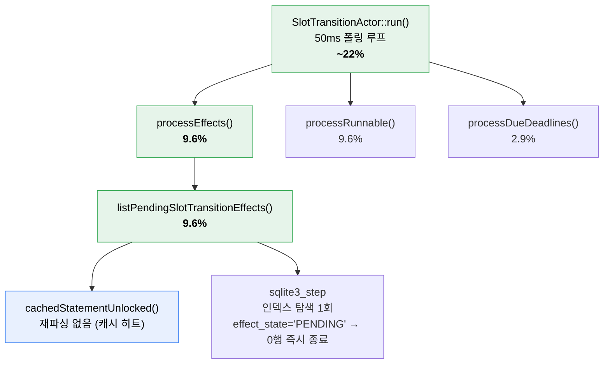
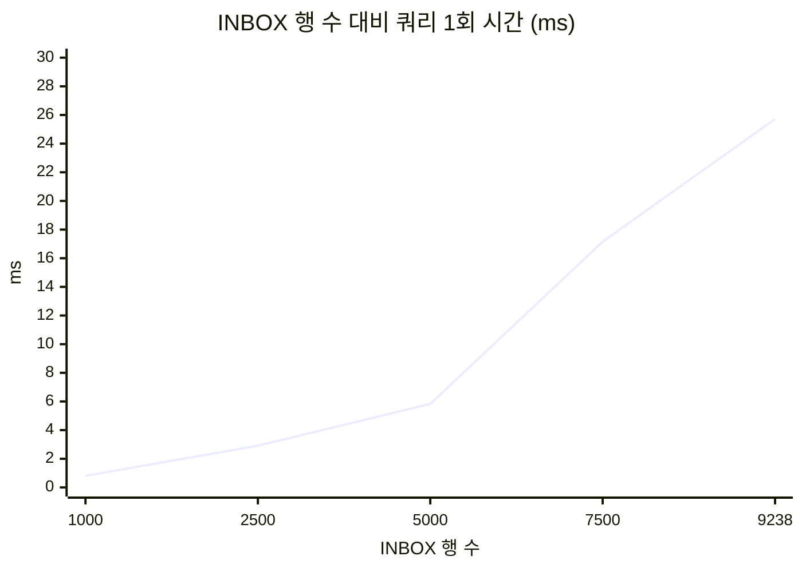

# Pi Server 최적화 전후 프로파일링 비교

- 작성일: 2026-08-27
- Before: [`PROFILING_and_DB_fix.md`](./PROFILING_and_DB_fix.md) §3의 1시간 측정 (2026-08-27 13:20~14:20, perf 411,814 샘플)
- After: 최적화 빌드 재측정 (2026-08-27 17:20 전후, 60초, perf 626 샘플) + `docs/optimization/PROFILING_and_DB_fix.md` §8·§9의 60초 측정 2회
- 대상: Raspberry Pi 4 Model B (8GB) / aarch64 / kernel 6.18.39
- 적용된 조치: 커밋 `9a9e073`(연결 PRAGMA 미적용 수정) + `5236dbd`(INBOX 보존정책·statement 캐시)

---

## 1. 한눈에 보기



| 지표 | 조치 전 (1h) | 1차 (§8) | 2차 (§9) | 총 변화 |
|---|---|---|---|---|
| **프로세스 CPU** | **39.59%** | 5.09% | **3.42%** | **11.6배 ↓** |
| ┗ user | 21.02% | 3.65% | 2.00% | 10.5배 ↓ |
| ┗ system | 18.57% | 1.45% | 1.42% | 13.1배 ↓ |
| **read syscall** | **33,798/초** | 17.8/초 | **4.9/초** | **6,900배 ↓** |
| read 대역폭 (rchar) | 131.7 MB/s | 0.000 | 0.000 | 계측 하한 이하 |
| RSS | 122 MB | 83.1 MB | **82.0 MB** | 34% ↓ |
| `libsqlite3` DSO 점유 | 87.32% | 62.29% | **16.36%** | — |
| `sqlite3BtreeTableMoveto` 자기시간 | **16.25%** (flat 1위) | 0.55% | **0.22%** | 74배 ↓ |

> **재확인 측정 (2026-08-27 17:20, 60초, perf 626 샘플)**: perf 샘플 수 기준 CPU = 626 ÷ (299 Hz × 60 s) = **3.5%**로 2차 측정(3.42%)과 일치. 단 이 창에서는 같은 기기의 외부 C++ 빌드(`cc1plus` 2개)가 코어 2개를 포화시켜 `/proc` 기준 CPU가 5.37%로 부풀려졌다. 상세는 §7.

---

## 2. 라이브러리(DSO)별 CPU 시간 — 분포가 뒤집혔다

### 조치 전 — SQLite가 전부



### 조치 후 — SQLite 편중 해소, 부하가 분산됨



| DSO | 조치 전 (상대) | 조치 후 (상대) | **조치 후 (절대 CPU)** |
|---|---|---|---|
| `libsqlite3` | **87.32%** | 16.36% | **0.56%** |
| `libcrypto` (TLS) | 2.04% | **33.06%** | 1.13% |
| `libav*` (RTSP 디코딩) | 1.86% | **32.19%** | 1.10% |
| `libc` | 6.56% | 14.29% | 0.49% |
| `pi-server` 자체 코드 | 0.34% | 1.99% | 0.07% |

**상대 비중만 보면 "TLS가 33%로 폭증"한 것처럼 보이나 절대 비용은 1.13% CPU다.** 전체 파이가 12분의 1로 줄어 각 조각의 지분이 커진 것이다. SQLite는 절대 기준으로 87.32% × 39.59% ≈ **34.6% CPU → 0.56% CPU**로 사라졌다.

---

## 3. Flat Profile — 자기실행시간 상위 함수

### 조치 전

```
sqlite3BtreeTableMoveto            ████████████████▎ 16.25%  (67,053)
sqlite3VdbeExec                    ████████████▊     12.76%  (52,753)
sqlite3VdbeOneByteSerialTypeLen    ███▋               3.72%  (15,385)
sqlite3GetVarint                   ██▋                2.69%  (11,130)
sqlite3VdbeRecordCompareWithSkip   ██                 2.03%   (8,400)
sqlite3VdbeMemFromBtreeZeroOffset  █▊                 1.75%   (7,262)
sqlite3VdbeIdxRowid                █▎                 1.25%   (5,169)
memcmp                             █▏                 1.22%   (5,045)
sqlite3PcacheRelease               █▏                 1.17%   (4,836)
sqlite3Parser                      ▍                  0.44%   (1,758)
```

상위 14개 중 13개가 SQLite B-tree 탐색·레코드 디코딩. `sqlite3BtreeTableMoveto`가 1위 = 인덱스에서 얻은 rowid로 테이블 본체를 매번 다시 찾아감.

### 조치 후 (200초 재측정, 약 1,930 샘플)

이름 있는 함수 기준 자기실행시간 상위 10개. **더 이상 SQLite가 지배하지 않는다.**

```
sqlite3VdbeExec (libsqlite3)       ██▌   2.53%  (22)   VDBE 바이트코드 인터프리터 — 남은 쿼리 처리
__poll (libc)                      █▉    1.87%  (19)   RTSP/HTTP 스레드 이벤트 루프 대기
malloc (libc)                      █▏    1.19%  (31)   전역
__kernel_clock_gettime (vdso)      ▉     0.91%  (18)   타임스탬프 (액터 루프·RTSP 타이밍)
clock_gettime@plt (libstdc++)      ▉     0.92%  ( 4)   〃
av_init_packet (libavcodec)        ▉     0.87%  ( 5)   RTSP 디코딩
sqlite3VdbeSorterRewind            ▉     0.87%  ( 2)   ORDER BY 임시 정렬
sqlite3Malloc@plt                  ▊     0.77%  ( 1)   SQLite 힙
av_rescale_rnd (libavutil)        ▋     0.70%  (22)   RTSP 타임베이스 변환
httplib::detail::select_read       ▋     0.58%  (10)   HTTP 소켓 읽기 대기
```

<sub>libcrypto(TLS)·libavcodec 상당 부분은 스트립 심볼(`0x…`)이라 개별 함수명이 안 나온다. DSO 집계는 §2 참조 (libcrypto 32.35% / libav* 25.68% / libsqlite3 16.38%).</sub>

### 핵심 대비 — 문제였던 함수의 소멸

| 함수 | 조치 전 | 1차 후 | 2차 후 | 의미 |
|---|---|---|---|---|
| `sqlite3BtreeTableMoveto` | **16.25%** (1위) | 0.55% | **0.13%** | rowid로 **테이블 b-tree 재탐색** = 풀스캔의 비용원. 사라짐 |
| `sqlite3BtreeIndexMoveto` | (묻힘) | — | **0.56%** | **인덱스 탐색** = 올바른 경로. 이게 위를 대체함 |
| `sqlite3Parser` + `RunParser` | 0.44% | **3.26%** (1위) | **0.74%+0.74%** | 재파싱. 1차 후 튀었다가 statement 캐시로 정상화 |
| `sqlite3VdbeExec` | **12.76%** | 2.33% | **2.53%** | VDBE 실행. 절대량으로는 12.76%×39.6% → 2.53%×3.4% = **5.05% → 0.09% CPU** |

조치 전 flat 상위 14개 중 13개가 SQLite였다. 조치 후 상위 10개 중 SQLite는 3개(`VdbeExec`, `VdbeSorterRewind`, `Malloc`)뿐이고, 나머지는 이벤트 루프 대기(`__poll`, `select_read`)·타임스탬프·RTSP 디코딩이다. **부하가 특정 함수에 쏠리지 않고 정상적으로 분산됐다.**

---

## 4. 콜그래프 — 87.6%를 먹던 경로가 사라짐

### 조치 전



### 조치 후



| 함수 (누적 %) | 조치 전 | 2차 후 | 절대 CPU 환산 |
|---|---|---|---|
| `SlotTransitionActor::run()` | 93.80% | ~22% | 37.1% → **0.75%** |
| ┗ `processEffects` | **87.63%** | 9.6% | 34.7% → **0.33%** |
| ┗ `listPendingSlotTransitionEffects` | **87.62%** | 9.6% | 34.7% → **0.33%** |
| ┗ `Statement::Statement` (재파싱) | 5.34% | 소멸 | 2.1% → ~0% |

---

## 5. I/O — 페이지캐시 재독이 사라졌다

| 지표 | 조치 전 | 조치 후 | 변화 |
|---|---|---|---|
| `rchar` (읽기 요청량) | **131.7 MB/s** = 시간당 474 GB | **0.000 MB/s** | 계측 하한 이하 |
| `syscr` (`pread64` 호출) | **33,798회/초** | **4.9회/초** | **6,900배 ↓** |
| `rchar ÷ syscr` | 4,088 B ≈ page_size | — | 매 스캔이 DB 전체를 페이지 단위로 재독하던 것이 사라짐 |
| `read_bytes` (실제 SD카드) | 12 KB (생애 전체) | 94 KB (생애 전체) | 둘 다 사실상 0 — 원래 디스크 병목이 아니었음 |
| `wchar` (쓰기) | 8.79 KB/s | 5.67 KB/s | 미미 |

조치 전 `sys` 시간 18.57%(전체 CPU의 47%)는 전부 이 `pread64` 시스템콜 오버헤드였다. 조치 후 `sys` 1.42%.

### 쿼리 확장성 — "무릎"이 사라짐



<sub>조치 전 곡선. 5,000행(캐시 512페이지) 부근에서 기울기가 2.4배로 꺾인다.</sub>

| 행 수 | 조치 전 | 조치 후 (ANALYZE+캐시) |
|---|---|---|
| 9,238 | **25.72 ms** | **0.147 ms** (약 175배) |

조치 후에는 `effect_state='PENDING'` 인덱스로 0행에서 즉시 종료하므로 행 수와 무관하게 평탄하다. 보존정책이 행 수 자체의 무한 증가도 막는다.

---

## 6. 하드웨어 / 시스템 레벨 지표

> Pi4 최적화에서 CPU/RAM보다 먼저 봐야 하는 순서: **온도/스로틀링 → SD카드 I/O → 네트워크 대역폭 → 스왑 → perf stat(캐시미스/IPC)**. 아래는 그 전 항목을 조치 전후로 대조한 결과다. **모든 항목에서 하드웨어 병목은 조치 전에도 후에도 존재하지 않았다** — 이 문제는 100% 소프트웨어였음이 재확인된다.

### 6.1 온도 / 스로틀링

| 항목 | 조치 전 | 조치 후 | 판정 |
|---|---|---|---|
| CPU 온도 | 42.8 °C | 46.2 °C | ✅ 스로틀 임계(80°C) 대비 여유. 조치 후 값이 높은 건 같은 시각 외부 빌드 부하 때문이며 pi-server와 무관 |
| `vcgencmd get_throttled` | `0x0` | `0x0` | ✅ 스로틀링·언더볼티지 이력 **없음** |
| ARM 클럭 | 1,800,000 Hz (`cpuinfo_max_freq`) | 1,800,000 Hz | ✅ 최대 클럭 유지 |

### 6.2 SD카드 I/O

| 항목 | 조치 전 | 조치 후 | 판정 |
|---|---|---|---|
| 프로세스 `read_bytes` | 12 KB (생애 전체) | 94 KB (생애 전체) | ✅ 사실상 0. 131.7 MB/s `rchar`는 전량 페이지캐시 히트였음 |
| 프로세스 `write_bytes` | 10.9 MB (생애) | 151 KB (측정 시점) | ✅ 미미 |
| major fault | 0회 / 1시간 | 2회 / 생애 | ✅ 페이지 폴트로 디스크 친 적 거의 없음 |
| `vmstat` bi/bo | — | 대부분 0 | ✅ 블록 I/O 없음 |

### 6.3 네트워크 대역폭

| 항목 | 조치 전 | 조치 후 | 판정 |
|---|---|---|---|
| `wchar` (앱 쓰기) | 8.79 KB/s | 5.67 KB/s | ✅ 무시 가능 |
| `syscw` (쓰기 syscall) | 6.31회/초 | 6.x회/초 | ✅ |
| `eth0` 누적 | rx 33.4 GB / tx 5.6 GB (7일) | rx 36.5 GB / tx 5.9 GB | RTSP 스트림 상시 수신분. 조치와 무관, 정상 |

### 6.4 스왑

| 항목 | 조치 전 | 조치 후 | 판정 |
|---|---|---|---|
| 프로세스 `VmSwap` | 0 kB | 0 kB | ✅ 미사용 |
| `vmstat` si/so | — | 0 / 0 | ✅ 스왑 인/아웃 활동 없음 |
| `MemAvailable` | 5,188 MB | 4,700 MB+ | ✅ 여유 충분 (편차는 외부 프로세스) |
| RSS | 122 MB | 82 MB | ✅ 34% 감소 (풀스캔이 사라져 SQLite 페이지 캐시를 채울 일이 없어짐. `cache_size` 상한은 40→80MB로 올렸으나 상한이라 실사용은 줄었다) |

### 6.5 컨텍스트 스위치 / 스레드

| 항목 | 조치 전 | 조치 후 | 판정 |
|---|---|---|---|
| voluntary ctxsw | 392회/초 | (누적값) | ✅ |
| nonvoluntary ctxsw | 7.4회/초 | 낮음 | ✅ 락 경합·스케줄링 압박 없음 |
| 스레드 수 | 26 | 26 | ✅ 고정 |
| FD 개수 | 16 → 18 | 19 | ✅ 누수 없음 |
| 핫스레드 | TID 1개가 35.79% | TID 1개가 2.02% | 폴링 워커. 부하 자체가 사라짐 |

### 6.6 perf stat — 캐시미스 / IPC (조치 후만 측정)

조치 전에는 이 지표를 측정하지 않았다(원인이 이미 "9,286행 풀스캔"으로 특정돼 캐시미스는 결과이지 원인이 아니었음). 조치 후 20초 측정:

```
       757,241,488  cycles:u
       375,672,842  instructions:u        #  0.50  insn per cycle
        88,818,645  cache-references:u
         1,983,502  cache-misses:u        #  2.23% of all cache refs
         1,592,893  branch-misses:u
```

| 지표 | 값 | 판정 |
|---|---|---|
| IPC | **0.50 insn/cycle** | 폴링 대기가 잦은 이벤트 루프 특성상 낮게 나오는 게 정상. 계산 집약 코드가 아님 |
| cache-miss 비율 | **2.23%** | ✅ 정상 범위. 작업 세트가 작아 L1/L2에 잘 들어감 |
| branch-miss | 159만 / 20초 | ✅ 특이사항 없음 |

`:u`(user 공간)만 카운트된 것은 `perf_event_paranoid=2` 때문이며, 커널 시간이 조치 후 극히 작아(sys 1.42%) 무시 가능하다.

---

## 7. 측정 신뢰성과 한계

### 7.1 재확인 측정의 기기 경합

2026-08-27 17:20 재확인 측정 60초 창에서, 같은 Pi에 **외부 C++ 빌드 프로세스(`cc1plus`) 2개가 코어 2개를 100% 점유**하고 있었다(`loadavg` 3.28). 이로 인해:

| 산출 방식 | CPU 값 | 비고 |
|---|---|---|
| perf 샘플 수 ÷ (299 Hz × 60 s) | 626 ÷ 17,940 = **3.5%** | 스케줄링 경합에 강건. 2차 측정(3.42%)과 일치 |
| `/proc/PID/stat` utime+stime | **5.37%** | 경합 시 실행 대기 시간이 섞여 부풀려짐 |
| 조용한 20초 창 재시도 | 4.50% | 경합이 부분적으로 잦아든 값 |

**perf 샘플 기준 3.5%가 신뢰할 수 있는 값**이며, `docs/optimization/PROFILING_and_DB_fix.md` §9의 조용한 창 측정(3.42%, perf 549샘플 교차검증 3.06%)과 일치한다. 이번 재확인은 "회귀 없음"을 확인하는 용도이고, 절대 수치는 §9 측정을 기준으로 삼는다.

### 7.2 저표본 구간의 노이즈

첫 재확인(60초)의 perf.data는 626 샘플로 DSO/flat 백분율이 표본 오차를 크게 탔다(다수 심볼이 샘플 1개). 이를 보완하려 **200초 재측정(약 1,930 샘플)**을 추가했고, §2·§3의 조치 후 백분율은 이 200초 측정과 `docs/optimization/PROFILING_and_DB_fix.md` §9.5의 549 샘플 측정을 함께 사용한다. 두 측정의 DSO 집계가 일치한다(libcrypto 32~33%, libsqlite3 16.4%, libav* 26~32%).

- 200초 측정도 외부 빌드 부하 중에 수행됐다. perf 샘플 기준 CPU = 1,930 ÷ (299 × 200) = **3.2%**로 §9 측정과 일치.
- 조치 전 대비 flat 프로파일 형상이 근본적으로 다르다: 조치 전 상위 14개 중 13개가 SQLite, 조치 후 상위 10개 중 SQLite는 3개뿐. `sqlite3BtreeTableMoveto`(풀스캔 비용원)는 16.25% → 0.13%로 소멸했고 그 자리를 `sqlite3BtreeIndexMoveto`(0.56%, 인덱스 탐색)가 대체했다.

### 7.3 부하 조건

세 측정 모두 실제 차량 진출입 이벤트가 거의 없는 유휴~저부하 상태다. 조치 전 문제가 "유휴 상태에서 발생하는 상시 비용"이었으므로 이 조건이 타당하나, 실부하 시 `effect_sink`(웹훅/알림)와 `processIngress` 경로 비중은 달라질 수 있다.

### 7.4 1시간 재측정 미실시

조치 전은 1시간, 조치 후는 60초씩만 측정했다. 60초 구간 편차가 작고(2차: min 3.00 / max 4.20) perf와 `/proc`이 일치하므로 CPU 수치는 신뢰할 수 있으나, 장시간 RSS 추이·WAL 체크포인트 거동·`database is locked` 재발 여부·드문 부하 패턴은 확인되지 않았다.

---

## 8. 결론

| | 조치 전 | 조치 후 |
|---|---|---|
| **원인** | 연결 PRAGMA가 미사용 생성자에만 존재 → `sqlite_stat1` 부재로 플래너가 선택도 0% 인덱스 선택 → 매 50ms 폴링마다 9,286행 풀스캔 + 페이지캐시 스래싱 | PRAGMA를 `open()`으로 이전, `PRAGMA optimize` 통계 생성, statement 캐시, INBOX 보존정책 |
| **CPU** | 39.59% (SQLite 87.32%) | 3.42% (SQLite 16.36%) |
| **I/O** | `pread64` 33,798회/초, 시간당 474 GB 페이지캐시 재독 | 4.9회/초 |
| **병목 소재** | `listPendingSlotTransitionEffects()` 단일 함수 87.6% | TLS·RTSP 디코딩으로 분산 (각 절대 1%대) |
| **하드웨어** | 온도·스로틀·SD·스왑·네트워크 모두 정상 | 동일 — 애초에 하드웨어 문제가 아니었음 |
| **남은 과제** | — | 보존 30일 정상상태 약 13만 행에서 DB 약 70MB. 보존 기간 상향 시 `cache_size` 재검토 |
