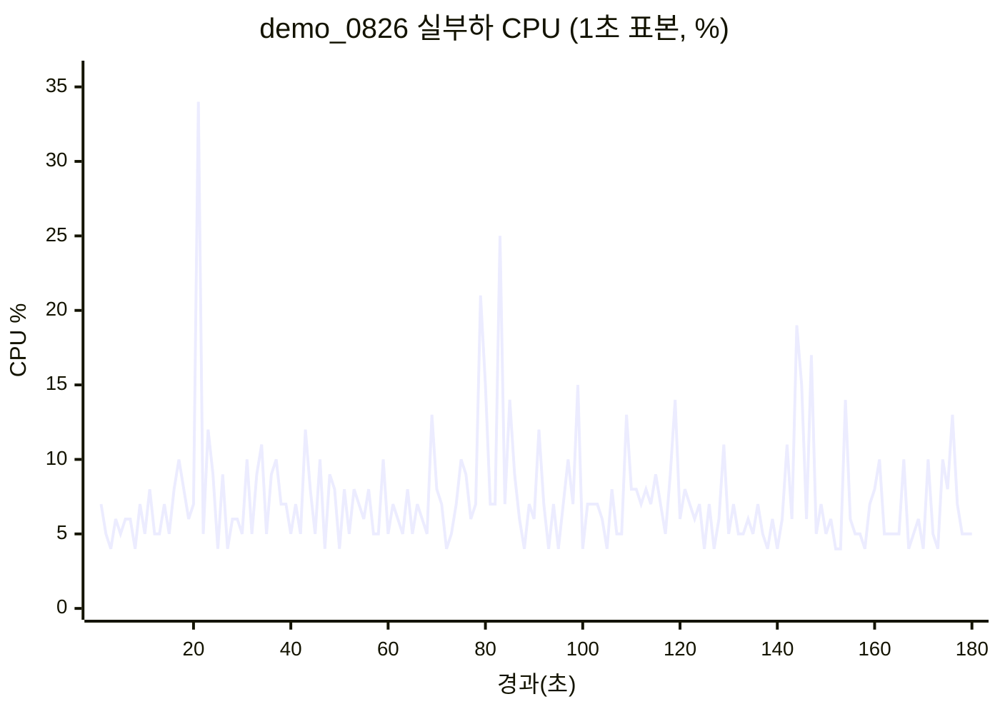
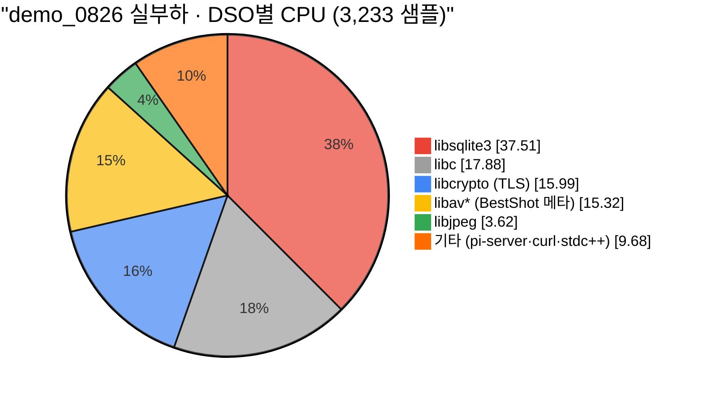
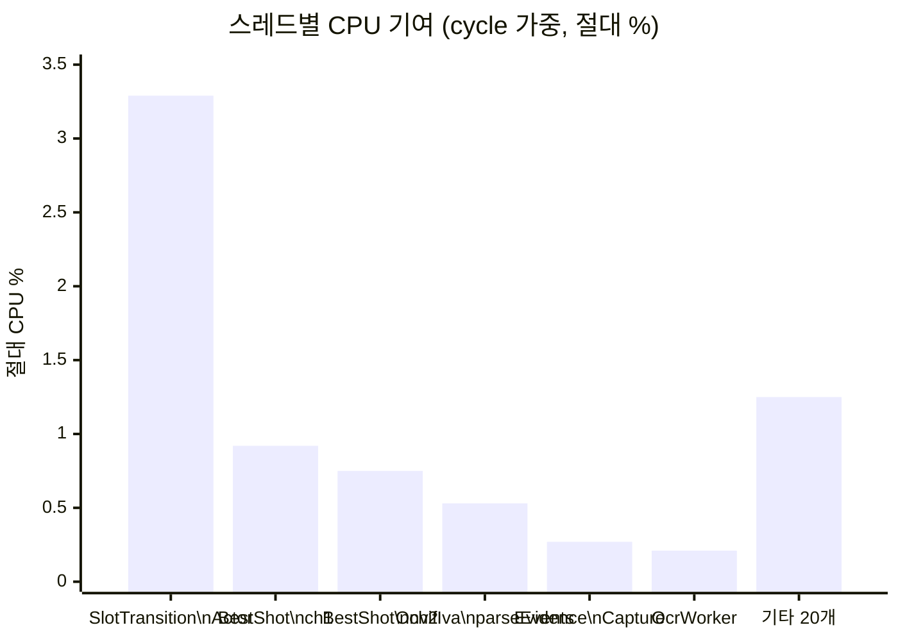

# 실부하 프로파일링 — 입출차 트리거 3분 (demo_0826)

- 작성일: 2026-08-28
- 대상: Raspberry Pi 4 Model B (8GB) / aarch64 / kernel 6.18.39 / 4코어
- 브랜치·커밋: **`demo_0826` / `79c5de4`** (시연영상 제출본)
- 측정 창: 2026-08-28 10:01:01 ~ 10:04:04 KST, **183.4초**
- 부하: 운영자가 실제 입차/출차 트리거를 수동 인가 (유휴 아님)
- 카메라 모드: Snapshot API (`CAMERA_SNAPSHOT_API_ENABLED=true`, RTSP 수신 없음)

> **요약: 실부하에서도 프로세스 CPU 평균 7.2%로 여유가 크다. 다만 프로파일 1위가
> `libsqlite3` 37.5%이고 그 정체가 SQL "실행"이 아니라 매 폴링마다 반복되는 **SQL 파싱**이다.
> demo_0826에는 EVDA-241 최적화(`9a9e073`·`5236dbd`)가 **미포함**이며,
> 이 브랜치가 39.6% 사태를 겪지 않는 이유는 코드가 아니라 DB 파일이 들고 있는 통계 덕분이다.**

---

## 1. 한눈에 보기

| 지표 | 값 | 비고 |
|---|---|---|
| **프로세스 CPU 평균** | **7.22%** (user 5.09 / sys 2.13) | 183초 창 |
| 정지 기저 (하위 50% 평균) | **5.07%** | 이벤트 없는 구간 |
| 이벤트 피크 (상위 10% 평균) | **15.79%** | 증거촬영·OCR 구간 |
| CPU p50 / p90 / p99 / max | 7% / 11% / 21% / **34%** | 4코어 중 최대 0.34코어 |
| RSS | 111.1 MB (변동 0.4 MB) | 누수 없음 |
| 스레드 수 | **26 고정** | 전 구간 불변 |
| rchar / wchar | 12.2 / 15.2 KB/s | — |
| syscr / syscw | 20.7 / 7.9 /s | — |
| ctxsw (vol/nonvol) | 1.0 / 0.0 /s | 락 경합 없음 |
| IPC | 0.75 insn/cycle | 유휴(0.61)보다 개선 — 실제 연산 수행 |
| cache-miss | 1.92% | 정상 |
| 온도 / throttled | 39.9 °C / `0x0` | 여유 |
| loadavg (1m) | 0.74 | 4코어 대비 한산 |

### 처리한 실제 작업량 (183초)

| 이벤트 | 건수 |
|---|---|
| `SLOT_OCCUPIED` (입차 확정) | 4 |
| `OCCUPANCY_START_EVIDENCE_STORED` (증거 촬영·저장) | 4 |
| `NON_EV_ALERT` (비-EV 판정) | 3 |
| `DEPARTURE` (출차) | 3 |
| `EARLY_DEPARTURE_IMAGES_DELETED` | 1 |
| **DB 델타** | `PARKING_SESSION` 78→82 (+4), `IMAGE_LOG` 43→46 (+3) |

---

## 2. CPU 시계열 — 이벤트와의 상관



**모든 주요 스파이크가 증거촬영 이벤트와 일치한다.** (창 시작 10:01:01 기준 상대 초)

| 시각(t) | CPU | 로그 이벤트 |
|---|---|---|
| t=16 | — | `SLOT_OCCUPIED` EV02 |
| **t=21** | **34%** ← 최대 | `OCCUPANCY_START_EVIDENCE_STORED` EV02 (t=20), `NON_EV_ALERT` (t=23) |
| t=52 | — | `DEPARTURE` EV02 |
| **t=79~85** | **21·15·25·14%** | `SLOT_OCCUPIED` EV01(t=76) → 증거저장 EV01(t=80) + `SLOT_OCCUPIED` EV02(t=80) → 증거저장 EV02(t=84) → `NON_EV_ALERT`(t=86) — **2세션 동시 처리** |
| t=110 | — | `DEPARTURE` EV01 + `EARLY_DEPARTURE_IMAGES_DELETED` |
| t=130 | — | `DEPARTURE` EV02 |
| **t=144~147** | **19·15·17%** | `SLOT_OCCUPIED` EV02(t=143) → 증거저장(t=146) → `NON_EV_ALERT`(t=149) |

**한 사이클(입차→촬영→OCR→DB→알림)의 비용은 CPU 15~34%가 3~5초간 지속**되는 수준이다.
1코어의 1/3을 잠깐 쓰고 끝난다. 출차(`DEPARTURE`)는 눈에 띄는 스파이크를 만들지 않는다 —
DB 트랜잭션과 타이머 취소뿐이라 저렴하다.

---

## 3. 라이브러리별 CPU — SQLite가 1위, 그런데 "파싱"이다



| DSO | 상대 % | **절대 CPU** | 무엇 |
|---|---|---|---|
| **`libsqlite3`** | **37.51%** | **2.71%** | 아래 §4 — 대부분 SQL **파싱** |
| `libc` | 17.88% | 1.29% | malloc/free (파싱·regex가 유발) |
| `libcrypto` | 15.99% | 1.15% | HTTPS API TLS |
| `libavcodec`+`libavformat`+`libavutil` | 15.32% | 1.11% | ENTRANCE BestShot 메타데이터 |
| `libjpeg` | 3.62% | 0.26% | 증거 JPEG 디코딩 |
| `pi-server` 자체 | 2.97% | 0.21% | — |
| `libcurl` | 1.46% | 0.11% | Snapshot API·Gemini HTTP |

### 3.1 스레드별 CPU

`perf script -F tid,period`로 **cycle 가중 합계**를 집계했다. 단순 샘플 수는 자주 깨어나
조금만 일하는 스레드를 과대평가하므로 cycle 합계를 기준으로 삼는다
(총 13,717,455,404 cycles).

| TID | cycle % | **절대 CPU** | 스레드 정체 | 주 DSO |
|---|---|---|---|---|
| 1438377 | **45.5%** | **3.29%** | `parking::SlotTransitionActor::run()` — 50ms 폴링 액터 | `libsqlite3` 37.0% |
| 1438382 | 12.8% | 0.92% | `bestshot::BestShotReceiver::receiveLoop` (채널 1) | `libavformat`/`libavcodec` |
| 1438383 | 10.4% | 0.75% | `bestshot::BestShotReceiver::receiveLoop` (채널 2) | `libavcodec`/`libavformat` |
| 1438386 | 7.3% | 0.53% | `camera::OnvifIvaEventSource::run/parseEvents` | `libstdc++`(regex) |
| 1438378 | 3.8% | 0.27% | `parking::EvidenceCaptureWorker::run` | **`libjpeg` 3.62%** |
| 1438379 | 2.9% | 0.21% | `ocr::OcrWorker::run/process` | `libcrypto`/`libcurl` (Gemini HTTPS) |
| 그 외 약 20개 | 17.3% | 1.25% | httplib TLS 워커, MQTT, 센서 링크 등 | `libcrypto` 외 |



**폴링 액터 한 스레드가 프로세스 CPU의 45.5%를 쓴다.** 그 안의 37%가 `libsqlite3`이고,
§4가 보이듯 실행이 아니라 파싱이다. 반면 **실제 업무 스레드는 저렴하다** —
증거촬영(JPEG 디코딩 포함) 0.27%, OCR(Gemini HTTPS 왕복 포함) 0.21%.

즉 이 서버의 부하는 "일을 많이 해서"가 아니라 **"일이 없는지 확인하는 폴링"** 이 대부분이다.

---

## 4. 발견 1 — SQL이 매 폴링마다 재파싱된다

자기실행시간 상위 심볼이 **실행이 아니라 컴파일** 계열이다.

```
sqlite3Parser              2.66%   ← SQL 파서
sqlite3GetToken            0.97%   ← 토크나이저
sqlite3WalkExprNN          0.93%   ← 표현식 트리 순회
sqlite3DbMallocRawNN       0.89%   ← 파싱 중 할당
sqlite3WhereCodeOneLoopStart 0.54% ← 쿼리 플랜 코드 생성
─────────────────────────────────
sqlite3VdbeExec            1.12%   ← 실제 실행은 이것뿐
sqlite3BtreeIndexMoveto    0.79%   ← 인덱스 탐색 (정상)
```

**파싱 계열 합계가 실행(`VdbeExec`)의 5배가 넘는다.** 콜그래프가 출처를 특정한다:

```
parking::SlotTransitionActor::run()                          2.65%
└─ processRunnable(long)                                     1.57%
   └─ database::SessionTransitionStore::listRunnable(long)
      └─ EventDatabase::listRunnableSlotTransitionCommands(long)
         └─ database::(anonymous)::Statement::Statement(sqlite3*, string)   ← prepare_v2
            └─ sqlite3RunParser → sqlite3Parser
```

`listRunnableSlotTransitionCommands()`(`src/database/EventDatabaseOccupancy.cpp:571`)가
폴링마다 `Statement`를 새로 만들어 **같은 SQL을 반복 컴파일**한다.
이 쿼리는 `NOT EXISTS` 서브쿼리를 포함해 파싱 비용이 특히 크다.

`fix/optimization-pi_EVDA-241`에는 이를 위한 statement 캐시(`cachedStatementUnlocked`)가
`EventDatabaseOccupancy.cpp`에 5곳 존재하지만, **demo_0826에는 그 헬퍼 자체가 없다** (§6).

---

## 5. 발견 2 — ONVIF XML 파싱에서 std::regex를 매번 컴파일

`pi-server` 자체 코드의 children 프로파일 1위가 정규식 **컴파일러**다.

```
camera::OnvifIvaEventSource::run()                                    1.46%
└─ parseEvents(string)                                                1.40%
   └─ camera::(anonymous)::attribute(string tag, string name)         1.32%
      └─ std::basic_regex::_M_compile()                               1.32%
         └─ _Compiler::_M_disjunction → _M_alternative
            → _M_bracket_expression → _BracketMatcher::_M_ready()     0.93% (self)
```

`src/camera/OnvifIvaEventSource.cpp:305`:

```cpp
std::optional<std::string> attribute(const std::string& tag,
                                     const std::string& name) {
    const std::regex pattern(            // ← static 아님. 호출마다 컴파일된다.
        "(?:^|[[:space:]])" + name +     // ← 패턴이 인자로 조립되므로
            R"([[:space:]]*=[[:space:]]*["']([^"']*)["'])",
        std::regex::icase);
    std::smatch match;
    if (!std::regex_search(tag, match, pattern)) return std::nullopt;
    return xmlUnescape(match[1].str());
}
```

같은 파일의 형제 함수들(257·263·294행)은 모두 `static const std::regex`로 올바르게
1회만 컴파일한다. `attribute()`만 예외이며, **패턴을 런타임 인자 `name`으로 조립**하기
때문에 단순히 `static`을 붙일 수 없다. ONVIF 이벤트 XML의 속성마다 호출되므로 가장 뜨겁다.

이것이 `libc`의 malloc/free 비중(17.88%)과 `__strxfrm_l`·`std::collate::do_transform`
(locale 처리) 표본의 주된 출처이기도 하다. 03번 보고서의 유휴 프로파일에도 같은 심볼이
보였으므로 **부하와 무관한 상시 비용**이다.

**개선안**: `name` → `std::regex`의 정적 맵 캐시(호출되는 `name`은 유한하다), 또는
정규식을 버리고 문자열 스캔으로 속성을 추출.

---

## 6. 발견 3 — demo_0826은 EVDA-241 최적화 미포함이며, "DB 파일 덕에" 무사하다

`git merge-base --is-ancestor` 검증 결과:

| 커밋 | 내용 | demo_0826 포함? |
|---|---|---|
| `9a9e073` | DB 연결 PRAGMA 미적용 수정 (39.6%→5.1%) | ❌ **미포함** |
| `5236dbd` | INBOX 보존정책·statement 캐시 (5.1%→3.4%) | ❌ **미포함** |

demo_0826은 `61df462`(EVDA-225 TLS)에서 분기했다. 소스 확인:

- `cachedStatement` 헬퍼: **없음** (최적화 브랜치는 5곳)
- `INBOX_RETENTION` / 보존정책 코드: **없음**
- `ANALYZE` / `PRAGMA optimize` / `cache_size`: **없음**
  (`busy_timeout`·`journal_mode=WAL`은 `EventDatabaseTimer.cpp:219` 에 존재)

### 그런데 왜 39.6%가 아니라 7%인가

현재 DB 파일이 **플래너 통계와 인덱스를 이미 들고 있기 때문**이다.

```sql
sqlite> select count(*) from OCCUPANCY_COMMAND_INBOX;
9335                            -- 39.6% 사태 당시 9,286행과 사실상 동일

sqlite> select tbl,idx,stat from sqlite_stat1 where tbl like '%INBOX%';
OCCUPANCY_COMMAND_INBOX|idx_occupancy_inbox_runnable|9286 2001 1001 1 1
OCCUPANCY_COMMAND_INBOX|idx_occupancy_effect_pending|9286 1001 286 1 1
```

`sqlite_stat1`이 존재하므로 플래너가 `idx_occupancy_inbox_runnable`를 선택하고,
풀스캔(`sqlite3BtreeTableMoveto`)이 아니라 인덱스 탐색(`sqlite3BtreeIndexMoveto` 0.79%)이
일어난다. 이 통계는 **최적화 브랜치가 같은 DB 파일에 만들어 둔 것**이며 demo_0826 코드는
`ANALYZE`를 실행하지 않는다.

> ⚠️ **위험**: demo_0826을 **새 DB로 배포하면** `sqlite_stat1`이 없어 플래너가 다시
> 풀스캔을 고르고, INBOX 보존정책도 없어 행이 무한히 쌓인다. 01·02번 보고서의
> **39.6% CPU / 초당 33,798회 `pread64`** 상태가 재현될 수 있다.
> 시연 재현이나 추가 배포 전에 `9a9e073`·`5236dbd` 체리픽을 권장한다.

---

## 7. 개선 여지 정리

| # | 항목 | 현재 절대 CPU | 조치 |
|---|---|---|---|
| 1 | `listRunnableSlotTransitionCommands` SQL 재파싱 | ~0.9% | `5236dbd` 체리픽 (statement 캐시) |
| 2 | `attribute()` std::regex 매회 컴파일 | ~1.3% | `name`별 정적 regex 캐시 또는 문자열 스캔 |
| 3 | INBOX 9,335행·보존정책 부재 | 잠재적 39%p | `5236dbd` 체리픽 (보존정책) |
| 4 | 새 DB 배포 시 통계 부재 | 잠재적 39%p | `9a9e073` 체리픽 (PRAGMA/ANALYZE) |

1·2번만 처리해도 현재 7.22% 중 **약 2.2%p(30%)**가 줄어든다.
3·4번은 지금 당장은 드러나지 않지만 배포 조건이 바뀌면 즉시 터지는 항목이다.

---

## 8. 측정 신뢰성과 한계

1. **부하가 수동 트리거 4사이클**이다. 183초에 입차 4·출차 3건은 실제 주차장 피크보다
   훨씬 성깁니다. 동시 8슬롯이 몰리는 상황은 측정되지 않았다.
2. **스레드별 CPU는 `top`이 아니라 perf에서 복원했다**: 스크립트가 `top -H -b -n 1`을 써서
   순간값 대신 부팅 이후 누적 평균이 찍혔다(전부 0.0%). 대신 `perf script -F tid,period`로
   cycle 가중 집계를 사후 복원해 §3.1을 작성했다 — perf 쪽이 오히려 정확하다.
   `top`을 쓸 경우 `-n 2 -d 2`로 두 번째 iteration을 읽어야 한다.

8. **함수 호출 "횟수"는 측정하지 않았다.** perf는 표본 프로파일러라 *시간이 어디에 쓰이는지*는
   알려주지만 *몇 번 호출됐는지*는 알려주지 않는다. 본 보고서의 모든 %는 시간 비중이다.
   호출 횟수가 필요하면 uprobe(`perf probe` + `perf stat`, root 필요)를 써야 한다.
   이 기기에는 `bpftrace`·`uftrace`·`ltrace`·`valgrind`가 설치돼 있지 않다.
   참고로 도메인 이벤트 횟수(입차 4·증거 4·출차 3 등)는 §1에 로그·DB 기준으로 실측돼 있다.
3. **03번 보고서의 3.47%와 직접 비교 불가**: 그 값은 `5236dbd`
   (`fix/optimization-pi_EVDA-241`)에서 측정했고 이번은 `demo_0826`이다.
   브랜치가 다르므로 유휴 기저도 다르다. 이번 창 자체의 하위 50% 평균 **5.07%**를
   demo_0826의 유휴 기저로 쓰는 것이 옳다.
4. **표본 3,233개**(perf record 180초). DSO 집계는 안정적이나 0.5% 미만 심볼은
   표본오차가 크다.
5. **네트워크 카운터는 시스템 전역**(rx 735.9 KB/s). pi-server 단독이 아니며
   `pi_worker.py`·SSH·ONVIF가 섞여 있다.
6. `perf_event_paranoid=2` → user 공간만 카운트. sys 시간(2.13%)은 `/proc` 기준.
7. **심볼 스트립**: `libcrypto`·`libavcodec`은 심볼이 없어 DSO 단위로만 귀속했다.

---

## 9. 결론

demo_0826은 **실부하에서 CPU 7.2%, 4코어 중 0.34코어 최대 사용**으로 헤드룸이 충분하다.
입출차 한 사이클의 비용은 15~34%가 3~5초 지속되는 정도이며, RSS·스레드 수는 완전히 안정적이다.
온도 39.9 °C, 스로틀 없음, loadavg 0.74 — 하드웨어 여유도 충분하다.

다만 프로파일 상위가 **본래 일(work)이 아닌 반복 컴파일**로 채워져 있다.
SQL 파싱(§4)과 정규식 컴파일(§5)이 전체의 30%가량을 차지하며, 둘 다 캐싱으로 제거 가능하다.

가장 중요한 것은 §6이다. 이 브랜치는 EVDA-241 최적화를 담고 있지 않으며,
현재 정상 동작하는 이유가 **코드가 아니라 기존 DB 파일이 보유한 통계**다.
새 환경 배포 시 39.6% 사태가 재현될 수 있으므로 체리픽이 필요하다.

---

## 10. 재현 방법

```bash
PID=$(pgrep -x pi-server | head -1); HZ=$(getconf CLK_TCK); DUR=180
LOG=data/logs/pi-server.log; DB=data/db/parking.db

LOG0=$(wc -l < $LOG); c0=$(awk '{print $14+$15}' /proc/$PID/stat)
perf record -p $PID -g -F 299 -o perf.data -- sleep $DUR &     # `-- sleep` 필수
( sleep 30; perf stat -p $PID -e task-clock,cycles,instructions,\
cache-references,cache-misses --timeout 30000 2> perf_stat.txt ) &

pc=$c0
for i in $(seq 1 $DUR); do sleep 1
  pn=$(awk '{print $14+$15}' /proc/$PID/stat)
  m=$(awk '/^VmRSS/{r=$2}/^Threads/{t=$2}END{print r,t}' /proc/$PID/status)
  awk -v d=$((pn-pc)) -v hz=$HZ -v i=$i -v m="$m" 'BEGIN{printf "%d %.2f %s\n",i,d*100/hz,m}'
  pc=$pn
done | tee cpu_ts.csv
# ← 이 3분 동안 운영자가 입차/출차 트리거 인가

c1=$(awk '{print $14+$15}' /proc/$PID/stat)
tail -n +$((LOG0+1)) $LOG | grep -o '"event_type":"[A-Z_]*"' | sort | uniq -c | sort -rn

perf report -i perf.data --stdio -g none --no-children --sort dso
perf report -i perf.data --stdio -S sqlite3Parser -g graph,0.5,caller   # 파싱 호출자 추적
perf report -i perf.data --stdio --children --sort symbol --dso pi-server
```

원자료: [`docs/optimization/data/`](./data/)

| 파일 | 내용 |
|---|---|
| `cpu_ts_demo0826_load.csv` | 1초 CPU·RSS·스레드 시계열 (180 표본) |
| `window_summary_demo0826_load.txt` | 창 집계 + DB 델타 + 온도/loadavg |
| `perf_stat_demo0826_load.txt` | 하드웨어 카운터 (30초) |
| `perf_dso_demo0826_load.txt` | DSO별 CPU |
| `event_counts_demo0826_load.txt` | 이벤트 종류별 건수 |
| `callgraph_sqlite_parser_demo0826.txt` | SQL 파싱 호출 경로 |
